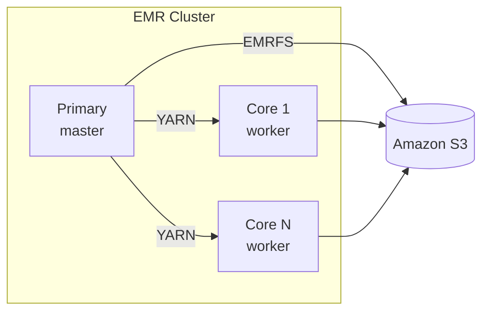

# AWS EMR on EC2

Amazon EMR manages the full Spark cluster lifecycle on EC2. It runs YARN under
the hood and integrates with S3, Glue Catalog, and IAM.

## Architecture



## Prerequisites

- AWS CLI configured (`aws configure`)
- An S3 bucket for scripts, input, output, and logs
- IAM role `EMR_EC2_DefaultRole`

## Create a Cluster

```bash
aws emr create-cluster \
  --name "PySpark Job" \
  --release-label emr-7.1.0 \
  --applications Name=Spark \
  --instance-type m5.xlarge \
  --instance-count 3 \
  --use-default-roles \
  --log-uri s3://my-bucket/emr-logs/ \
  --region us-east-1
```

Save the returned `ClusterID` (e.g. `j-XXXXXXXXXXXX`).

## Upload & Submit

```bash
aws s3 cp aws/emr_example.py s3://my-bucket/scripts/

aws emr add-steps \
  --cluster-id j-XXXXXXXXXXXX \
  --steps Type=Spark,Name="ETL",ActionOnFailure=CONTINUE,\
Args=[--deploy-mode,cluster,\
      --conf,spark.sql.adaptive.enabled=true,\
      s3://my-bucket/scripts/emr_example.py]
```

## Key EMR-Specific Configs

| Config | Value | Purpose |
|--------|-------|---------|
| `spark.sql.adaptive.enabled` | `true` | Auto-tune shuffle partitions |
| `spark.speculation` | `false` | Prevents duplicate S3 writes |
| `spark.hadoop.mapreduce.fileoutputcommitter.algorithm.version` | `2` | Faster S3 commits |

## Local Test

```bash
USE_LOCAL_DATA=true python aws/emr_example.py
```

## Full Example

```python title="aws/emr_example.py"
--8<-- "aws/emr_example.py"
```
