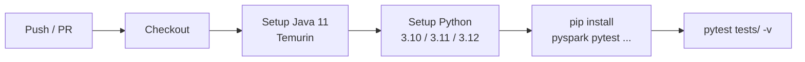

# CI/CD — GitHub Actions

Automate PySpark test runs on every push and pull request.

## Workflow

Copy [`ci/github-actions.yml`](../ci/github-actions.yml) to
`.github/workflows/pyspark.yml` in your repository:

```yaml title="ci/github-actions.yml"
--8<-- "ci/github-actions.yml"
```

## What the Workflow Does



- **Matrix** — tests run in parallel across Python 3.10, 3.11, and 3.12.
- **Pip cache** — `actions/setup-python` caches dependencies between runs.
- **SPARK_LOCAL_IP** — set to `127.0.0.1` to avoid hostname-resolution issues in CI.

## Test Suite

The test file [`ci/test_pyspark.py`](../ci/test_pyspark.py) validates:

| Class | What it tests |
|-------|--------------|
| `TestSparkSession` | Version ≥ 3, master is local, app name set |
| `TestDataFrame` | Create, filter, join, withColumn, groupBy |
| `TestSQL` | Temp views, aggregations, aliases |
| `TestWindowFunctions` | rank, running total, lag |
| `TestParquetIO` | Write, read-back, partitioned write |

Run locally before pushing:

```bash
export PYSPARK_PYTHON=python3
export PYSPARK_DRIVER_PYTHON=python3
export SPARK_LOCAL_IP=127.0.0.1

pytest ci/test_pyspark.py -v
```

## Full Test File

```python title="ci/test_pyspark.py"
--8<-- "ci/test_pyspark.py"
```
