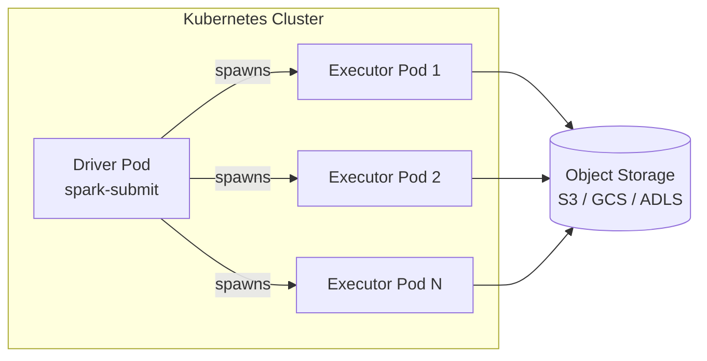

# Kubernetes

Kubernetes (K8s) is the cloud-native way to run Spark. No Hadoop required.
Spark 2.3+ includes a native Kubernetes scheduler.

## Architecture



## Prerequisites

1. A running Kubernetes cluster (minikube, EKS, GKE, AKS, etc.)
2. `kubectl` configured (`~/.kube/config`)
3. Docker image containing your PySpark code

## One-Time Cluster Setup

```bash
kubectl create serviceaccount spark
kubectl create clusterrolebinding spark-role \
  --clusterrole=edit \
  --serviceaccount=default:spark \
  --namespace=default
```

## Build & Push the Docker Image

```bash
docker build -t my-registry/pyspark-job:3.5 docker/
docker push my-registry/pyspark-job:3.5
```

## Submit

=== "Cluster mode"
    ```bash
    spark-submit \
      --master k8s://https://$(kubectl config view --minify \
          -o jsonpath='{.clusters[0].cluster.server}') \
      --deploy-mode cluster \
      --conf spark.kubernetes.container.image=my-registry/pyspark-job:3.5 \
      --conf spark.kubernetes.namespace=default \
      --conf spark.kubernetes.authenticate.driver.serviceAccountName=spark \
      --conf spark.executor.instances=3 \
      local:///opt/spark/work-dir/k8s_example.py
    ```

=== "Minikube"
    ```bash
    minikube start --cpus 4 --memory 8192
    eval $(minikube docker-env)
    docker build -t pyspark-job:3.5 docker/

    spark-submit \
      --master k8s://https://$(minikube ip):8443 \
      --deploy-mode cluster \
      --conf spark.kubernetes.container.image=pyspark-job:3.5 \
      --conf spark.kubernetes.container.image.pullPolicy=Never \
      --conf spark.executor.instances=2 \
      local:///opt/spark/work-dir/k8s_example.py
    ```

!!! note "local:// prefix"
    `local:///path` refers to a path **inside the container**, not your host machine.

## Monitor Pods

```bash
kubectl get pods                        # watch driver + executor pods
kubectl logs <driver-pod-name>          # stream driver logs
kubectl describe pod <driver-pod-name>  # debug scheduling issues
```

## Local Test

```bash
python cluster/k8s_example.py
```

## Full Example

```python title="cluster/k8s_example.py"
--8<-- "cluster/k8s_example.py"
```
