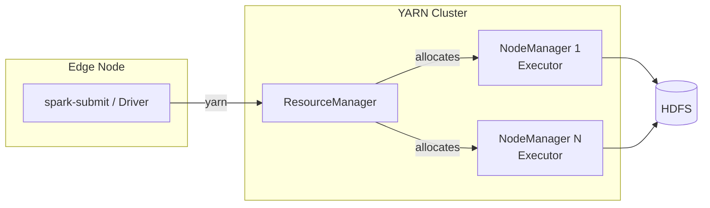

# YARN

YARN (Yet Another Resource Negotiator) is the resource manager bundled with Hadoop.
Most on-premise Spark deployments use YARN.

## Architecture



## Prerequisites

- Hadoop + YARN installed and reachable
- `HADOOP_CONF_DIR` or `YARN_CONF_DIR` pointing to cluster config files
- Same Python binary on edge node **and** all worker nodes

## Setup

Source the provided script to bootstrap all required variables:

```bash
source cluster/setup-yarn-env.sh
```

Or set them manually:

```bash
export HADOOP_CONF_DIR=/etc/hadoop/conf
export SPARK_HOME=/opt/spark
export PYSPARK_PYTHON=/usr/bin/python3
export PYSPARK_DRIVER_PYTHON=/usr/bin/python3
```

## Deploy Modes

| Mode | Driver location | Best for |
|------|-----------------|---------|
| `client` | Edge node (local) | Interactive / debugging |
| `cluster` | YARN container (remote) | Production batch jobs |

## Submit

=== "Client mode"
    ```bash
    spark-submit \
      --master yarn \
      --deploy-mode client \
      --num-executors 4 \
      --executor-cores 2 \
      --executor-memory 4g \
      cluster/yarn_example.py
    ```

=== "Cluster mode"
    ```bash
    spark-submit \
      --master yarn \
      --deploy-mode cluster \
      --num-executors 8 \
      --executor-cores 4 \
      --executor-memory 8g \
      --conf spark.yarn.maxAppAttempts=2 \
      cluster/yarn_example.py
    ```

## Shipping Python Dependencies

```bash
pip install venv-pack
venv-pack -o pyspark_venv.tar.gz

spark-submit \
  --master yarn \
  --archives pyspark_venv.tar.gz#env \
  --conf spark.yarn.appMasterEnv.PYSPARK_PYTHON=./env/bin/python \
  --conf spark.executorEnv.PYSPARK_PYTHON=./env/bin/python \
  cluster/yarn_example.py
```

## Local Test

```bash
# Test the script without a YARN cluster first
spark-submit --master local[*] cluster/yarn_example.py
# or:
python cluster/yarn_example.py
```

## Full Example

```python title="cluster/yarn_example.py"
--8<-- "cluster/yarn_example.py"
```
