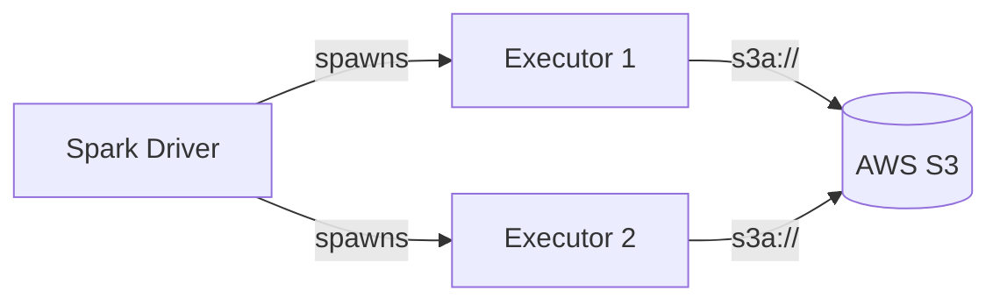

# PySpark Storage MkDocs Instructions

## Storage Page Structure

Every storage provider page should follow this order:

1. **Overview** — what the storage system is and when to use it with Spark.
2. **Architecture diagram** (Mermaid) — Spark Driver → Executor → Storage flow.
3. **Prerequisites** — JARs, credentials, and access setup.
4. **Authentication methods** — one section per auth method with code blocks.
5. **SparkSession snippet** — annotated Spark config approach.
6. **Hadoop config snippet** — annotated runtime config approach.
7. **Read / Write example** — bash block with the exact run command.
8. **Configuration reference** — table of all relevant `fs.*` properties.
9. **When to use / not use** — `!!! success` and `!!! failure` admonitions.
10. **Full example** — `--8<--` snippet include from `src/` directory.

## Architecture Diagram Template

```markdown

```

Adapt protocol and label per provider:

| Provider   | Protocol   | Label              |
|------------|------------|--------------------|
| AWS S3     | `s3a://`   | AWS S3             |
| Azure ADLS | `abfss://` | Azure ADLS Gen2    |
| GCS        | `gs://`    | Google Cloud Storage |
| HDFS       | `hdfs://`  | HDFS Cluster       |
| MinIO      | `s3a://`   | MinIO              |

## Authentication Sections

Use tabbed blocks for Spark config vs Hadoop config:

````markdown
=== "Spark Config"
    ```python title="src/s3a/read_s3_spark_config.py"
    --8<-- "src/s3a/read_s3_spark_config.py"
    ```

=== "Hadoop Config"
    ```python title="src/s3a/read_s3_hadoop_config.py"
    --8<-- "src/s3a/read_s3_hadoop_config.py"
    ```
````

## Credential Warnings

```markdown
!!! warning "Never hard-code credentials"
    Always use environment variables, IAM roles, managed identities, or a
    secrets manager.
```

## Configuration Reference Tables

```markdown
| Property | Description | Example |
|----------|-------------|---------|
| `fs.s3a.endpoint` | S3 endpoint URL | `https://s3.amazonaws.com` |
| `fs.s3a.access.key` | AWS access key ID | `AKIA...` |
| `fs.s3a.path.style.access` | Use path-style URLs | `true` (for MinIO) |
```

## Snippet Includes

```markdown
```python title="src/s3a/read_s3_spark_config.py"
--8<-- "src/s3a/read_s3_spark_config.py"
```
```

## Install Block (uv only)

```markdown
```bash
uv sync
```
```
