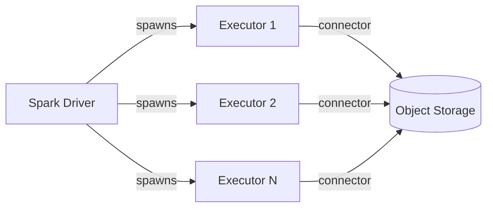
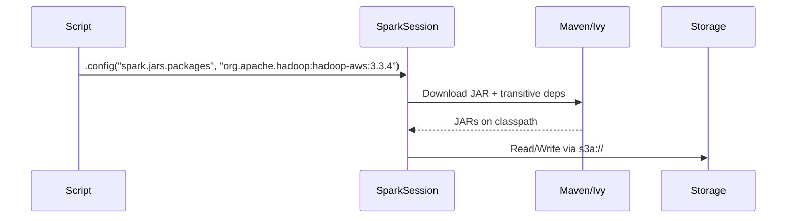
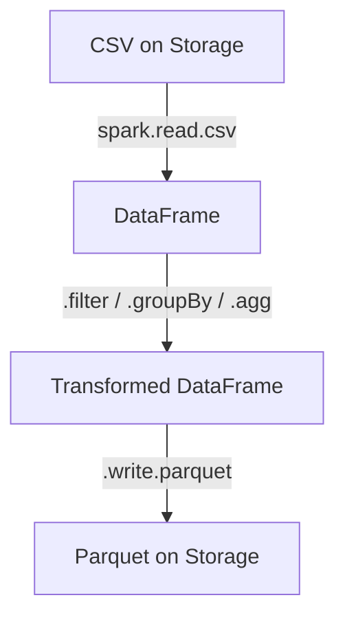
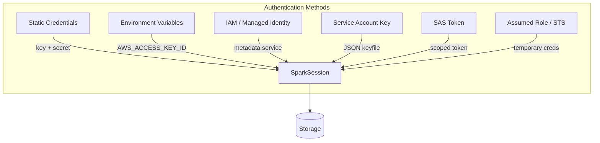

# Architecture

How PySpark connects to external storage systems.

## Overview

PySpark uses **Hadoop FileSystem connectors** to read and write data on remote storage.
The Spark Driver configures the connector, and each Executor uses it independently to
perform parallel I/O.



## Connector per Protocol

Each storage protocol requires a specific Hadoop FileSystem implementation:

| Protocol | Connector JAR | FileSystem Class |
|----------|--------------|------------------|
| `s3a://` | `hadoop-aws` | `org.apache.hadoop.fs.s3a.S3AFileSystem` |
| `abfss://` | `hadoop-azure` | `org.apache.hadoop.fs.azurebfs.AzureBlobFileSystem` |
| `gs://` | `gcs-connector` | `com.google.cloud.hadoop.fs.gcs.GoogleHadoopFileSystem` |
| `hdfs://` | (bundled) | `org.apache.hadoop.hdfs.DistributedFileSystem` |

## JAR Loading

Spark loads connector JARs at session creation time:



!!! tip "First run is slow"
    The first time you use `spark.jars.packages`, Spark downloads JARs from Maven Central.
    Subsequent runs use the local Ivy cache (`~/.ivy2/`).

## Configuration Flow

There are two ways to configure storage credentials:

### Spark Config (at build time)

Credentials are set via `spark.hadoop.fs.*` properties in the SparkSession builder.
They are immutable after the session starts.

```python
spark = (SparkSession.builder
         .config("spark.hadoop.fs.s3a.access.key", access_key)  # (1)!
         .config("spark.hadoop.fs.s3a.secret.key", secret_key)
         .getOrCreate())
```

1. Properties prefixed with `spark.hadoop.` are automatically propagated to the Hadoop `Configuration`.

### Hadoop Config (at runtime)

Credentials are set on the Hadoop `Configuration` object after the session is created.
This allows dynamic or per-path configuration.

```python
sc = spark.sparkContext
sc._jsc.hadoopConfiguration().set("fs.s3a.access.key", access_key)  # (1)!
```

1. Note: no `spark.hadoop.` prefix — you set Hadoop properties directly.

## Data Flow



All examples in this project follow this pattern:

1. **Read** — CSV from object storage into a DataFrame
2. **Transform** — filter, aggregate, or enrich the data
3. **Write** — output as Parquet back to storage

## Authentication Patterns



!!! warning "Never hard-code credentials"
    Always use environment variables, IAM roles, managed identities, or a secrets manager.
