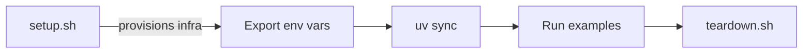

# Getting Started

Common prerequisites and setup instructions for all PySpark storage sub-projects.

## Prerequisites

### Java 11

!!! warning "Java is required"
    PySpark runs on the JVM. Java 11 (LTS) is the recommended version.

=== "macOS"
    ```bash
    brew install openjdk@11
    export JAVA_HOME="$(brew --prefix openjdk@11)"
    ```

=== "Ubuntu / Debian"
    ```bash
    sudo apt-get update && sudo apt-get install -y openjdk-11-jdk
    export JAVA_HOME=/usr/lib/jvm/java-11-openjdk-amd64
    ```

=== "Amazon Linux / RHEL"
    ```bash
    sudo yum install -y java-11-openjdk-devel
    export JAVA_HOME=/usr/lib/jvm/java-11-openjdk
    ```

Verify the installation:

```bash
java -version
```

### Python 3.11+

=== "pyenv"
    ```bash
    pyenv install 3.11
    pyenv local 3.11
    ```

=== "System"
    ```bash
    python3 --version  # should be 3.11+
    ```

### uv (Package Manager)

All sub-projects use [uv](https://docs.astral.sh/uv/) for dependency management.

```bash
curl -LsSf https://astral.sh/uv/install.sh | sh
```

### PySpark

Each sub-project declares PySpark as a dependency. Install with:

```bash
cd pyspark-<provider>
uv sync
```

## Environment Variables

Set these in every shell session before running PySpark scripts:

```bash
export PYSPARK_PYTHON=python3
export PYSPARK_DRIVER_PYTHON=python3
export SPARK_LOCAL_IP=127.0.0.1
```

## Infrastructure Tools

Depending on the storage provider, you will need additional tools:

| Provider | Tools Required |
|----------|---------------|
| AWS S3 | `terraform`, `aws` CLI |
| Azure Storage | `terraform`, `az` CLI |
| GCP Storage | `terraform`, `gcloud`, `gsutil` |
| HDFS | `docker` |
| LocalStack S3 | `docker`, `aws` CLI |
| MinIO | `docker` |

## Workflow

Every sub-project follows the same workflow:



1. **`./setup.sh`** — provisions infrastructure (Terraform or Docker Compose) and uploads sample data
2. **Export environment variables** — printed by `setup.sh` at the end
3. **`uv sync`** — installs Python dependencies
4. **Run examples** — `python src/<protocol>/<script>.py`
5. **`./teardown.sh`** — destroys infrastructure and cleans up

## Sample Data

All sub-projects use the same sample CSV:

```csv
id,name,department,salary
1,Alice,Engineering,95000
2,Bob,Marketing,72000
3,Charlie,Engineering,88000
4,Diana,Sales,67000
5,Eve,Marketing,71000
```

This dataset is small enough for local testing and demonstrates groupBy / aggregation patterns.
