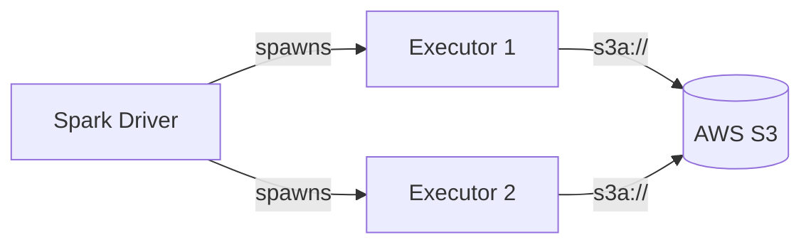

# AWS S3

PySpark examples for reading and writing data to **Amazon S3** using the `s3a://` protocol.

## Architecture



## Prerequisites

- Java 11
- PySpark 3.5.x
- AWS credentials (IAM user, role, or instance profile)
- Terraform (for infrastructure setup)
- AWS CLI

```bash
uv sync
```

## Infrastructure (Terraform)

This project includes Terraform configuration to provision:

- S3 bucket with versioning and SSE encryption
- IAM user with scoped S3 access policy
- Access key pair for the IAM user

### Provision

```bash
./setup.sh
```

### Teardown

```bash
./teardown.sh
```

### Terraform Resources

```hcl title="infra/main.tf (key resources)"
resource "aws_s3_bucket" "spark_demo" {
  bucket = "spark-demo-${random_id.bucket_suffix.hex}"
  tags   = { Project = "pyspark-storage", Environment = "dev" }
}

resource "aws_s3_bucket_server_side_encryption_configuration" "spark_demo" {
  bucket = aws_s3_bucket.spark_demo.id
  rule {
    apply_server_side_encryption_by_default { sse_algorithm = "AES256" }
  }
}

resource "aws_iam_user_policy" "spark_s3" {
  user   = aws_iam_user.spark.name
  policy = jsonencode({
    Statement = [{
      Effect   = "Allow"
      Action   = ["s3:GetObject", "s3:PutObject", "s3:ListBucket", "s3:DeleteObject"]
      Resource = [aws_s3_bucket.spark_demo.arn, "${aws_s3_bucket.spark_demo.arn}/*"]
    }]
  })
}
```

### Terraform Outputs

| Output | Description |
|--------|-------------|
| `bucket_name` | Name of the S3 bucket |
| `bucket_arn` | ARN of the S3 bucket |
| `access_key_id` | IAM access key ID for Spark |
| `secret_access_key` | IAM secret access key (sensitive) |

## Authentication Methods

### Simple Credentials (Spark Config)

=== "Spark Config"
    ```python title="src/s3a/read_s3_spark_config.py"
    --8<-- "pyspark-aws-s3/src/s3a/read_s3_spark_config.py"
    ```

=== "Hadoop Config"
    ```python title="src/s3a/read_s3_hadoop_config.py"
    --8<-- "pyspark-aws-s3/src/s3a/read_s3_hadoop_config.py"
    ```

### Environment Variables

```python title="src/s3a/authentication/spark_s3_env_auth.py"
--8<-- "pyspark-aws-s3/src/s3a/authentication/spark_s3_env_auth.py"
```

### Assumed Role (STS)

```python title="src/s3a/authentication/spark_s3_assumed_role.py"
--8<-- "pyspark-aws-s3/src/s3a/authentication/spark_s3_assumed_role.py"
```

### Temporary Credentials (Session Token)

```python title="src/s3a/authentication/spark_s3_session_token.py"
--8<-- "pyspark-aws-s3/src/s3a/authentication/spark_s3_session_token.py"
```

## Write Parquet Example

```python title="src/s3a/write_s3_parquet.py"
--8<-- "pyspark-aws-s3/src/s3a/write_s3_parquet.py"
```

## Run

```bash
# Set credentials (printed by setup.sh)
export AWS_ACCESS_KEY_ID=<your-key>
export AWS_SECRET_ACCESS_KEY=<your-secret>
export INPUT_PATH=s3a://<bucket>/input/sample.csv
export OUTPUT_PATH=s3a://<bucket>/output

# Spark config approach
python src/s3a/read_s3_spark_config.py

# Hadoop config approach
python src/s3a/read_s3_hadoop_config.py

# Write parquet
python src/s3a/write_s3_parquet.py
```

## Configuration Reference

| Property | Description | Example |
|----------|-------------|---------|
| `fs.s3a.endpoint` | S3 endpoint URL | `https://s3.amazonaws.com` |
| `fs.s3a.access.key` | AWS access key ID | `AKIA...` |
| `fs.s3a.secret.key` | AWS secret access key | `wJa...` |
| `fs.s3a.session.token` | STS session token | *(temporary creds)* |
| `fs.s3a.aws.credentials.provider` | Credential provider class | See table below |
| `fs.s3a.path.style.access` | Use path-style URLs | `false` (default) |
| `fs.s3a.impl` | FileSystem implementation | `o.a.h.fs.s3a.S3AFileSystem` |

## Credential Providers

| Class | Description |
|-------|-------------|
| `org.apache.hadoop.fs.s3a.SimpleAWSCredentialsProvider` | Static key/secret |
| `org.apache.hadoop.fs.s3a.TemporaryAWSCredentialsProvider` | Session credentials |
| `org.apache.hadoop.fs.s3a.auth.AssumedRoleCredentialProvider` | Assumed role |
| `com.amazonaws.auth.InstanceProfileCredentialsProvider` | EC2 metadata |
| `com.amazonaws.auth.EnvironmentVariableCredentialsProvider` | Environment variables |
| `com.amazonaws.auth.profile.ProfileCredentialsProvider` | Named profile |
| `org.apache.hadoop.fs.s3a.AnonymousAWSCredentialsProvider` | Anonymous (public buckets) |

## When to Use

!!! success "Good fit"
    - Production workloads on AWS
    - Data lake on S3
    - EMR / Glue integration
    - Cross-region data access

!!! failure "Not a good fit"
    - Local development without AWS account (use [LocalStack](../../localstack-s3/) instead)
    - Quick prototyping (use [MinIO](../../MinIO/) instead)

## EMR Note

!!! tip "EMR uses `s3://` natively"
    On EMR you can use the `s3://` scheme instead of `s3a://`. The EMRFS connector
    handles S3 access natively with consistent view and server-side encryption.
