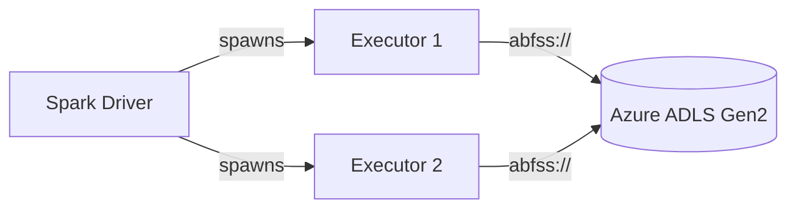

# Azure Storage

PySpark examples for reading and writing data to **Azure Blob Storage** and
**Azure Data Lake Storage Gen2** using the `abfss://` protocol.

## Architecture



## Prerequisites

- Java 11
- PySpark 3.5.x
- Azure storage account with access credentials
- Terraform (for infrastructure setup)
- Azure CLI (`az`)

```bash
uv sync
```

## Infrastructure (Terraform)

This project includes Terraform configuration to provision:

- Resource Group
- Storage Account with HNS enabled (ADLS Gen2)
- Blob container
- Azure AD Application + Service Principal
- Role assignment (Storage Blob Data Contributor)

### Provision

```bash
./setup.sh
```

### Teardown

```bash
./teardown.sh
```

### Terraform Resources

```hcl title="infra/main.tf (key resources)"
resource "azurerm_storage_account" "this" {
  name                     = replace(var.project_name, "-", "")
  resource_group_name      = azurerm_resource_group.this.name
  location                 = azurerm_resource_group.this.location
  account_tier             = "Standard"
  account_replication_type = "LRS"
  is_hns_enabled           = true  # ADLS Gen2
}

resource "azurerm_storage_container" "this" {
  name               = "spark-data"
  storage_account_id = azurerm_storage_account.this.id
}

resource "azurerm_role_assignment" "blob_contributor" {
  scope                = azurerm_storage_account.this.id
  role_definition_name = "Storage Blob Data Contributor"
  principal_id         = azuread_service_principal.this.object_id
}
```

### Terraform Outputs

| Output | Description |
|--------|-------------|
| `storage_account_name` | Name of the Storage Account |
| `storage_account_key` | Primary access key (sensitive) |
| `container_name` | Blob container name |
| `client_id` | Service Principal client ID |
| `client_secret` | Service Principal secret (sensitive) |
| `tenant_id` | Azure AD tenant ID |

## Protocols

| Protocol | Description |
|----------|-------------|
| `wasbs://` | Azure Blob Storage (legacy) |
| `abfs://` | Azure Data Lake Storage Gen2 (without TLS) |
| `abfss://` | Azure Data Lake Storage Gen2 (with TLS, **recommended**) |

## Path Format

```
abfss://<CONTAINER>@<ACCOUNT>.dfs.core.windows.net/<PATH>
```

## Authentication Methods

### Storage Account Key

```python title="src/abfss/read_abfss_account_key.py"
--8<-- "pyspark-azure-storage/src/abfss/read_abfss_account_key.py"
```

### Service Principal (OAuth 2.0)

```python title="src/abfss/authentication/spark_azure_service_principal.py"
--8<-- "pyspark-azure-storage/src/abfss/authentication/spark_azure_service_principal.py"
```

### SAS Token

```python title="src/abfss/authentication/spark_azure_sas_token.py"
--8<-- "pyspark-azure-storage/src/abfss/authentication/spark_azure_sas_token.py"
```

## Write Parquet Example

```python title="src/abfss/write_abfss_parquet.py"
--8<-- "pyspark-azure-storage/src/abfss/write_abfss_parquet.py"
```

## Run

```bash
# Set credentials (printed by setup.sh)
export AZURE_STORAGE_ACCOUNT=<account>
export AZURE_STORAGE_KEY=<key>
export AZURE_CONTAINER=spark-data

# Account key approach
python src/abfss/read_abfss_account_key.py

# Service principal (also set AZURE_CLIENT_ID, AZURE_CLIENT_SECRET, AZURE_TENANT_ID)
python src/abfss/authentication/spark_azure_service_principal.py

# Write parquet
python src/abfss/write_abfss_parquet.py
```

## Configuration Reference

| Property | Description | Example |
|----------|-------------|---------|
| `fs.azure.account.key.<ACCOUNT>.dfs.core.windows.net` | Storage account key | `Eby8v...` |
| `fs.azure.account.auth.type.<ACCOUNT>.dfs.core.windows.net` | Auth type | `OAuth` |
| `fs.azure.account.oauth.provider.type.*` | Token provider class | `ClientCredsTokenProvider` |
| `fs.azure.account.oauth2.client.id.*` | Service principal client ID | `<UUID>` |
| `fs.azure.account.oauth2.client.secret.*` | Service principal secret | `<secret>` |
| `fs.azure.account.oauth2.client.endpoint.*` | OAuth token endpoint | `https://login.microsoftonline.com/<TENANT>/oauth2/token` |
| `fs.azure.sas.token.provider.type.*` | SAS token provider | `FixedSASTokenProvider` |
| `fs.azure.sas.fixed.token.*` | SAS token value | `sv=2021-06-08&ss=...` |

## When to Use

!!! success "Good fit"
    - Production workloads on Azure
    - Data Lake on ADLS Gen2
    - Synapse / Databricks / HDInsight integration
    - Enterprise environments with Azure AD

!!! failure "Not a good fit"
    - Local development without Azure account
    - Quick prototyping (use [MinIO](../../MinIO/) or [LocalStack](../../localstack-s3/) instead)
