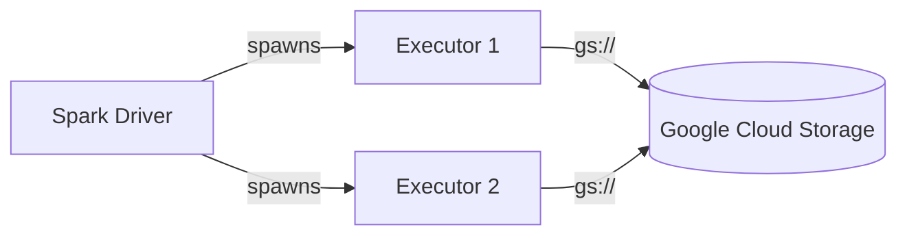

# Google Cloud Storage

PySpark examples for reading and writing data to **Google Cloud Storage (GCS)**
using the `gs://` protocol.

## Architecture



## Prerequisites

- Java 11
- PySpark 3.5.x
- GCP service account credentials (JSON key file)
- Terraform (for infrastructure setup)
- `gcloud` and `gsutil` CLIs

```bash
uv sync
```

## Infrastructure (Terraform)

This project includes Terraform configuration to provision:

- GCS bucket with uniform bucket-level access
- Service account with Storage Object Admin role
- Service account JSON key

### Provision

```bash
./setup.sh
```

### Teardown

```bash
./teardown.sh
```

### Terraform Resources

```hcl title="infra/main.tf (key resources)"
resource "google_storage_bucket" "spark_bucket" {
  name                        = var.bucket_name
  location                    = var.region
  uniform_bucket_level_access = true
  force_destroy               = true
}

resource "google_service_account" "spark_sa" {
  account_id   = "pyspark-gcs-sa"
  display_name = "PySpark GCS Service Account"
}

resource "google_project_iam_member" "spark_sa_storage_admin" {
  project = var.project_id
  role    = "roles/storage.objectAdmin"
  member  = "serviceAccount:${google_service_account.spark_sa.email}"
}

resource "google_service_account_key" "spark_sa_key" {
  service_account_id = google_service_account.spark_sa.name
}
```

### Terraform Outputs

| Output | Description |
|--------|-------------|
| `bucket_name` | Name of the GCS bucket |
| `service_account_email` | Email of the Spark service account |
| `service_account_key` | Base64-encoded service account JSON key (sensitive) |

## Path Format

```
gs://<BUCKET>/<PATH>
```

## Library

!!! note "GCS connector is not on Maven Central"
    Download from [GoogleCloudDataproc/hadoop-connectors](https://github.com/GoogleCloudDataproc/hadoop-connectors)
    and load via `spark.jars`:

    ```python
    .config("spark.jars", "/path/to/gcs-connector-hadoop3-latest.jar")
    ```

## Authentication Methods

### Service Account Key File

=== "Spark Config"
    ```python title="src/gs/read_gcs_service_account.py"
    --8<-- "pyspark-gcp-storage/src/gs/read_gcs_service_account.py"
    ```

=== "Hadoop Config"
    ```python title="src/gs/read_gcs_hadoop_config.py"
    --8<-- "pyspark-gcp-storage/src/gs/read_gcs_hadoop_config.py"
    ```

### Application Default Credentials (ADC)

First, authenticate locally:

```bash
gcloud auth application-default login
```

```python title="src/gs/authentication/spark_gcs_adc.py"
--8<-- "pyspark-gcp-storage/src/gs/authentication/spark_gcs_adc.py"
```

### Workload Identity (GKE)

!!! tip "Zero-config on GKE"
    No extra Spark config needed — credentials are provided by the GKE metadata
    server when the Kubernetes service account is annotated with the GCP service account.

## Write Parquet Example

```python title="src/gs/write_gcs_parquet.py"
--8<-- "pyspark-gcp-storage/src/gs/write_gcs_parquet.py"
```

## Run

```bash
# Set credentials (printed by setup.sh)
export GOOGLE_APPLICATION_CREDENTIALS="/path/to/sa-key.json"
export GCS_CONNECTOR_JAR="/path/to/gcs-connector-hadoop3-latest.jar"
export INPUT_PATH=gs://<bucket>/input/sample.csv
export OUTPUT_PATH=gs://<bucket>/output

# Service account approach
python src/gs/read_gcs_service_account.py

# Hadoop config approach
python src/gs/read_gcs_hadoop_config.py

# ADC approach
python src/gs/authentication/spark_gcs_adc.py

# Write parquet
python src/gs/write_gcs_parquet.py
```

## Configuration Reference

| Property | Description | Example |
|----------|-------------|---------|
| `fs.gs.impl` | FileSystem implementation | `com.google.cloud.hadoop.fs.gcs.GoogleHadoopFileSystem` |
| `google.cloud.auth.service.account.enable` | Enable service account auth | `true` |
| `google.cloud.auth.service.account.json.keyfile` | Path to JSON key file | `/path/to/key.json` |

## Environment Variables

| Variable | Description |
|----------|-------------|
| `GOOGLE_APPLICATION_CREDENTIALS` | Path to service account JSON keyfile |
| `GCS_CONNECTOR_JAR` | Path to the GCS connector JAR |
| `GCS_BUCKET` | Target GCS bucket name |

## When to Use

!!! success "Good fit"
    - Production workloads on GCP
    - Data lake on GCS
    - Dataproc / Vertex AI integration
    - BigQuery external tables over GCS

!!! failure "Not a good fit"
    - Local development without GCP account
    - Environments where Maven JARs are preferred over local JARs

## Dataproc Note

!!! tip "GCS connector is pre-installed on Dataproc"
    On Google Cloud Dataproc the GCS connector is pre-installed. No extra JARs or
    authentication config required — it uses the cluster's service account automatically.
