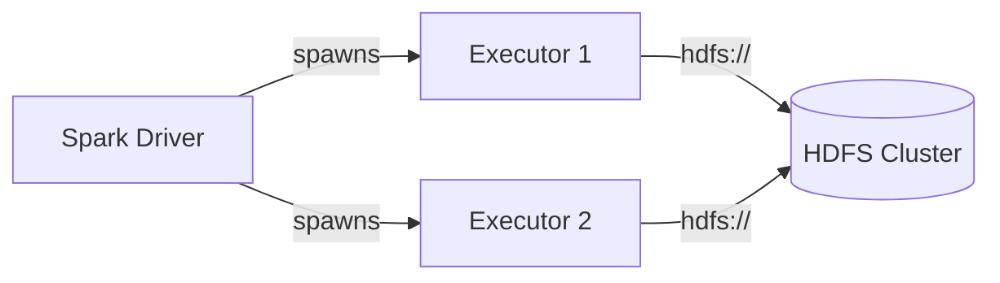
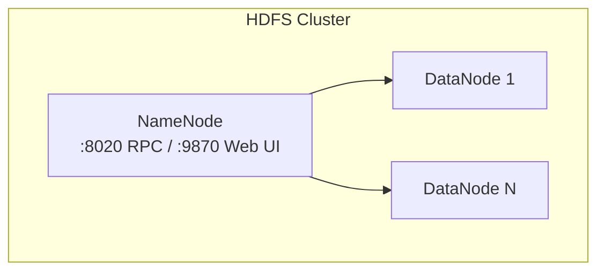

# HDFS

PySpark examples for reading and writing data to **Hadoop Distributed File System (HDFS)**
using the `hdfs://` protocol.

## Architecture





## Prerequisites

- Java 11
- PySpark 3.5.x
- Access to an HDFS cluster (or use the provided Docker Compose)
- Docker (for local development)

```bash
uv sync
```

## Infrastructure (Docker Compose)

This project includes two Docker Compose configurations:

- **`docker-compose.yml`** — single NameNode cluster (simple)
- **`docker-compose.ha.yml`** — HA cluster with 2 NameNodes + 3 JournalNodes

### Simple Cluster

```bash
./setup.sh
```

### HA Cluster

```bash
./setup.sh --ha
```

This provisions 3 JournalNodes, formats NameNode 1, bootstraps NameNode 2 as standby,
transitions NameNode 1 to active, starts a DataNode, and uploads sample data.

### Teardown

```bash
./teardown.sh        # simple cluster
./teardown.sh --ha   # HA cluster
```

### Simple Compose

```yaml title="docker-compose.yml"
--8<-- "pyspark-hdfs/docker-compose.yml"
```

### HA Compose

```yaml title="docker-compose.ha.yml"
--8<-- "pyspark-hdfs/docker-compose.ha.yml"
```

## Library

!!! tip "No extra JARs needed"
    HDFS support is bundled with Spark. Spark ships with `hadoop-client` which
    includes the HDFS connector.

## Path Formats

```
hdfs://<NAMENODE>:<PORT>/<PATH>     # single NameNode
hdfs://<NAMESERVICE>/<PATH>         # HA cluster
```

## Authentication Methods

### Simple (No Security)

Default mode — no extra config needed. HDFS uses the OS username of the Spark process.

### Kerberos

```bash
kinit -kt /path/to/keytab principal@REALM
```

```python
.config("spark.hadoop.hadoop.security.authentication", "kerberos")
.config("spark.hadoop.dfs.namenode.kerberos.principal", "nn/_HOST@REALM")
```

## Reading and Writing

### Single NameNode

```python title="src/hdfs/read_hdfs.py"
--8<-- "pyspark-hdfs/src/hdfs/read_hdfs.py"
```

### HA (High Availability) NameNode

```python title="src/hdfs/read_hdfs_ha.py"
--8<-- "pyspark-hdfs/src/hdfs/read_hdfs_ha.py"
```

## Write Parquet Example

```python title="src/hdfs/write_hdfs_parquet.py"
--8<-- "pyspark-hdfs/src/hdfs/write_hdfs_parquet.py"
```

## Run

### Simple Cluster

```bash
# Start single-node HDFS
./setup.sh

export HDFS_NAMENODE=localhost:8020
export INPUT_PATH=hdfs:///user/data/input/sample.csv
export OUTPUT_PATH=hdfs:///user/data/output

python src/hdfs/read_hdfs.py
python src/hdfs/write_hdfs_parquet.py
```

### HA Cluster

```bash
# Start HA HDFS (2 NameNodes + 3 JournalNodes)
./setup.sh --ha

export HDFS_NN1=localhost:8020
export HDFS_NN2=localhost:8021
export INPUT_PATH=hdfs://mycluster/user/data/input/sample.csv
export OUTPUT_PATH=hdfs://mycluster/user/data/output

python src/hdfs/read_hdfs_ha.py
python src/hdfs/write_hdfs_parquet.py
```

## Configuration Reference

| Property | Description | Example |
|----------|-------------|---------|
| `fs.defaultFS` | Default filesystem URI | `hdfs://namenode:8020` |
| `dfs.nameservices` | HA nameservice ID | `mycluster` |
| `dfs.ha.namenodes.<ns>` | HA NameNode IDs | `nn1,nn2` |
| `dfs.namenode.rpc-address.<ns>.<nn>` | NameNode RPC address | `namenode1:8020` |
| `dfs.client.failover.proxy.provider.<ns>` | HA failover class | `ConfiguredFailoverProxyProvider` |
| `hadoop.security.authentication` | Auth mechanism | `simple` or `kerberos` |
| `dfs.replication` | Block replication factor | `1` (dev), `3` (prod) |

## Environment Variables

| Variable | Description |
|----------|-------------|
| `HDFS_NAMENODE` | NameNode host:port (e.g. `namenode:8020`) |
| `HDFS_NN1` | HA NameNode 1 address |
| `HDFS_NN2` | HA NameNode 2 address |
| `KRB5_KTNAME` | Kerberos keytab path |

## When to Use

!!! success "Good fit"
    - On-premise Hadoop clusters
    - YARN-managed Spark jobs
    - Data co-located with compute (data locality)
    - High-throughput sequential I/O

!!! failure "Not a good fit"
    - Cloud-native workloads (use S3 / GCS / ADLS instead)
    - Small-scale development (overhead of running HDFS)
    - Serverless environments
