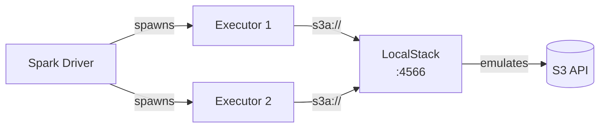

# LocalStack S3

PySpark examples for reading and writing data to **S3 via LocalStack** for local development
using the `s3a://` protocol.

## Architecture



## Overview

[LocalStack](https://localstack.cloud/) emulates AWS services locally. This sub-project
uses it to provide an S3-compatible endpoint for developing and testing PySpark jobs
without an AWS account.

## Prerequisites

- Java 11
- PySpark 3.5.x
- Docker
- AWS CLI (for bucket management)

```bash
uv sync
```

## Infrastructure (Docker Compose)

### Provision

```bash
./setup.sh
```

This script:

1. Starts LocalStack via Docker Compose
2. Waits for the health endpoint
3. Creates an `s3://spark-demo` bucket
4. Uploads `data/sample.csv` to the bucket

### Teardown

```bash
./teardown.sh
```

### Docker Compose

```yaml title="docker-compose.yml"
--8<-- "pyspark-local-s3/docker-compose.yml"
```

## Critical Configuration

!!! warning "Path-style access is required"
    LocalStack does not support virtual-hosted-style S3 URLs. You **must** set:

    ```python
    .config("spark.hadoop.fs.s3a.path.style.access", "true")
    ```

!!! note "Endpoint must point to LocalStack"
    ```python
    .config("spark.hadoop.fs.s3a.endpoint", "http://localhost:4566")
    ```

## Authentication Methods

LocalStack accepts any credentials. The examples use `test` / `test`:

=== "Spark Config"
    ```python title="src/s3a/read_s3_spark_config.py"
    --8<-- "pyspark-local-s3/src/s3a/read_s3_spark_config.py"
    ```

=== "Hadoop Config"
    ```python title="src/s3a/read_s3_hadoop_config.py"
    --8<-- "pyspark-local-s3/src/s3a/read_s3_hadoop_config.py"
    ```

## Write Parquet Example

```python title="src/s3a/write_s3_parquet.py"
--8<-- "pyspark-local-s3/src/s3a/write_s3_parquet.py"
```

## Run

```bash
# Set credentials
export AWS_ACCESS_KEY_ID=test
export AWS_SECRET_ACCESS_KEY=test
export AWS_DEFAULT_REGION=us-east-1

# Spark config approach
python src/s3a/read_s3_spark_config.py

# Hadoop config approach
python src/s3a/read_s3_hadoop_config.py

# Write parquet
export INPUT_PATH=s3a://spark-demo/input/sample.csv
export OUTPUT_PATH=s3a://spark-demo/output/dept_salary
python src/s3a/write_s3_parquet.py
```

## Manual Bucket Operations

```bash
# Set endpoint for all commands
export AWS_ENDPOINT_URL=http://localhost:4566

# Create bucket
aws --endpoint-url=http://localhost:4566 s3 mb s3://my-bucket

# Upload data
aws --endpoint-url=http://localhost:4566 s3 cp data.csv s3://my-bucket/

# List contents
aws --endpoint-url=http://localhost:4566 s3 ls s3://my-bucket/
```

## Configuration Reference

| Property | Description | Value |
|----------|-------------|-------|
| `fs.s3a.endpoint` | LocalStack endpoint | `http://localhost:4566` |
| `fs.s3a.access.key` | Access key | `test` |
| `fs.s3a.secret.key` | Secret key | `test` |
| `fs.s3a.path.style.access` | Path-style access | `true` (**required**) |
| `fs.s3a.impl` | FileSystem class | `o.a.h.fs.s3a.S3AFileSystem` |
| `fs.s3a.aws.credentials.provider` | Credential provider | `SimpleAWSCredentialsProvider` |

## When to Use

!!! success "Good fit"
    - Local development and testing without AWS
    - CI/CD pipelines
    - Prototyping S3 data pipelines
    - Learning the S3A connector

!!! failure "Not a good fit"
    - Production workloads (use [AWS S3](../../aws-s3/) instead)
    - Performance testing (LocalStack is not optimized for throughput)
    - Multi-service AWS integration testing
