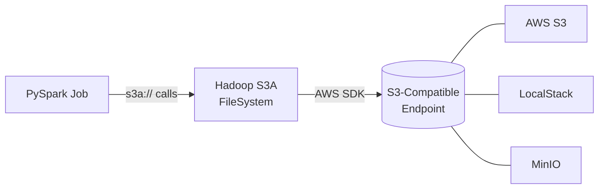

# S3A Connector Reference

The Hadoop S3A connector (`s3a://`) is the primary interface between Apache Spark and
Amazon S3-compatible storage. It is used for both AWS S3 and local emulators like
LocalStack and MinIO.

## How S3A Works



The S3A connector translates Hadoop FileSystem API calls into S3 REST API calls via the
AWS SDK. This makes it work with any endpoint that implements the S3 API.

## Required JARs

S3A depends on two JARs alongside `hadoop-common`:

| JAR | Description |
|-----|-------------|
| `hadoop-aws` | S3A FileSystem implementation |
| `aws-java-sdk-bundle` | AWS SDK (pulled transitively by `hadoop-aws`) |

!!! warning "Version alignment"
    The `hadoop-aws` version **must** match your `hadoop-common` version exactly.
    PySpark 3.5.x bundles Hadoop 3.3.4 — use `hadoop-aws:3.3.4`.

```python
.config("spark.jars.packages", "org.apache.hadoop:hadoop-aws:3.3.4")
```

## Authentication Properties

### Core Credentials

```xml
<property>
    <name>fs.s3a.access.key</name>
    <description>AWS access key ID.
     Omit for IAM role-based or provider-based authentication.</description>
</property>

<property>
    <name>fs.s3a.secret.key</name>
    <description>AWS secret key.
     Omit for IAM role-based or provider-based authentication.</description>
</property>

<property>
    <name>fs.s3a.session.token</name>
    <description>Session token, when using
     org.apache.hadoop.fs.s3a.TemporaryAWSCredentialsProvider
     as one of the providers.</description>
</property>
```

### Credential Provider Chain

The `fs.s3a.aws.credentials.provider` property accepts a comma-separated list of
credential provider classes implementing `com.amazonaws.auth.AWSCredentialsProvider`.

Each class must implement one of the following constructors (attempted in order):

1. A public constructor accepting `java.net.URI` and `org.apache.hadoop.conf.Configuration`
2. A public static `getInstance()` method returning an `AWSCredentialsProvider`
3. A public default constructor

!!! note "Default provider chain"
    If `fs.s3a.aws.credentials.provider` is not set, the following providers are
    queried in sequence:

    1. **SimpleAWSCredentialsProvider** — uses `fs.s3a.access.key` and `fs.s3a.secret.key`
    2. **EnvironmentVariableCredentialsProvider** — reads `AWS_ACCESS_KEY_ID` and
       `AWS_SECRET_ACCESS_KEY` from the environment
    3. **InstanceProfileCredentialsProvider** — uses EC2 instance metadata

### Environment Variable Authentication

```bash
export AWS_ACCESS_KEY_ID=my.aws.key
export AWS_SECRET_ACCESS_KEY=my.secret.key
```

!!! warning "Never hard-code credentials"
    Always use environment variables, IAM roles, managed identities, or a
    secrets manager. Hard-coded credentials in source code are a security risk.

## Credential Provider Classes

| Class | Description |
|-------|-------------|
| `o.a.h.fs.s3a.SimpleAWSCredentialsProvider` | Static key/secret from config |
| `o.a.h.fs.s3a.TemporaryAWSCredentialsProvider` | Session credentials (key + secret + token) |
| `o.a.h.fs.s3a.AnonymousAWSCredentialsProvider` | Anonymous access (public buckets only) |
| `o.a.h.fs.s3a.auth.AssumedRoleCredentialProvider` | STS assumed role |
| `c.a.auth.InstanceProfileCredentialsProvider` | EC2 instance metadata |
| `c.a.auth.EnvironmentVariableCredentialsProvider` | `AWS_ACCESS_KEY_ID` / `AWS_SECRET_ACCESS_KEY` |
| `c.a.auth.profile.ProfileCredentialsProvider` | Named profile from `~/.aws/credentials` |

!!! tip "Abbreviations"
    `o.a.h` = `org.apache.hadoop` · `c.a` = `com.amazonaws`

## S3 Access Points

[Access Points](https://docs.aws.amazon.com/AmazonS3/latest/userguide/access-points.html)
provide named network endpoints with dedicated access policies for S3 buckets.

### Configuring S3A with Access Points

Set the ARN on a per-bucket basis using `fs.s3a.bucket.{NAME}.accesspoint.arn`:

```xml
<property>
    <name>fs.s3a.bucket.finance.accesspoint.arn</name>
    <value>arn:aws:s3:eu-west-1:123456789012:accesspoint/finance</value>
    <description>Route S3A traffic through this Access Point</description>
</property>
```

### Enforcing Access Point Only Access

To require all S3A requests to go through an access point:

```xml
<property>
    <name>fs.s3a.accesspoint.required</name>
    <value>true</value>
</property>
```

## Configuration Reference

| Property | Description | Default |
|----------|-------------|---------|
| `fs.s3a.endpoint` | S3 endpoint URL | `https://s3.amazonaws.com` |
| `fs.s3a.access.key` | AWS access key ID | *(none)* |
| `fs.s3a.secret.key` | AWS secret access key | *(none)* |
| `fs.s3a.session.token` | STS session token | *(none)* |
| `fs.s3a.aws.credentials.provider` | Credential provider class(es) | Default chain (see above) |
| `fs.s3a.path.style.access` | Use path-style URLs | `false` |
| `fs.s3a.impl` | FileSystem implementation class | `o.a.h.fs.s3a.S3AFileSystem` |
| `fs.s3a.connection.ssl.enabled` | Enable HTTPS | `true` |
| `fs.s3a.attempts.maximum` | Max retry attempts | `20` |
| `fs.s3a.connection.timeout` | Connection timeout (ms) | `15000` |
| `fs.s3a.multipart.size` | Multipart upload part size | `64M` |

## When to Use S3A

!!! success "Good fit"
    - Any Spark job reading/writing to S3-compatible storage
    - Works across AWS S3, LocalStack, MinIO, and other S3-compatible services
    - Supported on all Spark deployment modes (local, YARN, K8s, EMR)

!!! failure "Not a good fit"
    - HDFS-only clusters with no S3 access (use `hdfs://` instead)
    - EMR with EMRFS — prefer the native `s3://` scheme for consistency and
      server-side encryption support

## Troubleshooting

??? failure "`No AWS profile named 'default'`"
    **Cause:** Using `ProfileCredentialsProvider` without a `~/.aws/credentials` file.

    **Fix:** Switch to `SimpleAWSCredentialsProvider` for LocalStack:

    ```python
    .config("spark.hadoop.fs.s3a.aws.credentials.provider",
            "org.apache.hadoop.fs.s3a.SimpleAWSCredentialsProvider")
    ```

??? failure "`java.lang.NoSuchMethodError` or `ClassNotFoundException` for AWS SDK classes"
    **Cause:** `hadoop-aws` version does not match the Hadoop version bundled with PySpark.

    **Fix:** Align `hadoop-aws` with your PySpark's Hadoop. PySpark 3.5.x uses Hadoop 3.3.4:

    ```python
    .config("spark.jars.packages", "org.apache.hadoop:hadoop-aws:3.3.4")
    ```

??? failure "`StatusCode=301` or `BucketNotFoundException` with LocalStack"
    **Cause:** Virtual-hosted-style URLs are not supported by LocalStack.

    **Fix:** Enable path-style access **and** set the endpoint:

    ```python
    .config("spark.hadoop.fs.s3a.endpoint", "http://localhost:4566")
    .config("spark.hadoop.fs.s3a.path.style.access", "true")
    ```

## Further Reading

- [Hadoop S3A Documentation](https://hadoop.apache.org/docs/current/hadoop-aws/tools/hadoop-aws/index.html)
- [LocalStack S3 usage](index.md) — using S3A with LocalStack for local development