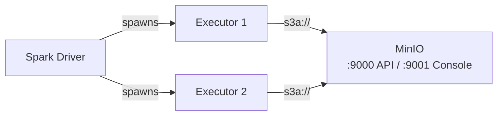

# MinIO

PySpark examples for reading and writing data to **MinIO**, an S3-compatible self-hosted
object storage, using the `s3a://` protocol.

## Architecture



## Overview

[MinIO](https://min.io/) is a high-performance, S3-compatible object storage system.
It uses the same `s3a://` connector as AWS S3, making it ideal for self-hosted
data lakes and on-premise deployments.

## Prerequisites

- Java 11
- PySpark 3.5.x
- Docker

```bash
uv sync
```

## Infrastructure (Docker Compose)

The Docker Compose setup includes:

- **MinIO server** — S3-compatible API on port `9000`, web console on `9001`
- **MinIO Client (mc) sidecar** — automatically creates a bucket and uploads sample data

### Provision

```bash
./setup.sh
```

### Teardown

```bash
./teardown.sh
```

### Docker Compose

```yaml title="docker-compose.yml"
--8<-- "pyspark-minio/docker-compose.yml"
```

## Critical Configuration

!!! warning "Path-style access is required"
    MinIO does not support virtual-hosted-style S3 URLs by default. You **must** set:

    ```python
    .config("spark.hadoop.fs.s3a.path.style.access", "true")
    ```

## Authentication Methods

MinIO uses access key / secret key — same as S3A Simple credentials.

=== "Spark Config"
    ```python title="src/s3a/read_minio_spark_config.py"
    --8<-- "pyspark-minio/src/s3a/read_minio_spark_config.py"
    ```

=== "Hadoop Config"
    ```python title="src/s3a/read_minio_hadoop_config.py"
    --8<-- "pyspark-minio/src/s3a/read_minio_hadoop_config.py"
    ```

## Write Parquet Example

```python title="src/s3a/write_minio_parquet.py"
--8<-- "pyspark-minio/src/s3a/write_minio_parquet.py"
```

## Run

```bash
# Set credentials
export MINIO_ENDPOINT=http://localhost:9000
export MINIO_ACCESS_KEY=minioadmin
export MINIO_SECRET_KEY=minioadmin
export INPUT_PATH=s3a://spark-demo/input/sample.csv
export OUTPUT_PATH=s3a://spark-demo/output/dept_salary

# Spark config approach
python src/s3a/read_minio_spark_config.py

# Hadoop config approach
python src/s3a/read_minio_hadoop_config.py

# Write parquet
python src/s3a/write_minio_parquet.py
```

## MinIO Client (mc) Operations

```bash
# Set up alias
mc alias set local http://localhost:9000 minioadmin minioadmin

# Create bucket
mc mb local/my-bucket

# Upload data
mc cp data.csv local/my-bucket/

# List contents
mc ls local/my-bucket/

# Access the web console
open http://localhost:9001
```

## Configuration Reference

| Property | Description | Value |
|----------|-------------|-------|
| `fs.s3a.endpoint` | MinIO endpoint | `http://localhost:9000` |
| `fs.s3a.access.key` | MinIO access key | `minioadmin` |
| `fs.s3a.secret.key` | MinIO secret key | `minioadmin` |
| `fs.s3a.path.style.access` | Path-style access | `true` (**required**) |
| `fs.s3a.impl` | FileSystem class | `o.a.h.fs.s3a.S3AFileSystem` |
| `fs.s3a.aws.credentials.provider` | Credential provider | `SimpleAWSCredentialsProvider` |

## Environment Variables

| Variable | Description | Default |
|----------|-------------|---------|
| `MINIO_ENDPOINT` | MinIO API endpoint | `http://localhost:9000` |
| `MINIO_ACCESS_KEY` | Root user access key | `minioadmin` |
| `MINIO_SECRET_KEY` | Root user secret key | `minioadmin` |

## When to Use

!!! success "Good fit"
    - Self-hosted / on-premise object storage
    - Kubernetes-native storage layer
    - Air-gapped environments
    - Development and testing (S3 API-compatible)
    - Multi-tenant storage with IAM policies

!!! failure "Not a good fit"
    - Managed cloud object storage (use [AWS S3](../../aws-s3/), [Azure](../../azure-storage/), or [GCP](../../gcp-storage/) instead)
    - Serverless environments
