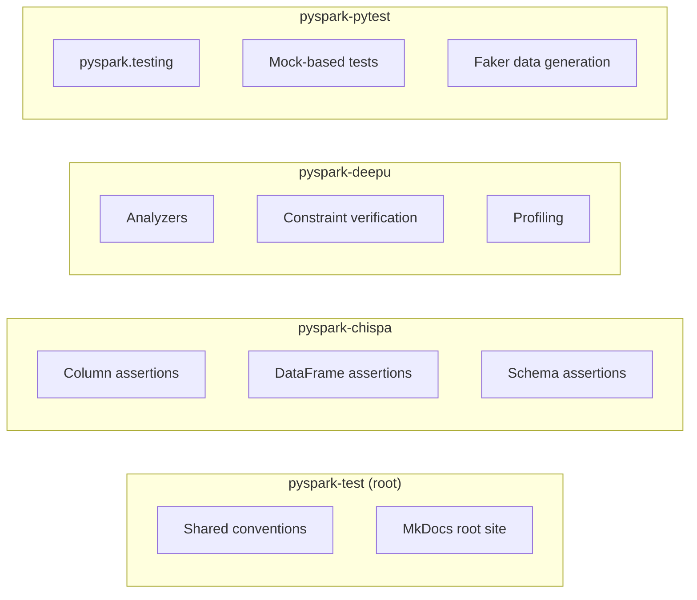

# Overview

## What Is This Repo?

This is a **mono-repo** containing multiple independent PySpark testing reference projects.
Each child project demonstrates a different testing approach and library, giving you
hands-on examples of how to test PySpark applications effectively.

## Architecture

## Project Comparison

| Feature | pyspark-chispa | pyspark-deepu | pyspark-pytest |
| --- | --- | --- | --- |
| **Assertion library** | chispa | PyDeequ | pyspark.testing |
| **Column equality** | ✅ `assert_column_equality` | — | — |
| **DataFrame equality** | ✅ `assert_df_equality` | — | ✅ `assertDataFrameEqual` |
| **Approx equality** | ✅ `assert_approx_df_equality` | — | — |
| **Schema comparison** | ✅ `assert_schema_equality` | — | — |
| **Data quality checks** | — | ✅ Constraint verification | — |
| **Data profiling** | — | ✅ Column profiling | — |
| **Mock testing** | — | — | ✅ `unittest.mock` |
| **Test data generation** | — | — | ✅ Faker |
| **Docker support** | — | — | ✅ Dockerfile |
| **MkDocs docs** | ✅ | ✅ | ✅ |

## When to Use What

!!! success "Use **pyspark-chispa** when"
    - You need detailed, colourful diff output on assertion failures
    - You want column-level and DataFrame-level equality checks
    - You need approximate float comparison with thresholds

!!! success "Use **pyspark-deepu** when"
    - You need automated data quality checks (completeness, uniqueness, etc.)
    - You want constraint suggestion based on data profiling
    - You work with data pipelines that need validation gates

!!! success "Use **pyspark-pytest** when"
    - You want PySpark's native testing utilities
    - You need mock-based testing for readers/writers
    - You want to generate realistic test data with Faker
