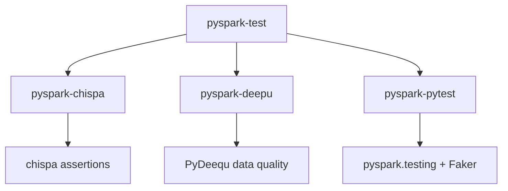

# PySpark Test

A **mono-repo of PySpark testing reference projects**, each demonstrating a different
approach to testing PySpark applications.



## Child Projects

| Project | Testing Library | Focus | Package Manager |
| --- | --- | --- | --- |
| [**pyspark-chispa**](pyspark-chispa/index.md) | pytest + chispa | DataFrame quality testing with rich error output | uv |
| [**pyspark-deepu**](pyspark-deepu/index.md) | pytest + PyDeequ | Data quality checks, profiling, constraint suggestions | uv |
| [**pyspark-pytest**](pyspark-pytest/index.md) | pytest + pyspark.testing | General testing patterns, mocking, Faker data generation | uv |

## Quick Start

Each child project is self-contained. Pick one and get started:

=== "pyspark-chispa"
    ```bash
    cd pyspark-chispa
    uv sync --group dev
    uv run task test
    ```

=== "pyspark-deepu"
    ```bash
    cd pyspark-deepu
    uv sync --group dev
    uv run task test
    ```

=== "pyspark-pytest"
    ```bash
    cd pyspark-pytest
    uv sync --group dev
    uv run task test
    ```

## Common Tech Stack

| Component | Version |
| --- | --- |
| Python | ≥ 3.11 |
| PySpark | 3.5.x |
| Package Manager | uv |
| Task Runner | taskipy |
| Linting | ruff |
| Type Checking | mypy |
| Documentation | MkDocs Material |

!!! tip "No cluster needed"
    All projects run locally with `local[2]` — no Spark cluster required.
