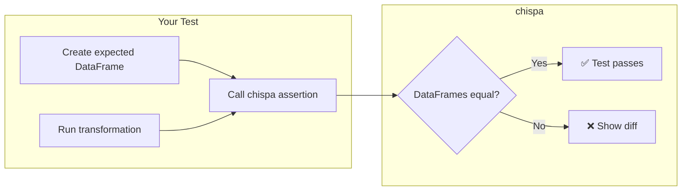
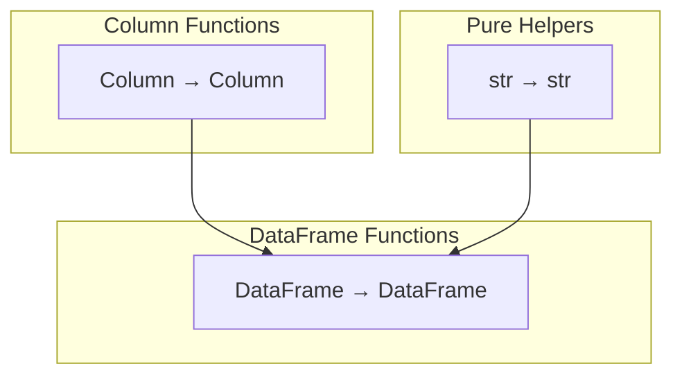

# Architecture

## How chispa Works with PySpark

chispa is a lightweight Python library that wraps PySpark's DataFrame and Column
objects to provide **clear, diff-style error messages** when test assertions fail.



## Source Module Design

The source code follows a **function-per-concern** pattern — each function takes
a PySpark `Column` or `DataFrame` and returns the same type:



### Column Functions (`columns/`, `functions/`)

Operate on individual columns. Composable via method chaining:

```python
from data_frame.columns.column_equality import (
    remove_non_word_characters,
    normalize_whitespace,
    title_case,
)

# Compose a cleaning pipeline
cleaned = title_case(normalize_whitespace(remove_non_word_characters(F.col("name"))))
df.withColumn("clean_name", cleaned)
```

### DataFrame Functions (`equality/`, `transformation/`)

Operate on entire DataFrames:

```python
from data_frame.transformation.df_transformations import deduplicate, filter_nulls

result = filter_nulls(deduplicate(df, subset=["id"], order_col="ts"), columns=["email"])
```

### Pure Helpers (`helper/`)

No Spark dependency — testable without a SparkSession:

```python
from data_frame.helper.string_helper import snake_case

assert snake_case("My Column.Name") == "my_column_name"
```

## Test Organisation

Tests mirror the source directory structure and use a shared `conftest.py`:

```
src/data_frame/columns/column_equality.py
    → tests/columns/test_column_equality.py

src/data_frame/helper/string_helper.py
    → tests/helper/test_string_helper.py
```

Each test file groups tests into classes by function:

```python
class TestRemoveNonWordCharacters:
    def test_removes_special_characters(self, spark): ...
    def test_preserves_digits(self, spark): ...
    def test_empty_string(self, spark): ...
```

## chispa Assertion Types

| Assertion | Use Case | Tolerance |
| --- | --- | --- |
| `assert_df_equality` | Exact structural + value match | None |
| `assert_approx_df_equality` | Floating point comparisons | Precision param |
| `assert_column_equality` | Compare two columns in same DataFrame | None |
| `assert_approx_column_equality` | Approximate column comparison | Precision param |
| `assert_schema_equality` | Schema structure match | None |
