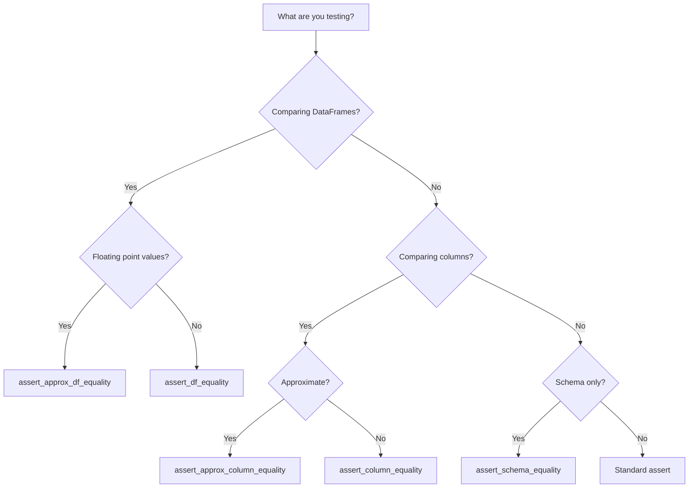

# Testing Best Practices

## Choosing the Right Assertion



## Pattern: Expected Column

Add an `expected` column to your test DataFrame, then compare with `actual`:

```python
def test_removes_special_characters(self, spark):
    data = [("jo&&se", "jose"), ("**li**", "li"), (None, None)]
    df = spark.createDataFrame(data, ["name", "expected"]).withColumn(
        "actual", remove_non_word_characters(F.col("name"))
    )
    assert_column_equality(df, "actual", "expected")
```

!!! tip "Why this pattern?"
    Keeping input, expected, and actual in one DataFrame makes test data
    self-documenting and easy to debug when shown in error output.

## Pattern: Full DataFrame Comparison

For transformation functions that return a new DataFrame:

```python
def test_ascending_sort(self, spark):
    source = spark.createDataFrame([("b", "a")], ["col2", "col1"])
    actual = sort_columns(source, "asc")
    expected = spark.createDataFrame([("a", "b")], ["col1", "col2"])
    assert_df_equality(actual, expected)
```

## Pattern: Error Assertion with Specific Exceptions

Use chispa's specific exception types, not broad `Exception`:

```python
# ✅ Good — specific exception
from chispa.dataframe_comparer import DataFramesNotEqualError

with pytest.raises(DataFramesNotEqualError):
    assert_approx_df_equality(df1, df2, 0.01)

# ✅ Good — specific exception
from chispa.schema_comparer import SchemasNotEqualError

with pytest.raises(SchemasNotEqualError):
    assert_schema_equality(schema1, schema2)

# ❌ Bad — too broad
with pytest.raises(Exception):
    assert_df_equality(df1, df2)
```

## Pattern: Pure Helper Testing (No Spark)

Helper functions in `helper/` don't need a SparkSession:

```python
class TestSnakeCase:
    def test_spaces(self):
        assert snake_case("Hello World") == "hello_world"

    def test_mixed(self):
        assert snake_case("My Column.Name-here") == "my_column_name_here"
```

!!! success "Fast tests"
    Pure helper tests run instantly — no SparkSession overhead.

## Edge Cases to Always Test

| Scenario | Why |
| --- | --- |
| `None` / `null` values | Spark nulls propagate differently than Python `None` |
| Empty strings `""` | Edge case for regex and string operations |
| Empty DataFrames | Schema should be preserved even with no rows |
| Single-row DataFrames | Window functions may behave differently |
| Special characters | Regex patterns may need escaping |

## Anti-Patterns

!!! failure "Don't: Create SparkSession in test files"
    Always use the shared `spark` fixture from `conftest.py`.

!!! failure "Don't: Use `assertEqual` for DataFrames"
    PySpark DataFrames don't support `==` comparison. Use chispa instead.

!!! failure "Don't: Assert on `df.collect()` for large tests"
    `collect()` brings all data to the driver. Use chispa assertions
    which compare DataFrames efficiently in Spark.

!!! failure "Don't: Use `assert_column_equality` across DataFrames"
    Both columns must be in the **same** DataFrame. Add the expected
    column to your test DataFrame first.
