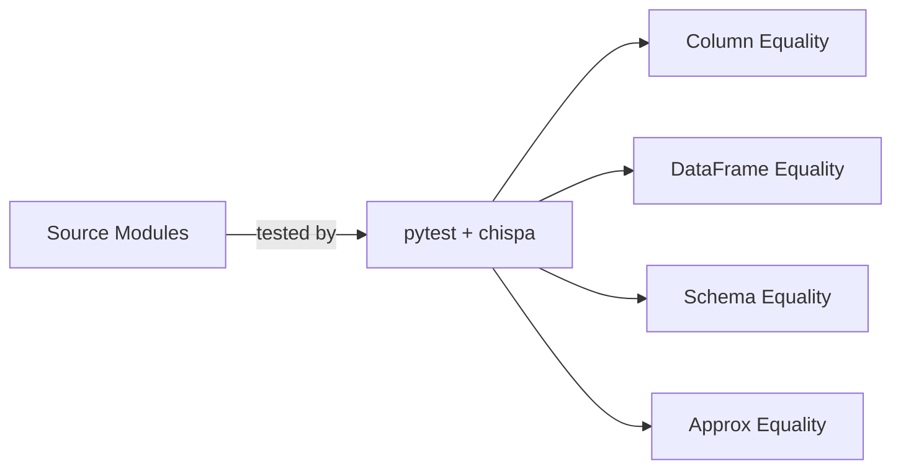

# PySpark Chispa

A **PySpark testing reference project** demonstrating DataFrame quality testing
with the [chispa](https://github.com/MrPowers/chispa) library and
[pytest](https://docs.pytest.org/).

## What You'll Find



| Module | Description |
| --- | --- |
| **columns** | Column-level string transformations |
| **functions** | Arithmetic and logic column functions |
| **equality** | DataFrame sorting and comparison utilities |
| **transformations** | Window functions, deduplication, filtering |
| **schema** | Schema inspection and conversion |
| **helpers** | Pure Python string utilities |

## Quick Start

```bash
# Install dependencies
uv sync --group dev

# Run all tests
uv run task test

# Run tests in parallel
uv run task test_parallel

# Lint, format check, type check, and test
uv run task check
```

## Tech Stack

| Component | Version |
| --- | --- |
| Python | ≥ 3.11 |
| PySpark | 3.5.x |
| chispa | ≥ 0.11 |
| pytest | latest |
| ruff | ≥ 0.11 |
| mypy | ≥ 1.15 |
| MkDocs Material | ≥ 9.7 |

!!! tip "No cluster needed"
    Everything runs locally with `local[2]` — no Spark cluster required.
