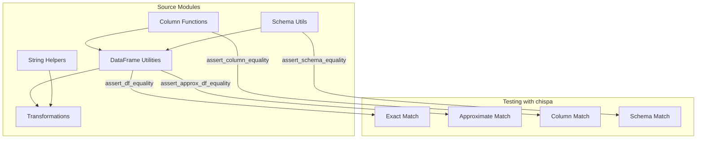

# PySpark Chispa

A **PySpark testing reference project** demonstrating DataFrame quality testing
with the [chispa](https://github.com/MrPowers/chispa) library and
[pytest](https://docs.pytest.org/).



## Why chispa?

!!! tip "Better error messages than assertEqual"
    chispa shows **exactly which rows differ** when assertions fail, making
    it much faster to debug test failures than PySpark's built-in assertions.

    ```
    DataFramesNotEqualError:

    +----+------+
    | id | name |
    +----+------+
    | 1  | Ali  |  ← actual
    | 1  | Alice|  ← expected
    +----+------+
    ```

## What You'll Find

| Module | Description | chispa Assertion |
| --- | --- | --- |
| **columns** | Column-level string transformations | `assert_column_equality` |
| **functions** | Arithmetic column functions (divide, clamp, %) | `assert_approx_column_equality` |
| **equality** | DataFrame sorting and comparison utilities | `assert_df_equality` |
| **transformations** | Window functions, dedup, filtering | `assert_df_equality` |
| **schema** | Schema inspection and conversion | `assert_schema_equality` |
| **helpers** | Pure Python string utilities (no Spark) | standard `assert` |

## Quick Start

```bash
# Install dependencies
uv sync --group dev

# Run all tests
uv run task test

# Run tests in parallel
uv run task test_parallel

# Full quality pipeline (lint + format + typecheck + security + test)
uv run task check

# Run examples
make examples
```

## Tech Stack

| Component | Version | Purpose |
| --- | --- | --- |
| Python | ≥ 3.11 | Runtime |
| PySpark | ≥ 3.5 | Distributed DataFrame processing |
| chispa | ≥ 0.12 | DataFrame & column equality assertions |
| pytest | ≥ 8.0 | Testing framework |
| pytest-xdist | ≥ 3.5 | Parallel test execution |
| ruff | ≥ 0.11 | Linting & formatting |
| mypy | ≥ 1.15 | Type checking |
| bandit | ≥ 1.8 | Security scanning |
| MkDocs Material | ≥ 9.7 | Documentation |

## Testing Approaches

This project demonstrates four chispa assertion types:

!!! success "Exact DataFrame Equality"
    `assert_df_equality(actual, expected)` — structural and value match.

!!! success "Approximate DataFrame Equality"
    `assert_approx_df_equality(actual, expected, 0.01)` — floating point tolerance.

!!! success "Column Equality"
    `assert_column_equality(df, "actual_col", "expected_col")` — compare two columns.

!!! success "Schema Equality"
    `assert_schema_equality(schema1, schema2)` — structural schema match.

!!! note "No cluster needed"
    Everything runs locally with `local[2]` — no Spark cluster required.
