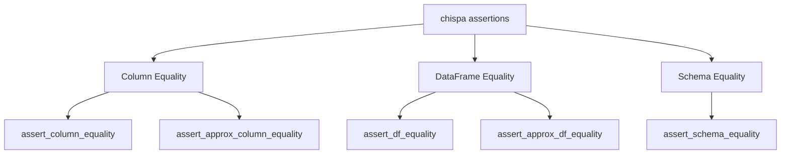

# Testing with Chispa — Overview

[chispa](https://github.com/MrPowers/chispa) is a PySpark test helper library
that provides rich, readable assertion functions for DataFrames, columns, and
schemas. It produces clear diff tables on failure, making debugging fast.

## Why Chispa?

!!! success "Good fit"
    - Rich error messages with side-by-side diff tables
    - Column-level, DataFrame-level, and schema-level assertions
    - Approximate equality for floating-point comparisons
    - Works with any PySpark version ≥ 3.x

!!! failure "What it doesn't do"
    - It does not replace pytest — it extends it
    - It does not manage SparkSession — you handle that in `conftest.py`
    - It does not test Spark performance or plans

## Assertion Types



| Assertion | Use Case |
| --- | --- |
| `assert_column_equality` | Compare two columns in the same DataFrame |
| `assert_approx_column_equality` | Floating-point column comparison with tolerance |
| `assert_df_equality` | Compare two entire DataFrames (schema + data) |
| `assert_approx_df_equality` | Approximate DataFrame comparison |
| `assert_schema_equality` | Compare two `StructType` schemas |

## Test Setup

All tests share a single `SparkSession` via `tests/conftest.py`:

```python title="tests/conftest.py"
--8<-- "tests/conftest.py"
```

!!! tip "Why `local[2]`?"
    Two threads expose concurrency bugs that `local[1]` would hide, while
    staying fast and deterministic.

## Test Pattern

Every test follows this pattern:

```python
class TestMyFunction:
    def test_happy_path(self, spark):
        # 1. Create input data
        data = [("input", "expected_output")]
        df = spark.createDataFrame(data, ["input_col", "expected_col"])

        # 2. Apply the function under test
        result = df.withColumn("actual", my_function(F.col("input_col")))

        # 3. Assert with chispa
        assert_column_equality(result, "actual", "expected_col")
```

## Edge Cases to Always Cover

| Case | Why |
| --- | --- |
| Null values | Verify null propagation |
| Empty strings | Distinct from null |
| Empty DataFrames | Zero rows with correct schema |
| Single row / column | Boundary conditions |
| Error paths | Invalid input → `pytest.raises` |

## Running Tests

```bash
uv run task test            # sequential, stop on first failure
uv run task test_parallel   # parallel via pytest-xdist
uv run task test_verbose    # verbose with full tracebacks
```
