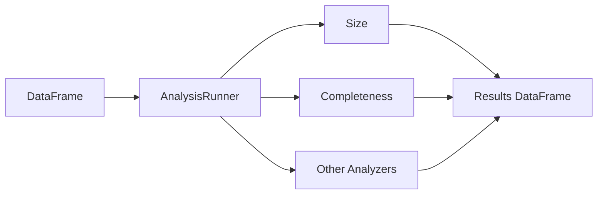

# Analyzers

The `AnalysisRunner` computes data quality metrics on a DataFrame. Each analyzer
measures a specific property of the data.

## Source

```python title="src/mertics/computations/analyzers/analyzers.py"
--8<-- "src/mertics/computations/analyzers/analyzers.py"
```

## How It Works



The `AnalysisRunner` accepts a DataFrame and one or more analyzers, runs them,
and returns a results object that can be converted to a DataFrame.

## Available Analyzers

| Analyzer | What it measures |
| --- | --- |
| `Size()` | Total number of rows |
| `Completeness("col")` | Fraction of non-null values in a column |
| `Mean("col")` | Average value of a numeric column |
| `ApproxCountDistinct("col")` | Approximate number of distinct values |

## Usage

```python
from pydeequ.analyzers import AnalysisRunner, AnalyzerContext, Size, Completeness

analysisResult = (
    AnalysisRunner(spark)
    .onData(df)
    .addAnalyzer(Size())
    .addAnalyzer(Completeness("column_name"))
    .run()
)

result_df = AnalyzerContext.successMetricsAsDataFrame(spark, analysisResult)
result_df.show()
```

## Example Output

| entity | instance | name | value |
| --- | --- | --- | --- |
| Dataset | * | Size | 3.0 |
| Column | b | Completeness | 1.0 |

## Run

```bash
uv run python src/mertics/computations/analyzers/analyzers.py
```
