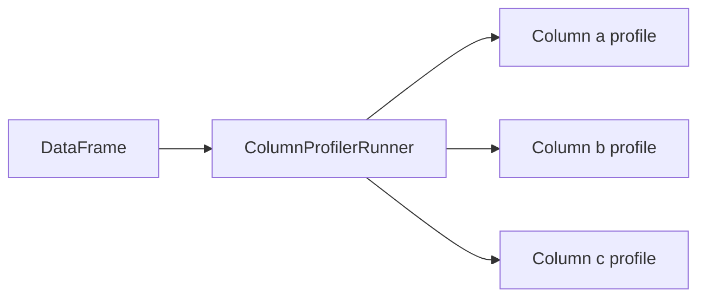

# Column Profiling

The `ColumnProfilerRunner` generates statistical profiles for each column
in a DataFrame — giving you a summary of data distribution, types, and
completeness.

## Source

```python title="src/mertics/computations/profiles/mertics_profile.py"
--8<-- "src/mertics/computations/profiles/mertics_profile.py"
```

## How It Works



## Usage

```python
from pydeequ.profiles import ColumnProfilerRunner

result = (
    ColumnProfilerRunner(spark)
    .onData(df)
    .run()
)

for col, profile in result.profiles.items():
    print(profile)
```

## Profile Output

Each column profile includes:

| Metric | Description |
| --- | --- |
| **completeness** | Fraction of non-null values |
| **approximateNumDistinctValues** | Approximate unique count |
| **dataType** | Detected data type |
| **isDataTypeInferred** | Whether type was inferred |
| **typeCounts** | Breakdown by detected types |
| **histogram** | Value distribution (for categorical) |

!!! tip "Data exploration"
    Column profiling is great for initial data exploration before writing
    formal constraints. Run it first to understand your data shape.

## Run

```bash
uv run python src/mertics/computations/profiles/mertics_profile.py
```
