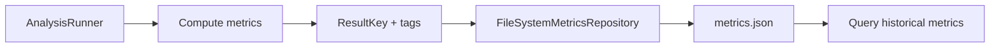

# Metrics Repository

The `FileSystemMetricsRepository` persists analysis results to a file,
enabling metric tracking over time.

## Source

```python title="src/mertics/repository/repository.py"
--8<-- "src/mertics/repository/repository.py"
```

## How It Works



## Usage

### Save metrics

```python
from pydeequ.repository import FileSystemMetricsRepository, ResultKey
from pydeequ.analyzers import AnalysisRunner, ApproxCountDistinct

metrics_file = FileSystemMetricsRepository.helper_metrics_file(spark, 'metrics.json')
repository = FileSystemMetricsRepository(spark, metrics_file)

key_tags = {'tag': 'my pipeline run'}
resultKey = ResultKey(spark, ResultKey.current_milli_time(), key_tags)

analysisResult = (
    AnalysisRunner(spark)
    .onData(df)
    .addAnalyzer(ApproxCountDistinct('column_name'))
    .useRepository(repository)
    .saveOrAppendResult(resultKey)
    .run()
)
```

### Query historical metrics

```python
result_df = (
    repository.load()
    .before(ResultKey.current_milli_time())
    .forAnalyzers([ApproxCountDistinct('column_name')])
    .getSuccessMetricsAsDataFrame()
)
result_df.show()
```

## Use Cases

!!! success "Good fit"
    - Tracking data quality trends across pipeline runs
    - Alerting when metrics deviate from historical baselines
    - Auditing data quality over time

!!! warning "Note"
    Remember to call `spark.sparkContext._gateway.shutdown_callback_server()`
    before `spark.stop()` when using the metrics repository to ensure clean
    shutdown of the Py4J gateway.

## Run

```bash
uv run python src/mertics/repository/repository.py
```
