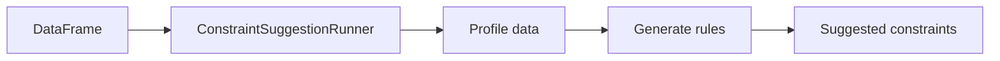

# Constraint Suggestions

The `ConstraintSuggestionRunner` automatically profiles your data and suggests
constraints based on observed patterns.

## Source

```python title="src/constraints/suggestions/constraint_suggestions.py"
--8<-- "src/constraints/suggestions/constraint_suggestions.py"
```

## How It Works



PyDeequ inspects column distributions, null patterns, and value ranges to
propose constraints that match your actual data.

## Usage

```python
from pydeequ.suggestions import ConstraintSuggestionRunner, DEFAULT

suggestionResult = (
    ConstraintSuggestionRunner(spark)
    .onData(df)
    .addConstraintRule(DEFAULT())
    .run()
)

print(suggestionResult)
```

## Example Output

The result is a JSON structure containing suggested constraints:

```json
{
  "constraint_suggestions": [
    {
      "constraint_name": "CompletenessConstraint",
      "column_name": "b",
      "description": "'b' is not null"
    },
    {
      "constraint_name": "UniquenessConstraint",
      "column_name": "a",
      "description": "'a' has unique values"
    }
  ]
}
```

!!! tip "Bootstrap your checks"
    Use suggestions as a starting point, then refine the constraints
    for your specific data quality requirements.

## Run

```bash
uv run python src/constraints/suggestions/constraint_suggestions.py
```
