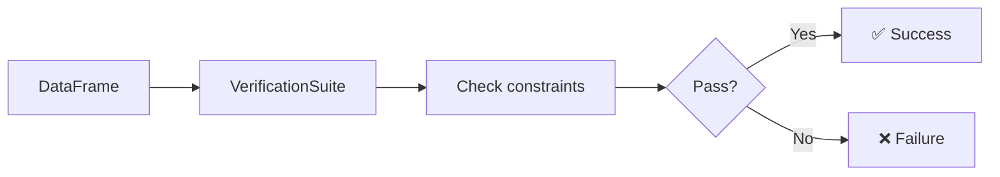

# Constraint Verification

The `VerificationSuite` validates a DataFrame against a set of constraints
defined using `Check`. Each constraint produces a pass/fail result.

## Source

```python title="src/constraints/verifications/constraint_verification.py"
--8<-- "src/constraints/verifications/constraint_verification.py"
```

## How It Works



## Available Check Methods

| Method | What it checks |
| --- | --- |
| `.hasSize(lambda x: x >= n)` | Row count meets condition |
| `.hasMin("col", lambda x: x == v)` | Minimum value of column |
| `.isComplete("col")` | No null values in column |
| `.isUnique("col")` | All values are distinct |
| `.isContainedIn("col", [...])` | All values in allowed set |
| `.isNonNegative("col")` | No negative values |

## Usage

```python
from pydeequ.checks import Check, CheckLevel
from pydeequ.verification import VerificationSuite, VerificationResult

check = Check(spark, CheckLevel.Warning, "My Check")

checkResult = (
    VerificationSuite(spark)
    .onData(df)
    .addCheck(
        check.hasSize(lambda x: x >= 3)
        .isComplete("column_name")
        .isUnique("id_column")
    )
    .run()
)

result_df = VerificationResult.checkResultsAsDataFrame(spark, checkResult)
result_df.show()
```

## Check Levels

| Level | Behaviour |
| --- | --- |
| `CheckLevel.Warning` | Log failures but don't stop |
| `CheckLevel.Error` | Treat failures as errors |

## Run

```bash
uv run python src/constraints/verifications/constraint_verification.py
```
