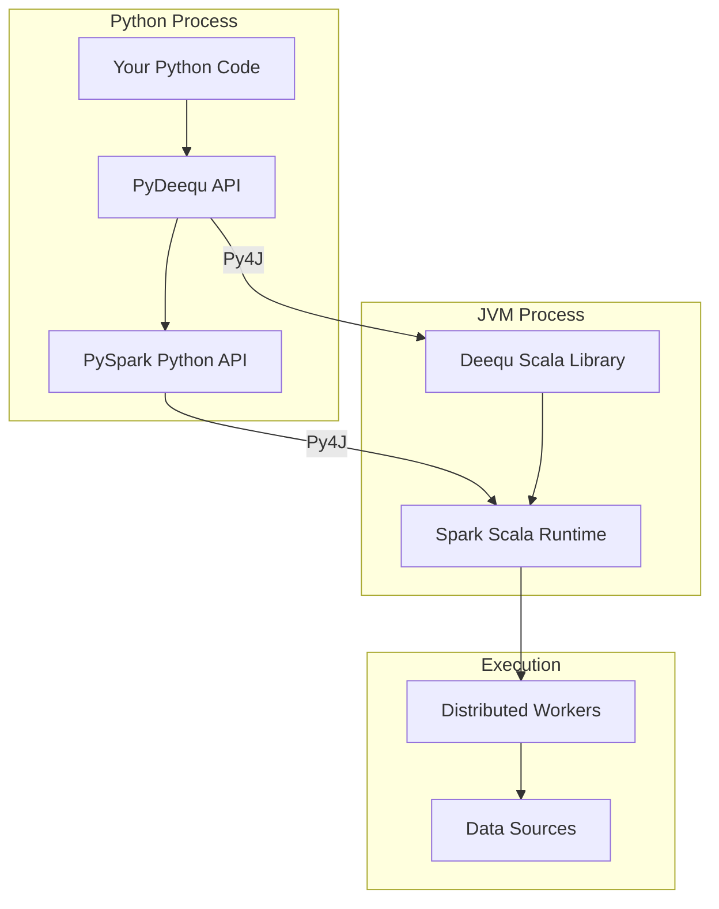
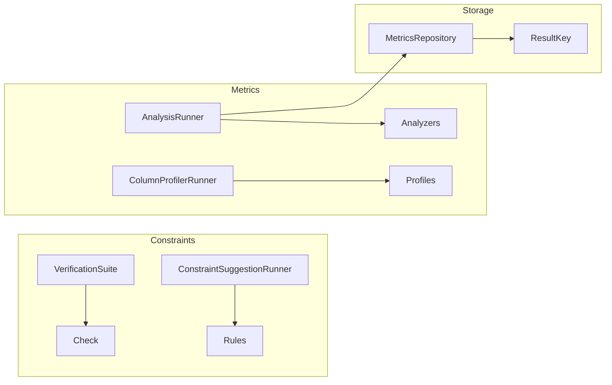
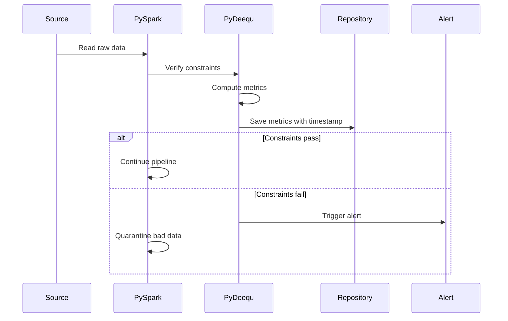

# Architecture

## PySpark + PyDeequ Stack

PyDeequ is a thin Python wrapper over the **Deequ** Scala library. It communicates
with the JVM via Py4J (the same bridge PySpark uses).



## Key Concepts

### DataFrame as Input

Every PyDeequ operation starts with a PySpark DataFrame. PyDeequ doesn't
read data directly — it operates on whatever DataFrame you provide:

```python
df = spark.read.parquet("s3://bucket/data/")

# All PyDeequ operations take `df` as input
AnalysisRunner(spark).onData(df).addAnalyzer(Size()).run()
VerificationSuite(spark).onData(df).addCheck(check).run()
ColumnProfilerRunner(spark).onData(df).run()
```

### Lazy Evaluation

Like PySpark transformations, PyDeequ builds an execution plan. Metrics are
only computed when `.run()` is called:

```python
runner = (
    AnalysisRunner(spark)
    .onData(df)
    .addAnalyzer(Size())           # ← No computation yet
    .addAnalyzer(Completeness("a"))  # ← Still just building the plan
)

result = runner.run()  # ← NOW metrics are computed
```

### Results as DataFrames

PyDeequ returns results as PySpark DataFrames, making them easy to query,
filter, and persist:

```python
result_df = AnalyzerContext.successMetricsAsDataFrame(spark, result)
# Standard DataFrame operations work:
result_df.filter(F.col("name") == "Size").show()
```

## Module Architecture



| Component | Input | Output | Purpose |
| --- | --- | --- | --- |
| `VerificationSuite` | DataFrame + Checks | Pass/Fail per constraint | Validate data quality rules |
| `ConstraintSuggestionRunner` | DataFrame | Suggested constraints | Discover rules from data |
| `AnalysisRunner` | DataFrame + Analyzers | Metric values | Compute data statistics |
| `ColumnProfilerRunner` | DataFrame | Column profiles | Full statistical summary |
| `FileSystemMetricsRepository` | Metrics + ResultKey | Persisted JSON | Track metrics over time |

## Data Flow in a Production Pipeline



## SPARK_VERSION Environment Variable

!!! warning "Critical: Set before import"
    PyDeequ reads `SPARK_VERSION` at **import time** to determine which
    Deequ JAR version to use. It must be set before `import pydeequ`:

    ```python
    import os
    os.environ["SPARK_VERSION"] = "3.5"

    import pydeequ  # Now uses Deequ 2.x JAR for Spark 3.5
    ```

| SPARK_VERSION | Deequ JAR | Spark Compatibility |
| --- | --- | --- |
| `"3.5"` | deequ-2.0.7-spark-3.5 | Spark 3.5.x |
| `"3.4"` | deequ-2.0.4-spark-3.4 | Spark 3.4.x |
| `"3.3"` | deequ-2.0.3-spark-3.3 | Spark 3.3.x |
