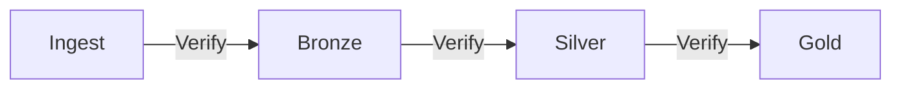

# Data Quality Best Practices

## Design Principles

### 1. Validate Early, Validate Often

!!! tip "Shift Left"
    Run data quality checks as close to the data source as possible.
    Catching issues early prevents downstream corruption.



### 2. Start with Suggestions, Then Customize

Use `ConstraintSuggestionRunner` to bootstrap your constraints, then refine:

```python
# Step 1: Auto-discover constraints
suggestions = ConstraintSuggestionRunner(spark).onData(df).addConstraintRule(DEFAULT()).run()

# Step 2: Review and customize
check = (
    Check(spark, CheckLevel.Error, "production-check")
    .isComplete("user_id")          # From suggestion
    .isUnique("user_id")            # From suggestion
    .hasSize(lambda x: x >= 1000)   # Added manually — business rule
)
```

### 3. Use Appropriate Check Levels

| Level | When to Use | Pipeline Behaviour |
| --- | --- | --- |
| `CheckLevel.Error` | Critical constraints that must never fail | Stop pipeline, alert team |
| `CheckLevel.Warning` | Important but non-blocking checks | Log warning, continue |

```python
# Critical: data must have rows
critical = Check(spark, CheckLevel.Error, "critical-checks")
critical.hasSize(lambda x: x > 0).isComplete("primary_key")

# Advisory: ideally true but not a blocker
advisory = Check(spark, CheckLevel.Warning, "advisory-checks")
advisory.hasCompleteness("optional_field", lambda x: x >= 0.9)
```

### 4. Track Metrics Over Time

```python
from pydeequ.repository import FileSystemMetricsRepository, ResultKey

repository = FileSystemMetricsRepository(spark, metrics_path)
result_key = ResultKey(spark, ResultKey.current_milli_time(), {"pipeline": "daily_etl"})

AnalysisRunner(spark).onData(df) \
    .addAnalyzer(Size()) \
    .addAnalyzer(Completeness("email")) \
    .useRepository(repository) \
    .saveOrAppendResult(result_key) \
    .run()
```

!!! success "Trend Detection"
    Compare today's metrics against historical baselines to detect anomalies
    like sudden drops in completeness or unexpected row count changes.

## Common Patterns

### Pattern: Gate Keeper

Block bad data from proceeding to the next pipeline stage:

```python
result = VerificationSuite(spark).onData(df).addCheck(check).run()
result_df = VerificationResult.checkResultsAsDataFrame(spark, result)

failures = result_df.filter(F.col("constraint_status") == "Failure")
if failures.count() > 0:
    failures.show(truncate=False)
    raise RuntimeError("Data quality check failed — pipeline halted")
```

### Pattern: Quarantine

Separate good and bad records:

```python
# Identify rows that violate constraints
bad_rows = df.filter(F.col("email").isNull() | (F.col("age") < 0))
good_rows = df.subtract(bad_rows)

# Write separately
good_rows.write.parquet("s3://data/silver/users/")
bad_rows.write.parquet("s3://data/quarantine/users/")
```

### Pattern: Metric Alerting

```python
result_df = AnalyzerContext.successMetricsAsDataFrame(spark, analysis_result)

completeness = result_df.filter(
    (F.col("name") == "Completeness") & (F.col("instance") == "email")
).first()["value"]

if completeness < 0.95:
    send_alert(f"Email completeness dropped to {completeness:.2%}")
```

## Anti-Patterns

!!! failure "Don't: Validate after writing"
    Running quality checks after data is already written to production
    means corrupted data is already visible to consumers.

!!! failure "Don't: Over-constrain"
    Adding too many constraints creates alert fatigue. Focus on constraints
    that represent actual business rules or data contracts.

!!! failure "Don't: Ignore Warning results"
    Warnings indicate drift. Track them and promote to errors when patterns
    are confirmed.

## Recommended Constraint Set

For any new table or dataset, start with these:

| Constraint | Why |
| --- | --- |
| `hasSize(lambda x: x > 0)` | Empty data = broken pipeline |
| `isComplete("primary_key")` | PKs must never be null |
| `isUnique("primary_key")` | PKs must be unique |
| `isComplete("created_at")` | Timestamps for auditability |
| `isContainedIn("status", [...])` | Enums should be validated |
| `isNonNegative("amount")` | Business logic sanity check |
