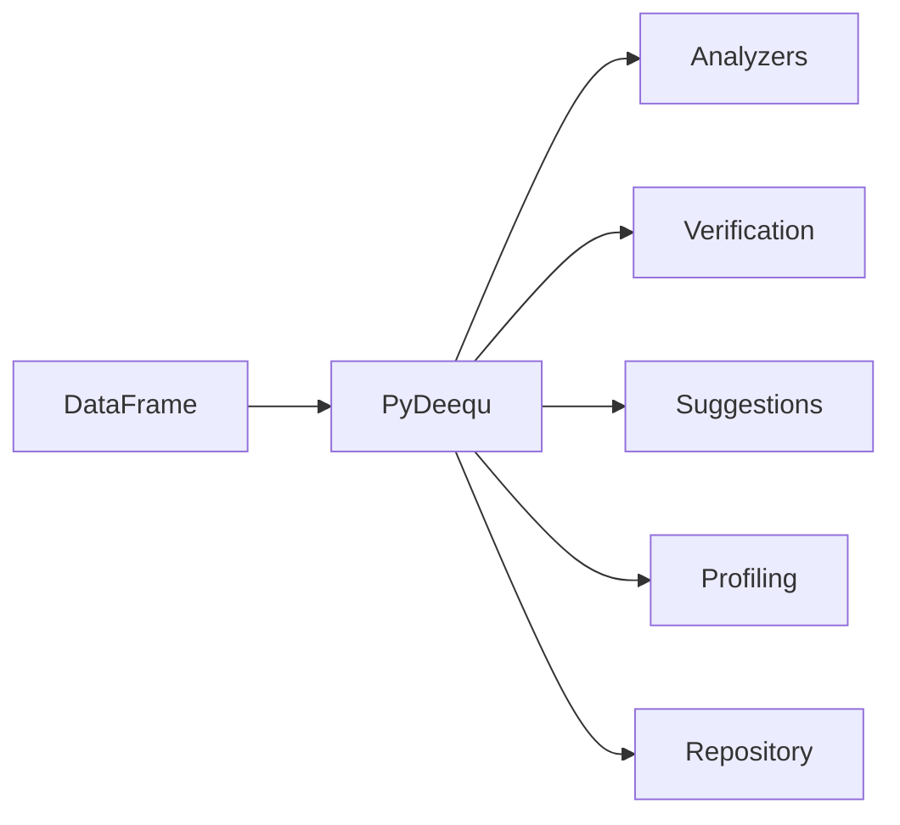

# PySpark PyDeequ

A **PySpark data quality reference project** demonstrating the
[PyDeequ](https://github.com/awslabs/python-deequ) library — the Python wrapper
for AWS Deequ.



## What You'll Find

| Module | Description |
| --- | --- |
| **Analyzers** | Compute metrics like size, completeness, and mean |
| **Verification** | Validate DataFrames against defined constraints |
| **Suggestions** | Auto-suggest constraints from data patterns |
| **Profiling** | Profile columns for data distribution analysis |
| **Repository** | Persist and query metrics over time |

## Quick Start

```bash
# Install dependencies
uv sync --group dev

# Run all tests
uv run task test

# Lint, format check, and test
uv run task check
```

## Tech Stack

| Component | Version |
| --- | --- |
| Python | ≥ 3.11 |
| PySpark | 3.5.x |
| PyDeequ | ≥ 1.0.1 |
| pytest | ≥ 8.0 |
| ruff | ≥ 0.11 |
| mypy | ≥ 1.15 |
| MkDocs Material | ≥ 9.7 |

!!! note "Maven JAR"
    PyDeequ automatically downloads the Deequ JAR via `spark.jars.packages`
    when the SparkSession is created. No manual JAR installation needed.
