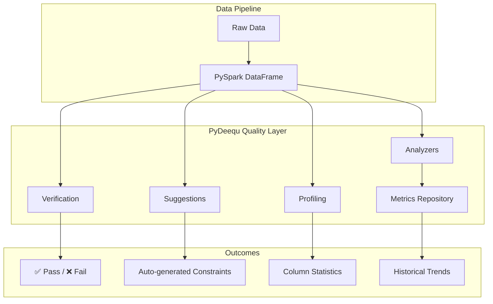

# PySpark PyDeequ

A **PySpark data quality reference project** demonstrating the
[PyDeequ](https://github.com/awslabs/python-deequ) library — the Python wrapper
for [AWS Deequ](https://github.com/awslabs/deequ), a data quality framework built on Apache Spark.



## Why PyDeequ?

!!! success "Data Quality at Scale"
    PyDeequ leverages Spark's distributed processing to validate **billions of rows**
    with the same constraints you'd apply to a small dataset. No sampling required.

| Feature | What It Solves |
| --- | --- |
| **Constraint Verification** | "Does my data meet these rules?" |
| **Constraint Suggestions** | "What rules should I apply?" |
| **Analyzers** | "What are the metrics of my data?" |
| **Column Profiling** | "What does my data look like?" |
| **Metrics Repository** | "How has quality changed over time?" |

## How PySpark and PyDeequ Work Together

```python
import os
os.environ["SPARK_VERSION"] = "3.5"  # (1)!

import pydeequ
from pyspark.sql import SparkSession

spark = (
    SparkSession.builder
    .appName("data-quality")
    .master(os.environ.get("SPARK_MASTER", "local[*]"))
    .config("spark.jars.packages", pydeequ.deequ_maven_coord)  # (2)!
    .config("spark.jars.excludes", pydeequ.f2j_maven_coord)  # (3)!
    .getOrCreate()
)
```

1. Must be set **before** importing pydeequ — it selects the correct Deequ JAR version.
2. Downloads the Deequ Scala library from Maven Central automatically.
3. Excludes `f2j` to avoid classpath conflicts with Spark's bundled libraries.

## Quick Start

```bash
# Install dependencies
uv sync --group dev

# Run all tests
uv run task test

# Full quality pipeline (lint + format + typecheck + security + test)
uv run task check
```

## Tech Stack

| Component | Version | Purpose |
| --- | --- | --- |
| Python | ≥ 3.11 | Runtime |
| PySpark | ≥ 3.5 | Distributed DataFrame processing |
| PyDeequ | ≥ 1.0.1 | Data quality constraints & metrics |
| Deequ JAR | 2.0.7 | Underlying Scala library (auto-downloaded) |
| pytest | ≥ 8.0 | Testing framework |
| ruff | ≥ 0.11 | Linting & formatting |
| mypy | ≥ 1.15 | Type checking |
| bandit | ≥ 1.8 | Security scanning |
| MkDocs Material | ≥ 9.7 | Documentation |

## Project Modules

| Module | PyDeequ Feature | Description |
| --- | --- | --- |
| `constraints/verifications/` | `VerificationSuite` | Define and run constraint checks |
| `constraints/suggestions/` | `ConstraintSuggestionRunner` | Auto-discover constraints |
| `mertics/computations/analyzers/` | `AnalysisRunner` | Compute data metrics |
| `mertics/computations/profiles/` | `ColumnProfilerRunner` | Statistical column profiles |
| `mertics/repository/` | `FileSystemMetricsRepository` | Persist metrics over time |

!!! note "Maven JAR Download"
    PyDeequ downloads the Deequ JAR from Maven Central on the **first run**.
    Subsequent runs use the cached JAR. Ensure internet access for the initial setup.
