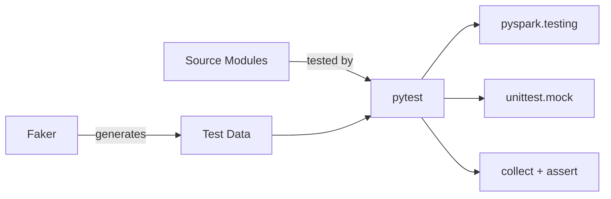

# PySpark Pytest

A **PySpark testing reference project** demonstrating general testing patterns
using pytest and PySpark's built-in testing utilities.



## What You'll Find

| Module | Description |
| --- | --- |
| **data_processing** | Transaction classification pipeline |
| **reader** | CSV reader utility |
| **transformation** | DataFrame text transformations |
| **utility** | Faker-based test data generators |

## Quick Start

```bash
# Install dependencies
uv sync --group dev

# Run all tests
uv run task test

# Lint, format check, and test
uv run task check
```

## Tech Stack

| Component | Version |
| --- | --- |
| Python | ≥ 3.11 |
| PySpark | ≥ 3.5.0 |
| Faker | ≥ 25.8.0 |
| pandas | ≥ 2.2.2 |
| pyarrow | ≥ 16.1.0 |
| pytest | ≥ 8.0 |
| ruff | ≥ 0.11 |
| MkDocs Material | ≥ 9.7 |

## Testing Approaches

This project demonstrates three complementary testing patterns:

!!! success "PySpark Native Assertions"
    Use `assertDataFrameEqual` for structural equality checks.

!!! success "Mock-Based Testing"
    Use `unittest.mock` to test reader/writer functions without real files.

!!! success "Faker Data Generation"
    Generate realistic test data with [Faker](https://faker.readthedocs.io/).
