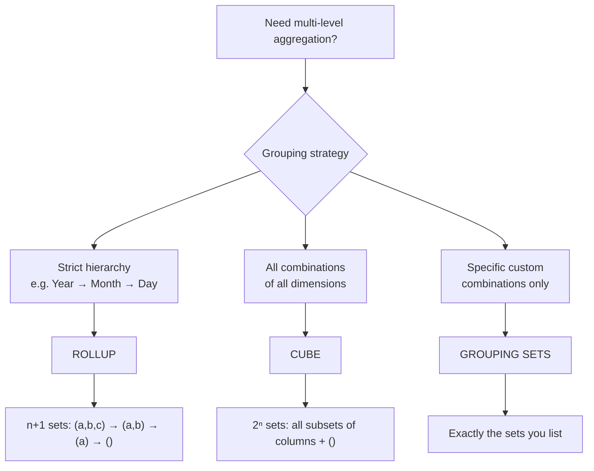

# CUBE

`CUBE` extends `GROUP BY` to generate aggregate rows for **every possible combination** of the specified grouping columns, including all sub-totals and one grand total.

---

## �� Syntax

```sql
SELECT col1 [, col2, ...], agg_func(expr) [AS alias]
FROM   table_name
GROUP BY CUBE (col1 [, col2, ...]);
```

For `n` columns, `CUBE` produces **2ⁿ** grouping sets:

| Columns | Grouping sets generated |
|---------|------------------------|
| `(a)` | `(a)`, `()` → 2 sets |
| `(a, b)` | `(a, b)`, `(a)`, `(b)`, `()` → 4 sets |
| `(a, b, c)` | `(a,b,c)`, `(a,b)`, `(a,c)`, `(b,c)`, `(a)`, `(b)`, `(c)`, `()` → 8 sets |

`CUBE(a, b, c)` is equivalent to:

```sql
GROUPING SETS (
    (a, b, c), (a, b), (a, c), (b, c),
    (a), (b), (c),
    ()
)
```

---

## 🔍 Behavior

1. **NULL as subtotal marker** — columns not participating in a given grouping set are set to `NULL` in the output row for that set; this is *not* real data `NULL` but a subtotal placeholder.
2. **`GROUPING(col)`** — returns `1` when a column's `NULL` was generated by `CUBE` (subtotal), `0` when it is a real grouping value; use this to distinguish actual `NULL` data from aggregation placeholders.
3. **Symmetric operation** — unlike `ROLLUP`, `CUBE` is order-independent: `CUBE(a, b)` and `CUBE(b, a)` produce the same set of grouping combinations.
4. **Row volume** — the output contains the normal detail rows plus all subtotal/grand-total rows; expect significantly more rows than a plain `GROUP BY`.
5. **Performance** — `CUBE` can be expensive on high-cardinality columns; use [`GROUPING SETS`](group_set.md) when only a subset of combinations is needed.

---

## 🧪 Practical Examples

### Setup

```sql
CREATE TABLE sales (
    order_id   BIGINT,
    region     STRING,
    product    STRING,
    amount     DOUBLE,
    order_date DATE
);

INSERT INTO sales VALUES
    (1, 'East',  'Widget',  120.00, DATE '2024-01-15'),
    (2, 'West',  'Gadget',  340.00, DATE '2024-01-15'),
    (3, 'East',  'Widget',   80.00, DATE '2024-02-10'),
    (4, 'North', 'Gadget',  210.00, DATE '2024-02-10'),
    (5, 'West',  'Widget',  150.00, DATE '2024-03-05'),
    (6, 'East',  'Gadget',  450.00, DATE '2024-03-05'),
    (7, 'North', 'Widget',   90.00, DATE '2024-03-20'),
    (8, 'West',  'Gadget',  270.00, DATE '2024-03-20');
```

### 1 — Basic CUBE on two columns

```sql
SELECT
    region,
    product,
    SUM(amount) AS total_sales
FROM sales
GROUP BY CUBE (region, product)
ORDER BY region NULLS LAST, product NULLS LAST;
-- Result (4 grouping combinations):
-- region | product | total_sales
-- --------|---------|------------
-- East    | Gadget  | 450.0       ← (region, product) detail
-- East    | Widget  | 200.0       ← (region, product) detail
-- East    | NULL    | 650.0       ← (region) subtotal
-- North   | Gadget  | 210.0
-- North   | Widget  | 90.0
-- North   | NULL    | 300.0       ← (region) subtotal
-- West    | Gadget  | 610.0
-- West    | Widget  | 150.0
-- West    | NULL    | 760.0       ← (region) subtotal
-- NULL    | Gadget  | 1270.0      ← (product) subtotal
-- NULL    | Widget  | 440.0       ← (product) subtotal
-- NULL    | NULL    | 1710.0      ← grand total ()
```

### 2 — Distinguish subtotals with `GROUPING()`

```sql
SELECT
    region,
    product,
    SUM(amount)       AS total_sales,
    GROUPING(region)  AS is_region_subtotal,
    GROUPING(product) AS is_product_subtotal
FROM sales
GROUP BY CUBE (region, product)
ORDER BY GROUPING(region), GROUPING(product), region NULLS LAST, product NULLS LAST;
-- is_region_subtotal=0, is_product_subtotal=0  → detail row
-- is_region_subtotal=0, is_product_subtotal=1  → region subtotal
-- is_region_subtotal=1, is_product_subtotal=0  → product subtotal
-- is_region_subtotal=1, is_product_subtotal=1  → grand total
```

### 3 — Readable labels with `GROUPING()`

```sql
SELECT
    CASE WHEN GROUPING(region)  = 1 THEN 'All Regions'  ELSE region  END AS region_label,
    CASE WHEN GROUPING(product) = 1 THEN 'All Products' ELSE product END AS product_label,
    SUM(amount) AS total_sales
FROM sales
GROUP BY CUBE (region, product)
ORDER BY region_label, product_label;
-- Result:
-- region_label | product_label | total_sales
-- -------------|---------------|------------
-- All Regions  | All Products  | 1710.0      ← grand total
-- All Regions  | Gadget        | 1270.0      ← product subtotal
-- All Regions  | Widget        | 440.0       ← product subtotal
-- East         | All Products  | 650.0       ← region subtotal
-- East         | Gadget        | 450.0
-- East         | Widget        | 200.0
-- North        | All Products  | 300.0
-- ...
```

### 4 — Filtering to only the grand total row

```sql
SELECT SUM(amount) AS grand_total
FROM sales
GROUP BY CUBE (region, product)
HAVING GROUPING(region) = 1 AND GROUPING(product) = 1;
-- Result:
-- grand_total
-- -----------
-- 1710.0
```

### 5 — Three-column CUBE (8 grouping combinations)

```sql
SELECT
    CASE WHEN GROUPING(YEAR(order_date)) = 1 THEN 'All Years'    ELSE CAST(YEAR(order_date) AS STRING) END AS yr,
    CASE WHEN GROUPING(region)           = 1 THEN 'All Regions'  ELSE region                              END AS rgn,
    CASE WHEN GROUPING(product)          = 1 THEN 'All Products' ELSE product                             END AS prd,
    SUM(amount)  AS total_sales,
    COUNT(*)     AS order_count
FROM sales
GROUP BY CUBE (YEAR(order_date), region, product)
ORDER BY yr, rgn, prd;
```

---

## 🔍 Decision Flow



---

## 🧠 When to Use

| Scenario | Recommended Pattern |
|----------|---------------------|
| Cross-dimensional BI reports | `CUBE` |
| Grand totals + all sub-totals in one query | `CUBE` |
| Exploring all aggregation levels up-front | `CUBE` |
| Only a few specific combinations needed | [`GROUPING SETS`](group_set.md) |
| Strictly hierarchical rollup (year → month) | [`ROLLUP`](rollup.md) |
| Distinguish data NULLs from subtotal NULLs | `GROUPING(col)` alongside `CUBE` |
