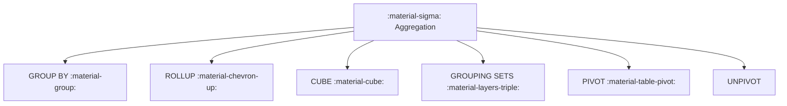

# :material-sigma: Aggregation in Spark SQL

Aggregation groups rows and computes summary metrics such as `COUNT`, `SUM`,
`AVG`, and `MAX`. Spark SQL also supports advanced grouping with `ROLLUP`,
`CUBE`, and `GROUPING SETS`.

### :material-sitemap: Overview



---

## 📌 Common Aggregation Patterns

| Pattern | Use Case |
|---------|----------|
| `GROUP BY` | Group rows and compute metrics |
| `ROLLUP` | Subtotals across hierarchical dimensions |
| `CUBE` | Subtotals across all combinations |
| `GROUPING SETS` | Custom grouping combinations |
| `PIVOT/UNPIVOT` | Rotate dimensions into columns or rows |

---

## 🧪 Practical Examples

### Simple Group By

```sql
SELECT region, COUNT(*) AS orders
FROM orders
GROUP BY region;
```

### Rollup

```sql
SELECT region, product, SUM(amount) AS total
FROM sales
GROUP BY ROLLUP(region, product);
```

---

## 🧠 When to Use

| Scenario | Recommended Feature |
|----------|---------------------|
| Standard aggregations | `GROUP BY` |
| Subtotals by hierarchy | `ROLLUP` |
| All combinations | `CUBE` |
| Custom grouping | `GROUPING SETS` |
| Reshape outputs | `PIVOT` / `UNPIVOT` |

---

### :material-sigma: Related Guides

- [Simple Aggregations](simple/index.md)
- [Rollup](rollup.md)
- [Cube](cube.md)
- [Grouping Sets](group_set.md)
- [Stats](stats.md)
- [Pivoting](pivoting/unpivot.md)
