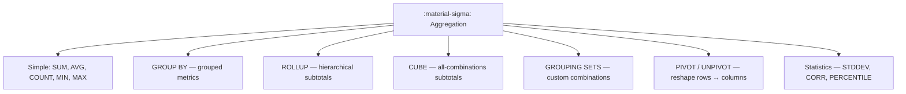
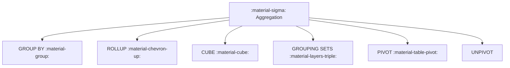

# :material-sigma: Aggregation in Spark SQL

Aggregation groups rows and computes summary metrics. Spark SQL supports simple aggregates, hierarchical subtotals with `ROLLUP`, cross-dimensional analysis with `CUBE`, custom grouping with `GROUPING SETS`, and column rotation with `PIVOT` / `UNPIVOT`.

---

## :material-sitemap: Overview



---

## :material-pin: Aggregation Patterns

| Pattern | Produces | Example use case |
|---------|----------|-----------------|
| `GROUP BY` | One row per group | Total sales per region |
| `ROLLUP(a, b)` | Detail + subtotals left-to-right | Year → Month → Day hierarchy |
| `CUBE(a, b)` | All 2ⁿ grouping combinations | Cross-tab report |
| `GROUPING SETS(...)` | Exactly the combinations you list | Custom multi-level reporting |
| `PIVOT` | Rows → columns | Wide sales-by-year table |
| `UNPIVOT` | Columns → rows | Normalise wide survey data |

---

## :material-pin: Simple Aggregate Functions

| Function | NULL handling | Returns |
|----------|--------------|---------|
| `COUNT(*)` | Counts all rows including NULLs | `BIGINT` (never NULL) |
| `COUNT(col)` | Skips NULLs | `BIGINT` |
| `COUNT(DISTINCT col)` | Skips NULLs, deduplicates | `BIGINT` |
| `SUM(col)` | Skips NULLs | Same type as input |
| `AVG(col)` | Skips NULLs | `DOUBLE` or `DECIMAL` |
| `MIN(col)` | Skips NULLs | Same type as input |
| `MAX(col)` | Skips NULLs | Same type as input |
| `APPROX_COUNT_DISTINCT(col)` | Skips NULLs, probabilistic | `BIGINT` |
| `STDDEV(col)` | Skips NULLs | `DOUBLE` |
| `PERCENTILE_APPROX(col, p)` | Skips NULLs | Same type as input |

---

## :material-flask-outline: Quick Examples

### Single-column GROUP BY with HAVING

```sql
SELECT
    region,
    COUNT(*)    AS order_count,
    SUM(amount) AS total_sales
FROM sales
GROUP BY region
HAVING SUM(amount) > 500
ORDER BY total_sales DESC;
```

### ROLLUP for hierarchy (region → product)

```sql
SELECT
    region,
    product,
    SUM(amount) AS total_sales
FROM sales
GROUP BY ROLLUP (region, product)
ORDER BY region NULLS LAST, product NULLS LAST;
```

### Conditional aggregate with FILTER

```sql
SELECT
    product,
    SUM(amount)                                   AS total_sales,
    SUM(amount) FILTER (WHERE region = 'East')    AS east_sales
FROM sales
GROUP BY product;
```

---

## :material-brain: When to Use

| Scenario | Recommended Feature |
|----------|---------------------|
| Standard grouped metrics | [`GROUP BY`](group.md) |
| Subtotals for a strict hierarchy | [`ROLLUP`](rollup.md) |
| All combinations across dimensions | [`CUBE`](cube.md) |
| Custom non-hierarchical combinations | [`GROUPING SETS`](group_set.md) |
| Rotate categories into columns | [`PIVOT`](pivoting/pivot/spark.md) |
| Flatten wide columns into rows | [`UNPIVOT`](pivoting/unpivot.md) |
| Dispersion, correlation, percentiles | [`Statistics`](stats.md) |
| Simple SUM / AVG / COUNT / MIN / MAX | [`Simple Aggregations`](simple/index.md) |


### :material-sitemap: Overview



---

## :material-pin: Common Aggregation Patterns

| Pattern | Use Case |
|---------|----------|
| `GROUP BY` | Group rows and compute metrics |
| `ROLLUP` | Subtotals across hierarchical dimensions |
| `CUBE` | Subtotals across all combinations |
| `GROUPING SETS` | Custom grouping combinations |
| `PIVOT/UNPIVOT` | Rotate dimensions into columns or rows |

---

## :material-flask-outline: Practical Examples

### Simple Group By

```sql
SELECT region, COUNT(*) AS orders
FROM orders
GROUP BY region;
```

### Rollup

```sql
SELECT region, product, SUM(amount) AS total
FROM sales
GROUP BY ROLLUP(region, product);
```

---

## :material-brain: When to Use

| Scenario | Recommended Feature |
|----------|---------------------|
| Standard aggregations | `GROUP BY` |
| Subtotals by hierarchy | `ROLLUP` |
| All combinations | `CUBE` |
| Custom grouping | `GROUPING SETS` |
| Reshape outputs | `PIVOT` / `UNPIVOT` |

---

### :material-sigma: Related Guides

- [Simple Aggregations](simple/index.md)
- [Rollup](rollup.md)
- [Cube](cube.md)
- [Grouping Sets](group_set.md)
- [Stats](stats.md)
- [Pivoting](pivoting/unpivot.md)
