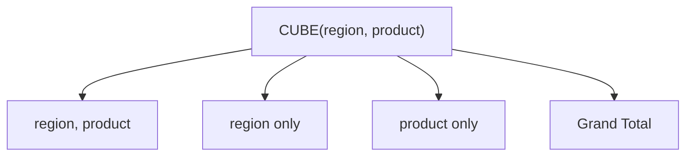
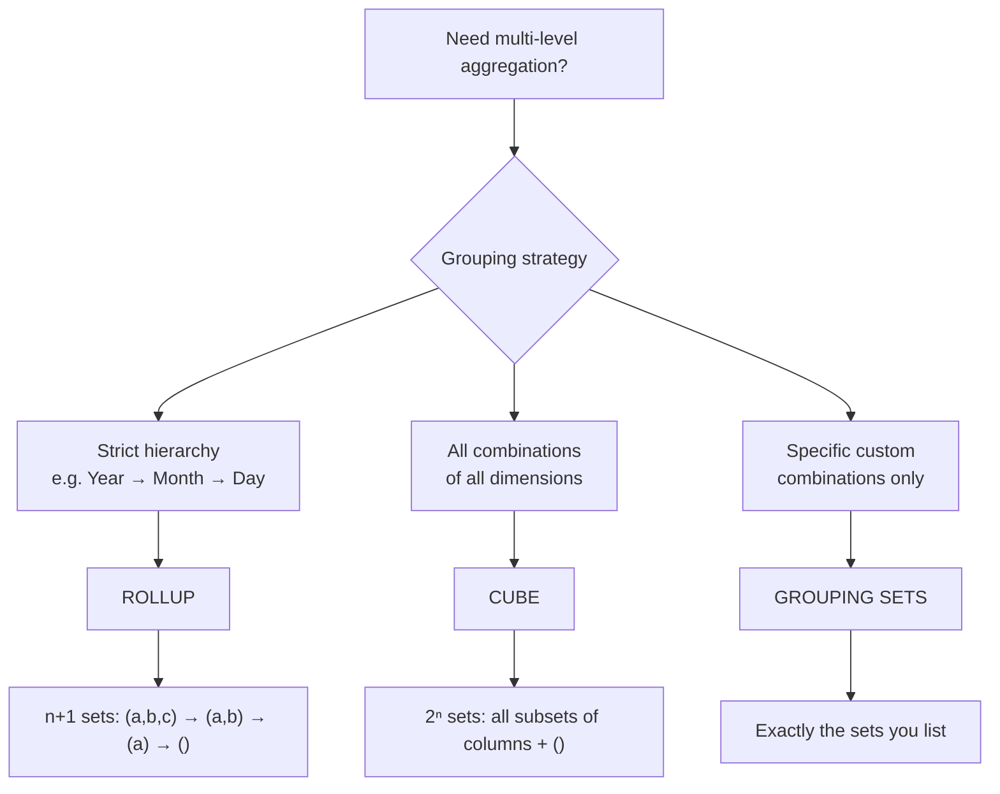

# :material-cube: CUBE

`CUBE` extends `GROUP BY` to generate aggregate rows for **every possible combination** of the specified grouping columns, including all sub-totals and one grand total.

### :material-sitemap: Overview



---

## :material-pin: Syntax

```sql
SELECT col1 [, col2, ...], agg_func(expr) [AS alias]
FROM   table_name
GROUP BY CUBE (col1 [, col2, ...]);
```

For `n` columns, `CUBE` produces **2ⁿ** grouping sets:

| Columns | Grouping sets generated |
|---------|------------------------|
| `(a)` | `(a)`, `()` → 2 sets |
| `(a, b)` | `(a, b)`, `(a)`, `(b)`, `()` → 4 sets |
| `(a, b, c)` | `(a,b,c)`, `(a,b)`, `(a,c)`, `(b,c)`, `(a)`, `(b)`, `(c)`, `()` → 8 sets |

`CUBE(a, b, c)` is equivalent to:

```sql
GROUPING SETS (
    (a, b, c), (a, b), (a, c), (b, c),
    (a), (b), (c),
    ()
)
```

---

## :material-magnify: Behavior

1. **NULL as subtotal marker** — columns not participating in a given grouping set are set to `NULL` in the output row for that set; this is *not* real data `NULL` but a subtotal placeholder.
2. **`GROUPING(col)`** — returns `1` when a column's `NULL` was generated by `CUBE` (subtotal), `0` when it is a real grouping value; use this to distinguish actual `NULL` data from aggregation placeholders.
3. **Symmetric operation** — unlike `ROLLUP`, `CUBE` is order-independent: `CUBE(a, b)` and `CUBE(b, a)` produce the same set of grouping combinations.
4. **Row volume** — the output contains the normal detail rows plus all subtotal/grand-total rows; expect significantly more rows than a plain `GROUP BY`.
5. **Performance** — `CUBE` can be expensive on high-cardinality columns; use [`GROUPING SETS`](group_set.md) when only a subset of combinations is needed.

---

## :material-tag-outline: GROUPING_ID()

`GROUPING_ID(col1, col2, ...)` returns a compact **bitmask integer** that encodes the full grouping level in one value — cleaner than chaining multiple `GROUPING()` calls in a `CASE` expression.

The bit position of each column mirrors its order in the argument list (leftmost = most-significant bit):

| `GROUPING(region)` | `GROUPING(product)` | `GROUPING_ID(region, product)` | Grouping level |
|--------------------|---------------------|-------------------------------|----------------|
| 0 | 0 | 0 | Detail `(region, product)` |
| 0 | 1 | 1 | Region subtotal `(region)` |
| 1 | 0 | 2 | Product subtotal `(product)` |
| 1 | 1 | 3 | Grand total `()` |

```sql
SELECT
    region,
    product,
    SUM(amount)                  AS total_sales,
    GROUPING_ID(region, product) AS grp_id,
    CASE GROUPING_ID(region, product)
        WHEN 0 THEN 'Detail'
        WHEN 1 THEN 'Region Subtotal'
        WHEN 2 THEN 'Product Subtotal'
        WHEN 3 THEN 'Grand Total'
    END AS row_type
FROM sales
GROUP BY CUBE (region, product)
ORDER BY grp_id, region NULLS LAST, product NULLS LAST;
```

---

## :material-flask-outline: Practical Examples

### Setup

```sql
CREATE TABLE sales (
    order_id   BIGINT,
    region     STRING,
    product    STRING,
    amount     DOUBLE,
    order_date DATE
);

INSERT INTO sales VALUES
    (1, 'East',  'Widget',  120.00, DATE '2024-01-15'),
    (2, 'West',  'Gadget',  340.00, DATE '2024-01-15'),
    (3, 'East',  'Widget',   80.00, DATE '2024-02-10'),
    (4, 'North', 'Gadget',  210.00, DATE '2024-02-10'),
    (5, 'West',  'Widget',  150.00, DATE '2024-03-05'),
    (6, 'East',  'Gadget',  450.00, DATE '2024-03-05'),
    (7, 'North', 'Widget',   90.00, DATE '2024-03-20'),
    (8, 'West',  'Gadget',  270.00, DATE '2024-03-20');
```

### 1 — Basic CUBE on two columns

```sql
SELECT
    region,
    product,
    SUM(amount) AS total_sales
FROM sales
GROUP BY CUBE (region, product)
ORDER BY region NULLS LAST, product NULLS LAST;
```

??? success "Expected output"

    | region | product | total_sales | Note |
    |--------|---------|-------------|------|
    | East | Gadget | 450.0 | (region, product) detail |
    | East | Widget | 200.0 | (region, product) detail |
    | East | NULL | 650.0 | (region) subtotal |
    | North | Gadget | 210.0 |  |
    | North | Widget | 90.0 |  |
    | North | NULL | 300.0 | (region) subtotal |
    | West | Gadget | 610.0 |  |
    | West | Widget | 150.0 |  |
    | West | NULL | 760.0 | (region) subtotal |
    | NULL | Gadget | 1270.0 | (product) subtotal |
    | NULL | Widget | 440.0 | (product) subtotal |
    | NULL | NULL | 1710.0 | grand total () |

### 2 — Distinguish subtotals with `GROUPING()`

```sql
SELECT
    region,
    product,
    SUM(amount)       AS total_sales,
    GROUPING(region)  AS is_region_subtotal,
    GROUPING(product) AS is_product_subtotal
FROM sales
GROUP BY CUBE (region, product)
ORDER BY GROUPING(region), GROUPING(product), region NULLS LAST, product NULLS LAST;
-- is_region_subtotal=0, is_product_subtotal=0  → detail row
-- is_region_subtotal=0, is_product_subtotal=1  → region subtotal
-- is_region_subtotal=1, is_product_subtotal=0  → product subtotal
-- is_region_subtotal=1, is_product_subtotal=1  → grand total
```

### 3 — Readable labels with `GROUPING()`

```sql
SELECT
    CASE WHEN GROUPING(region)  = 1 THEN 'All Regions'  ELSE region  END AS region_label,
    CASE WHEN GROUPING(product) = 1 THEN 'All Products' ELSE product END AS product_label,
    SUM(amount) AS total_sales
FROM sales
GROUP BY CUBE (region, product)
ORDER BY region_label, product_label;
```

??? success "Expected output"

    | region_label | product_label | total_sales | Note |
    |--------------|---------------|-------------|------|
    | All Regions | All Products | 1710.0 | grand total |
    | All Regions | Gadget | 1270.0 | product subtotal |
    | All Regions | Widget | 440.0 | product subtotal |
    | East | All Products | 650.0 | region subtotal |
    | East | Gadget | 450.0 |  |
    | East | Widget | 200.0 |  |
    | North | All Products | 300.0 |  |
    | ... |  |  |  |

### 4 — Filtering to only the grand total row

```sql
SELECT SUM(amount) AS grand_total
FROM sales
GROUP BY CUBE (region, product)
HAVING GROUPING(region) = 1 AND GROUPING(product) = 1;
```

??? success "Expected output"

    | grand_total |
    |-------------|
    | 1710.0 |

### 5 — Three-column CUBE (8 grouping combinations)

```sql
SELECT
    CASE WHEN GROUPING(YEAR(order_date)) = 1 THEN 'All Years'    ELSE CAST(YEAR(order_date) AS STRING) END AS yr,
    CASE WHEN GROUPING(region)           = 1 THEN 'All Regions'  ELSE region                              END AS rgn,
    CASE WHEN GROUPING(product)          = 1 THEN 'All Products' ELSE product                             END AS prd,
    SUM(amount)  AS total_sales,
    COUNT(*)     AS order_count
FROM sales
GROUP BY CUBE (YEAR(order_date), region, product)
ORDER BY yr, rgn, prd;
```

### 6 — GROUPING_ID() for single-pass row classification

```sql
SELECT
    CASE WHEN GROUPING(region)  = 1 THEN 'All Regions'  ELSE region  END AS region_label,
    CASE WHEN GROUPING(product) = 1 THEN 'All Products' ELSE product END AS product_label,
    SUM(amount)                  AS total_sales,
    GROUPING_ID(region, product) AS grp_id
FROM sales
GROUP BY CUBE (region, product)
ORDER BY grp_id, region_label, product_label;
-- grp_id=0 → detail; 1 → region subtotal; 2 → product subtotal; 3 → grand total
```

### 7 — Multiple aggregates: revenue, order count, average, max

```sql
SELECT
    CASE WHEN GROUPING(region)  = 1 THEN 'All Regions'  ELSE region  END AS region_label,
    CASE WHEN GROUPING(product) = 1 THEN 'All Products' ELSE product END AS product_label,
    ROUND(SUM(amount), 2)    AS total_revenue,
    COUNT(*)                 AS order_count,
    ROUND(AVG(amount), 2)    AS avg_order_value,
    MAX(amount)              AS max_order_value
FROM sales
GROUP BY CUBE (region, product)
ORDER BY GROUPING_ID(region, product), region_label, product_label;
```

!!! tip
    A single pass produces all rolled-up revenue KPIs at every dimension cross.

### 8 — CTE + CUBE for clean BI reporting

Compute the cube once in a CTE, then apply presentation logic and filtering downstream:

```sql
WITH cube_base AS (
    SELECT
        region,
        product,
        YEAR(order_date)             AS sale_year,
        SUM(amount)                  AS total_revenue,
        COUNT(*)                     AS order_count,
        GROUPING_ID(region, product, YEAR(order_date)) AS grp_id
    FROM sales
    GROUP BY CUBE (region, product, YEAR(order_date))
),
labelled AS (
    SELECT
        COALESCE(region,   'All Regions')  AS region_label,
        COALESCE(product,  'All Products') AS product_label,
        COALESCE(CAST(sale_year AS STRING), 'All Years') AS year_label,
        total_revenue,
        order_count,
        ROUND(total_revenue / NULLIF(order_count, 0), 2) AS avg_order_value,
        grp_id
    FROM cube_base
)
SELECT *
FROM labelled
WHERE grp_id IN (0, 3)   -- only detail rows and grand total; adjust as needed
ORDER BY year_label, region_label, product_label;
```

!!! tip "Filter with `grp_id` not `IS NULL`"
    Using `GROUPING_ID` in a `WHERE` clause is cleaner and safer than filtering on `column IS NULL`, which may accidentally exclude real `NULL` data rows.

### 9 — Filtering to cross-dimensional subtotals only (exclude detail rows)

Useful when the consumer only needs summary rows for a dashboard tile:

```sql
SELECT
    COALESCE(region,  'All Regions')  AS region_label,
    COALESCE(product, 'All Products') AS product_label,
    SUM(amount) AS total_revenue
FROM sales
GROUP BY CUBE (region, product)
HAVING GROUPING_ID(region, product) > 0   -- drop detail rows (grp_id = 0)
ORDER BY GROUPING_ID(region, product) DESC, region_label, product_label;
```

!!! tip
    Result contains only region subtotals, product subtotals, and the grand total.

### 10 — Real-world use case: quarterly marketing spend analysis

```sql
CREATE TABLE marketing_spend (
    campaign   STRING,
    channel    STRING,
    quarter    STRING,
    spend      DOUBLE,
    conversions BIGINT
);

INSERT INTO marketing_spend VALUES
    ('Summer Sale', 'Email',   'Q1', 12000.0, 340),
    ('Summer Sale', 'Social',  'Q1',  8500.0, 210),
    ('Black Friday','Email',   'Q2', 15000.0, 520),
    ('Black Friday','Social',  'Q2', 22000.0, 890),
    ('Summer Sale', 'Email',   'Q2',  9500.0, 280),
    ('Black Friday','Display', 'Q2',  6000.0, 120),
    ('New Year',    'Social',  'Q3', 18000.0, 640),
    ('New Year',    'Email',   'Q3', 11000.0, 390);

SELECT
    CASE WHEN GROUPING(campaign) = 1 THEN 'All Campaigns' ELSE campaign END AS campaign_label,
    CASE WHEN GROUPING(channel)  = 1 THEN 'All Channels'  ELSE channel  END AS channel_label,
    CASE WHEN GROUPING(quarter)  = 1 THEN 'All Quarters'  ELSE quarter  END AS quarter_label,
    ROUND(SUM(spend), 2)                           AS total_spend,
    SUM(conversions)                               AS total_conversions,
    ROUND(SUM(spend) / NULLIF(SUM(conversions), 0), 2) AS cost_per_conversion
FROM marketing_spend
GROUP BY CUBE (campaign, channel, quarter)
ORDER BY GROUPING_ID(campaign, channel, quarter), campaign_label, channel_label, quarter_label;
```

!!! tip
    Produces 2³ = 8 grouping combinations in a single scan: campaign + channel + quarter detail, every pairwise subtotal, and grand totals.

### 11 — CUBE vs UNION ALL: single scan vs four scans

`CUBE` replaces a `UNION ALL` stack while scanning the table **once**:

```sql
-- Before: four separate GROUP BY queries — four table scans
SELECT region, product, SUM(amount) AS revenue FROM sales GROUP BY region, product
UNION ALL
SELECT region, NULL,    SUM(amount)             FROM sales GROUP BY region
UNION ALL
SELECT NULL,   product, SUM(amount)             FROM sales GROUP BY product
UNION ALL
SELECT NULL,   NULL,    SUM(amount)             FROM sales;

-- After: identical output, one scan
SELECT
    region,
    product,
    ROUND(SUM(amount), 2) AS revenue
FROM sales
GROUP BY CUBE (region, product)
ORDER BY GROUPING_ID(region, product), region NULLS LAST, product NULLS LAST;
```

!!! tip
    Same 12 output rows. The query plan shows a single Exchange node instead of four.

### 12 — HAVING threshold: keep all subtotals but prune low-value detail rows

```sql
SELECT
    CASE WHEN GROUPING(region)  = 1 THEN 'All Regions'  ELSE region  END AS region_label,
    CASE WHEN GROUPING(product) = 1 THEN 'All Products' ELSE product END AS product_label,
    ROUND(SUM(amount), 2)        AS total_revenue,
    GROUPING_ID(region, product) AS grp_id
FROM sales
GROUP BY CUBE (region, product)
HAVING
    GROUPING_ID(region, product) > 0      -- always include every subtotal and grand total
    OR SUM(amount) > 200                  -- detail rows: only high-revenue combinations
ORDER BY grp_id, region_label, product_label;
```

!!! tip
    `East | Widget` (200.0) is excluded; all subtotal and grand-total rows are retained.

### 13 — Ranking within each grouping level using window functions

Combine `CUBE` with `RANK()` to find the top performer at every aggregation level in a single query:

```sql
WITH cubed AS (
    SELECT
        region,
        product,
        ROUND(SUM(amount), 2)        AS total_revenue,
        GROUPING_ID(region, product) AS grp_id
    FROM sales
    GROUP BY CUBE (region, product)
)
SELECT
    COALESCE(region,  'All Regions')  AS region_label,
    COALESCE(product, 'All Products') AS product_label,
    total_revenue,
    grp_id,
    RANK() OVER (
        PARTITION BY grp_id
        ORDER BY total_revenue DESC
    ) AS revenue_rank_within_level
FROM cubed
ORDER BY grp_id, revenue_rank_within_level;
```

!!! tip
    `grp_id=1`: rank 1 = West (760.0), `grp_id=2`: rank 1 = Gadget (1270.0), and `grp_id=0`: rank 1 = East | Gadget (450.0).

### 14 — Inventory analysis: warehouse × category × supplier

```sql
CREATE TABLE inventory (
    warehouse   STRING,
    category    STRING,
    supplier    STRING,
    qty_on_hand BIGINT,
    unit_cost   DOUBLE
);

INSERT INTO inventory VALUES
    ('London',    'Electronics', 'TechCorp',    1200, 85.0),
    ('London',    'Electronics', 'MegaSupply',   800, 92.0),
    ('London',    'Clothing',    'FashionCo',   3500,  8.5),
    ('Frankfurt', 'Electronics', 'TechCorp',     950, 85.0),
    ('Frankfurt', 'Clothing',    'FashionCo',   2200,  8.5),
    ('Frankfurt', 'Home',        'HomePro',     1800, 22.0),
    ('Singapore', 'Electronics', 'MegaSupply',  1500, 90.0),
    ('Singapore', 'Home',        'HomePro',     2100, 20.0),
    ('Singapore', 'Clothing',    'FashionCo',   4000,  7.5);

SELECT
    CASE WHEN GROUPING(warehouse) = 1 THEN 'All Warehouses' ELSE warehouse END AS warehouse_label,
    CASE WHEN GROUPING(category)  = 1 THEN 'All Categories' ELSE category  END AS category_label,
    CASE WHEN GROUPING(supplier)  = 1 THEN 'All Suppliers'  ELSE supplier  END AS supplier_label,
    SUM(qty_on_hand)                              AS total_units,
    ROUND(SUM(qty_on_hand * unit_cost), 2)        AS total_inventory_value,
    ROUND(AVG(unit_cost), 2)                      AS avg_unit_cost,
    GROUPING_ID(warehouse, category, supplier)    AS grp_id
FROM inventory
GROUP BY CUBE (warehouse, category, supplier)
ORDER BY grp_id, warehouse_label, category_label, supplier_label;
```

!!! tip
    2³ = 8 sets: every warehouse × category × supplier cross plus all single-dimension subtotals and one grand total.

### 15 — Pre-computing a CUBE into a Delta summary table

A common data warehouse pattern: materialise the cube once per ETL cycle so dashboards query the summary table rather than the raw fact table.

```sql
CREATE OR REPLACE TABLE sales_cube_summary
USING DELTA
COMMENT 'Pre-aggregated CUBE over region × product — refreshed nightly'
AS
SELECT
    COALESCE(region,  'All Regions')  AS region_label,
    COALESCE(product, 'All Products') AS product_label,
    ROUND(SUM(amount), 2)             AS total_revenue,
    COUNT(*)                          AS order_count,
    ROUND(AVG(amount), 2)             AS avg_order_value,
    GROUPING_ID(region, product)      AS grp_id
FROM sales
GROUP BY CUBE (region, product);

-- Cluster on grp_id so dashboard queries that filter by level hit minimal files
OPTIMIZE sales_cube_summary ZORDER BY (grp_id);
```

!!! note "Refresh strategy"
    Re-run the `CREATE OR REPLACE TABLE ... AS` statement on each ETL cycle to fully refresh.
    For incremental loads, filter the source to the new date partition, compute the partial cube, then `MERGE` the results into the summary table on `(region_label, product_label, grp_id)`.

---

## :material-magnify: Decision Flow



---

## :material-shield-outline: Common Pitfalls

!!! warning "Exponential row growth"
    `CUBE` on `n` columns generates **2ⁿ grouping sets**. Four columns = 16 sets; six columns = 64 sets. Always benchmark row counts on representative data before deploying to production.

!!! warning "NULL ambiguity without GROUPING()"
    A `NULL` in the output can mean either a subtotal placeholder *or* genuine `NULL` data in that column. Always use `GROUPING(col)` or `GROUPING_ID()` to tell them apart — never filter on `col IS NULL` alone.

!!! warning "CUBE is symmetric — ROLLUP is not"
    `CUBE(a, b)` and `CUBE(b, a)` produce identical grouping sets. If you need strict left-to-right hierarchy (year → month → day), use [`ROLLUP`](rollup.md) instead.

!!! note "Aggregating already-aggregated data"
    Never apply `CUBE` to a pre-aggregated table and then `SUM` the pre-aggregated values — double-counting will occur. Always cube over the raw row-level source.

!!! tip "Use GROUPING SETS to avoid unwanted combinations"
    If your report only needs `(region, product)`, `(region)`, and `()` — not `(product)` alone — use [`GROUPING SETS`](group_set.md) to enumerate exactly those combinations and skip the rest.

---

## :material-speedometer: Performance Tips

| Tip | Details |
|-----|---------|
| Pre-filter in a CTE | Apply `WHERE` filters in a CTE before the outer `GROUP BY CUBE` so only relevant rows are shuffled. |
| Limit column count | Keep `CUBE` to ≤ 4 columns in production; beyond that, prefer explicit `GROUPING SETS`. |
| AQE coalesces partitions | Spark's Adaptive Query Execution (`spark.sql.adaptive.coalescePartitions.enabled = true`) automatically right-sizes the shuffle output partitions for cube queries. |
| High-cardinality columns | Avoid cubing on columns with thousands of distinct values (e.g., `order_id`). Aggregate to lower cardinality first. |
| Broadcast small dimensions | If one dimension is small (< ~10 MB), add `/*+ BROADCAST(dim) */` on the source scan to avoid a full shuffle. |

---

## :material-database-outline: Data Warehouse Patterns

`CUBE` is well-suited to the **pre-aggregation layer** in a Lakehouse architecture, where summary tables are built once and queried repeatedly by BI tools.

### Pre-aggregate once, query many times

```
Raw fact table (millions of rows)
        │
        ▼  nightly ETL
  sales_cube_summary  (hundreds of rows, all grouping levels pre-computed)
        │
        ▼  sub-millisecond reads
  Dashboard / BI tool
```

### Incremental CUBE refresh via MERGE

```sql
-- Step 1: compute the new partial cube for today's data only
WITH new_data AS (
    SELECT
        COALESCE(region,  'All Regions')  AS region_label,
        COALESCE(product, 'All Products') AS product_label,
        ROUND(SUM(amount), 2)             AS total_revenue,
        COUNT(*)                          AS order_count,
        GROUPING_ID(region, product)      AS grp_id
    FROM sales
    WHERE order_date = CURRENT_DATE()
    GROUP BY CUBE (region, product)
)
-- Step 2: upsert into the summary table
MERGE INTO sales_cube_summary AS tgt
USING new_data AS src
    ON tgt.region_label  = src.region_label
   AND tgt.product_label = src.product_label
   AND tgt.grp_id        = src.grp_id
WHEN MATCHED THEN
    UPDATE SET
        total_revenue = tgt.total_revenue + src.total_revenue,
        order_count   = tgt.order_count   + src.order_count,
        avg_order_value = ROUND(
            (tgt.total_revenue + src.total_revenue) /
            NULLIF(tgt.order_count + src.order_count, 0), 2)
WHEN NOT MATCHED THEN
    INSERT (region_label, product_label, total_revenue, order_count, avg_order_value, grp_id)
    VALUES (src.region_label, src.product_label, src.total_revenue,
            src.order_count, ROUND(src.total_revenue / NULLIF(src.order_count, 0), 2),
            src.grp_id);
```

!!! warning "Additive measures only"
    `SUM` and `COUNT` are safely additive across incremental merges. `AVG` and `MAX` are not — recompute derived measures from the stored `SUM` and `COUNT` columns rather than incrementally merging pre-computed averages.

---

## :material-brain: When to Use

| Scenario | Recommended Pattern |
|----------|---------------------|
| Cross-dimensional BI reports | `CUBE` |
| Grand totals + all sub-totals in one query | `CUBE` |
| Exploring all aggregation levels up-front | `CUBE` |
| Marketing spend by campaign × channel × quarter | `CUBE` |
| Inventory analysis by warehouse × category × supplier | `CUBE` |
| Financial P&L by cost centre × department × period | `CUBE` |
| Replace four `UNION ALL GROUP BY` queries | `CUBE` (single scan) |
| Pre-compute a nightly summary table | `CUBE` + `CREATE OR REPLACE TABLE ... AS` |
| Incremental summary table refresh | `CUBE` on new partition + `MERGE INTO` |
| Ranking top performers at every aggregation level | `CUBE` + `RANK() OVER (PARTITION BY grp_id ...)` |
| Prune low-value detail rows but keep all subtotals | `CUBE` + `HAVING ... OR GROUPING_ID(...) > 0` |
| Single compact row-type classifier | `GROUPING_ID()` alongside `CUBE` |
| Distinguish data NULLs from subtotal NULLs | `GROUPING(col)` alongside `CUBE` |
| Only a few specific combinations needed | [`GROUPING SETS`](group_set.md) |
| Strictly hierarchical rollup (year → month) | [`ROLLUP`](rollup.md) |
| More than 4 grouping columns | [`GROUPING SETS`](group_set.md) (explicit, cost-controlled) |
