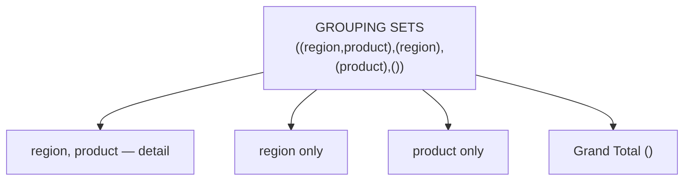
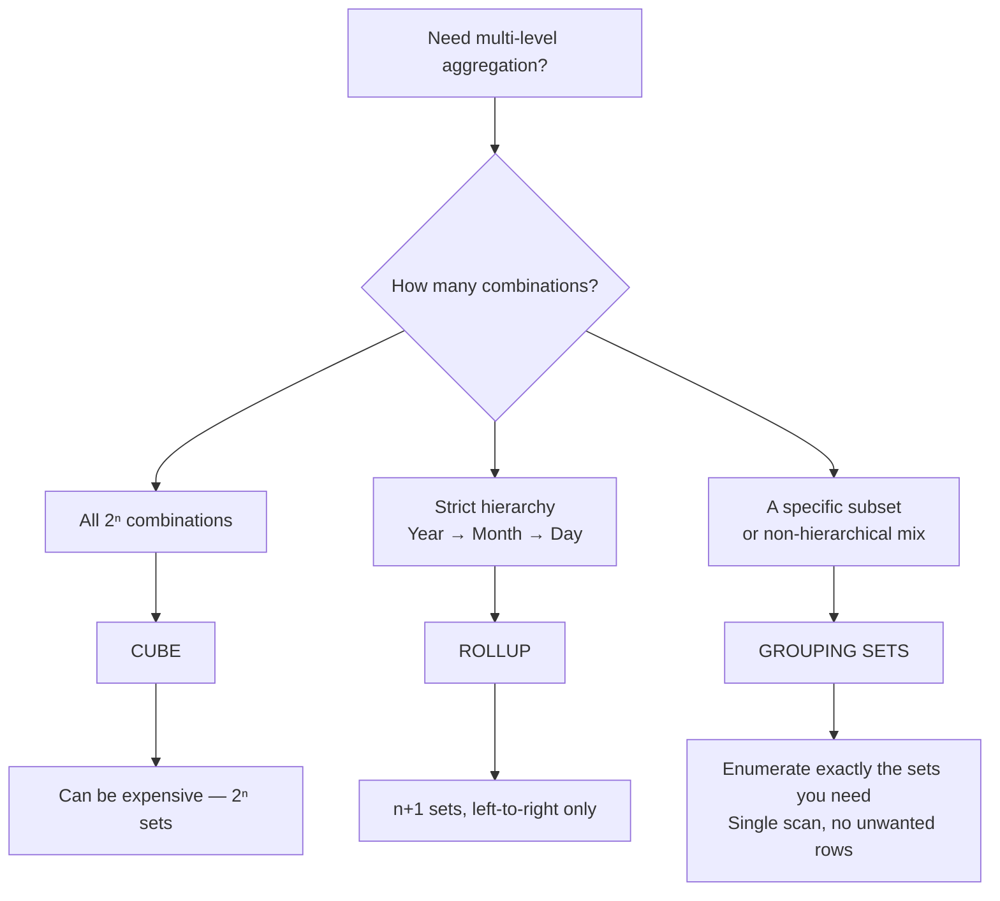

# :material-layers-triple: GROUPING SETS

`GROUPING SETS` lets you compute aggregates for multiple, explicitly listed grouping combinations in a single query — without writing multiple `UNION ALL` branches.

### :material-sitemap: Overview



---

## :material-pin: Syntax

```sql
SELECT col1 [, col2, ...], agg_func(expr) [AS alias]
FROM   table_name
GROUP BY GROUPING SETS (
    (col1, col2),   -- grouping combination 1
    (col1),         -- grouping combination 2
    (col2),         -- grouping combination 3
    ()              -- grand total (empty grouping)
);
```

| Element | Description |
|---------|-------------|
| `(col1, col2)` | Aggregate by both columns together |
| `(col1)` | Aggregate by `col1` only |
| `()` | Empty set — produces one grand-total row |

### Equivalences

```sql
-- ROLLUP(a, b) is equivalent to:
GROUPING SETS ((a, b), (a), ())

-- CUBE(a, b) is equivalent to:
GROUPING SETS ((a, b), (a), (b), ())
```

The table below shows which sets each shorthand generates for two columns `(a, b)`:

| Shorthand | Sets generated | Count |
|-----------|----------------|-------|
| `ROLLUP(a, b)` | `(a,b)`, `(a)`, `()` | 3 |
| `CUBE(a, b)` | `(a,b)`, `(a)`, `(b)`, `()` | 4 |
| `GROUPING SETS((a,b),(a),())` | exactly as listed | 3 |
| `GROUPING SETS((a),(b))` | `(a)`, `(b)` only — no cross, no grand total | 2 |

---

## :material-magnify: Behavior

1. **NULL as grouping marker** — columns not included in a specific grouping set appear as `NULL` in the output rows for that set; these are synthetic NULLs, not data NULLs.
2. **`GROUPING(col)`** — returns `1` for a synthetic NULL (grouping placeholder) and `0` for a real grouping value; use it to label or filter subtotal rows.
3. **UNION ALL equivalence** — `GROUPING SETS` is logically equivalent to a `UNION ALL` of separate `GROUP BY` queries, but executes in a single scan which is far more efficient.
4. **Duplicate sets** — listing the same set twice produces duplicate output rows; avoid duplicates.
5. **Any combination** — unlike `ROLLUP` and `CUBE`, you can mix arbitrary column subsets in any order, including non-hierarchical combinations.

---

## :material-tag-outline: GROUPING_ID()

`GROUPING_ID(col1, col2, ...)` returns a bitmask integer encoding which columns are rolled up in the current row. Because you **explicitly list** every combination in `GROUPING SETS`, you also control exactly which `GROUPING_ID` values appear — making it ideal for a single `CASE` dispatcher.

For `GROUPING SETS ((region, product), (region), (product), ())`:

| Set | `GROUPING(region)` | `GROUPING(product)` | `GROUPING_ID` |
|-----|---------------------|---------------------|---------------|
| `(region, product)` | 0 | 0 | 0 |
| `(region)` | 0 | 1 | 1 |
| `(product)` | 1 | 0 | 2 |
| `()` | 1 | 1 | 3 |

!!! tip "You choose which IDs appear"
    Omit a set from the enumeration and its `GROUPING_ID` value will not appear in the output. This is the key advantage over `CUBE` — you get only the integers you need.

```sql
SELECT
    region,
    product,
    SUM(amount)                  AS total_sales,
    GROUPING_ID(region, product) AS grp_id,
    CASE GROUPING_ID(region, product)
        WHEN 0 THEN 'Detail'
        WHEN 1 THEN 'Region Subtotal'
        WHEN 2 THEN 'Product Subtotal'
        WHEN 3 THEN 'Grand Total'
    END AS row_type
FROM sales
GROUP BY GROUPING SETS (
    (region, product),
    (region),
    (product),
    ()
)
ORDER BY grp_id, region NULLS LAST, product NULLS LAST;
```

---

## :material-flask-outline: Practical Examples

### Setup

```sql
CREATE TABLE sales (
    order_id   BIGINT,
    region     STRING,
    product    STRING,
    amount     DOUBLE,
    order_date DATE
);

INSERT INTO sales VALUES
    (1, 'East',  'Widget',  120.00, DATE '2024-01-15'),
    (2, 'West',  'Gadget',  340.00, DATE '2024-01-15'),
    (3, 'East',  'Widget',   80.00, DATE '2024-02-10'),
    (4, 'North', 'Gadget',  210.00, DATE '2024-02-10'),
    (5, 'West',  'Widget',  150.00, DATE '2024-03-05'),
    (6, 'East',  'Gadget',  450.00, DATE '2024-03-05'),
    (7, 'North', 'Widget',   90.00, DATE '2024-03-20'),
    (8, 'West',  'Gadget',  270.00, DATE '2024-03-20');
```

### 1 — Custom subtotals: `(region, product)`, `(region)`, grand total

```sql
SELECT
    region,
    product,
    SUM(amount) AS total_sales
FROM sales
GROUP BY GROUPING SETS (
    (region, product),
    (region),
    ()
)
ORDER BY region NULLS LAST, product NULLS LAST;
```

??? success "Expected output"

    | region | product | total_sales | Note |
    |--------|---------|-------------|------|
    | East | Gadget | 450.0 | (region, product) |
    | East | Widget | 200.0 | (region, product) |
    | East | NULL | 650.0 | (region) |
    | North | Gadget | 210.0 | |
    | North | Widget | 90.0 | |
    | North | NULL | 300.0 | (region) |
    | West | Gadget | 610.0 | |
    | West | Widget | 150.0 | |
    | West | NULL | 760.0 | (region) |
    | NULL | NULL | 1710.0 | grand total () |

### 2 — Equivalence to UNION ALL

The following two queries produce identical results:

```sql
-- GROUPING SETS (single scan — preferred)
SELECT region, NULL AS product, SUM(amount) AS total_sales
FROM sales
GROUP BY GROUPING SETS ((region), ());

-- Equivalent UNION ALL (two separate scans)
SELECT region, NULL AS product, SUM(amount) AS total_sales
FROM sales
GROUP BY region
UNION ALL
SELECT NULL AS region, NULL AS product, SUM(amount) AS total_sales
FROM sales;
```

### 3 — Non-hierarchical combinations: `(region)` and `(product)` without the cross

```sql
SELECT
    region,
    product,
    SUM(amount)       AS total_sales,
    GROUPING(region)  AS g_region,
    GROUPING(product) AS g_product
FROM sales
GROUP BY GROUPING SETS (
    (region),
    (product)
)
ORDER BY g_region, g_product, region NULLS LAST, product NULLS LAST;
```

??? success "Expected output"

    | region | product | total_sales | g_region | g_product |
    |--------|---------|-------------|----------|-----------|
    | East | NULL | 650.0 | 0 | 1 |
    | North | NULL | 300.0 | 0 | 1 |
    | West | NULL | 760.0 | 0 | 1 |
    | NULL | Gadget | 1270.0 | 1 | 0 |
    | NULL | Widget | 440.0 | 1 | 0 |

### 4 — Readable labels with `GROUPING()`

```sql
SELECT
    CASE WHEN GROUPING(region)  = 1 THEN 'All Regions'  ELSE region  END AS region_label,
    CASE WHEN GROUPING(product) = 1 THEN 'All Products' ELSE product END AS product_label,
    SUM(amount) AS total_sales
FROM sales
GROUP BY GROUPING SETS (
    (region, product),
    (region),
    (product),
    ()
)
ORDER BY region_label, product_label;
```

### 5 — Three-column GROUPING SETS (select specific combinations)

```sql
SELECT
    YEAR(order_date) AS yr,
    region,
    product,
    SUM(amount)      AS total_sales
FROM sales
GROUP BY GROUPING SETS (
    (YEAR(order_date), region, product),  -- full detail
    (YEAR(order_date), region),           -- year + region subtotal
    (region),                             -- region across all years
    ()                                    -- grand total
)
ORDER BY yr NULLS LAST, region NULLS LAST, product NULLS LAST;
```

### 6 — Multiple aggregates in one scan

```sql
SELECT
    CASE WHEN GROUPING(region)  = 1 THEN 'All Regions'  ELSE region  END AS region_label,
    CASE WHEN GROUPING(product) = 1 THEN 'All Products' ELSE product END AS product_label,
    ROUND(SUM(amount), 2)  AS total_revenue,
    COUNT(*)               AS order_count,
    ROUND(AVG(amount), 2)  AS avg_order_value,
    MAX(amount)            AS max_order_value
FROM sales
GROUP BY GROUPING SETS (
    (region, product),
    (region),
    ()
)
ORDER BY GROUPING_ID(region, product), region_label, product_label;
```

### 7 — Replacing three UNION ALL GROUP BY queries

`GROUPING SETS` executes in a **single scan** where a `UNION ALL` would scan the table three times:

```sql
-- Before: three separate scans
SELECT 'Region+Product' AS report_level, region, product, SUM(amount) AS revenue
FROM sales GROUP BY region, product
UNION ALL
SELECT 'Region',        region, NULL,    SUM(amount) FROM sales GROUP BY region
UNION ALL
SELECT 'Grand Total',   NULL,   NULL,    SUM(amount) FROM sales;

-- After: one scan with GROUPING SETS
SELECT
    CASE GROUPING_ID(region, product)
        WHEN 0 THEN 'Region+Product'
        WHEN 1 THEN 'Region'
        WHEN 3 THEN 'Grand Total'
    END AS report_level,
    region,
    product,
    ROUND(SUM(amount), 2) AS revenue
FROM sales
GROUP BY GROUPING SETS (
    (region, product),
    (region),
    ()
)
ORDER BY GROUPING_ID(region, product), region NULLS LAST, product NULLS LAST;
```

### 8 — Partial CUBE: skip combinations with no business value

[`CUBE`](cube.md) on three columns generates 8 sets. Use `GROUPING SETS` when you need only a targeted subset:

```sql
-- CUBE(YEAR(order_date), region, product) would produce 8 sets.
-- This report only needs 5 — skip (region), (product, year), and (region, product).
SELECT
    CASE WHEN GROUPING(YEAR(order_date)) = 1 THEN 'All Years'    ELSE CAST(YEAR(order_date) AS STRING) END AS yr,
    CASE WHEN GROUPING(region)           = 1 THEN 'All Regions'  ELSE region  END AS rgn,
    CASE WHEN GROUPING(product)          = 1 THEN 'All Products' ELSE product END AS prd,
    ROUND(SUM(amount), 2) AS total_revenue,
    COUNT(*)              AS order_count
FROM sales
GROUP BY GROUPING SETS (
    (YEAR(order_date), region, product),   -- full detail
    (YEAR(order_date), region),            -- region within year
    (YEAR(order_date)),                    -- year total
    (product),                             -- product across all time
    ()                                     -- grand total
)
ORDER BY
    GROUPING_ID(YEAR(order_date), region, product),
    yr NULLS LAST, rgn NULLS LAST, prd NULLS LAST;
```

### 9 — CTE + GROUPING SETS for clean BI output

```sql
WITH base AS (
    SELECT
        region,
        product,
        YEAR(order_date)  AS sale_year,
        amount
    FROM sales
    WHERE order_date >= DATE '2024-01-01'
),
grouped AS (
    SELECT
        region,
        product,
        sale_year,
        SUM(amount)                                AS total_revenue,
        COUNT(*)                                   AS order_count,
        GROUPING_ID(region, product, sale_year)    AS grp_id
    FROM base
    GROUP BY GROUPING SETS (
        (region, product, sale_year),
        (region, sale_year),
        (product),
        ()
    )
)
SELECT
    COALESCE(region,                        'All Regions')  AS region_label,
    COALESCE(product,                       'All Products') AS product_label,
    COALESCE(CAST(sale_year AS STRING),     'All Years')    AS year_label,
    ROUND(total_revenue, 2)                                 AS total_revenue,
    order_count,
    grp_id
FROM grouped
ORDER BY grp_id, region_label, product_label, year_label;
```

!!! tip "Pre-filter before GROUPING SETS"
    Filtering in a CTE narrows the data before the shuffle, which is critical on large fact tables where multiple grouping sets each trigger a partial-aggregate phase.

### 10 — Real-world use case: multi-channel e-commerce dashboard

Six custom combinations to power a marketing performance report — omitting device-only and device+country subtotals that have no business value:

```sql
CREATE TABLE web_sessions (
    session_date  DATE,
    channel       STRING,
    device        STRING,
    country       STRING,
    sessions      BIGINT,
    conversions   BIGINT,
    revenue       DOUBLE
);

INSERT INTO web_sessions VALUES
    (DATE '2024-01-10', 'Organic', 'Desktop', 'US', 4200, 210, 18900.0),
    (DATE '2024-01-10', 'Organic', 'Mobile',  'US', 5100, 180, 14400.0),
    (DATE '2024-01-10', 'Paid',    'Desktop', 'US', 2800, 196, 19600.0),
    (DATE '2024-01-10', 'Paid',    'Mobile',  'UK', 3300, 165, 15675.0),
    (DATE '2024-01-11', 'Email',   'Desktop', 'US', 1500, 135, 13500.0),
    (DATE '2024-01-11', 'Email',   'Mobile',  'UK', 2200, 110,  9900.0),
    (DATE '2024-01-11', 'Social',  'Mobile',  'US', 6800, 204, 18360.0),
    (DATE '2024-01-11', 'Social',  'Desktop', 'UK', 1900,  76,  7600.0);

SELECT
    CASE WHEN GROUPING(channel) = 1 THEN 'All Channels'  ELSE channel END AS channel_label,
    CASE WHEN GROUPING(device)  = 1 THEN 'All Devices'   ELSE device  END AS device_label,
    CASE WHEN GROUPING(country) = 1 THEN 'All Countries' ELSE country END AS country_label,
    SUM(sessions)                                                  AS total_sessions,
    SUM(conversions)                                               AS total_conversions,
    ROUND(SUM(revenue), 2)                                         AS total_revenue,
    ROUND(SUM(conversions) * 100.0 / NULLIF(SUM(sessions), 0), 2) AS conversion_rate_pct,
    GROUPING_ID(channel, device, country)                          AS grp_id
FROM web_sessions
GROUP BY GROUPING SETS (
    (channel, device, country),   -- full detail
    (channel, device),            -- channel × device
    (channel, country),           -- channel × country
    (channel),                    -- channel summary
    (country),                    -- country summary
    ()                            -- grand total
)
-- (device) and (device, country) are intentionally omitted — 6 of CUBE's 8 sets.
ORDER BY grp_id, channel_label, device_label, country_label;
```

---

## :material-magnify: Decision Flow



---

## :material-shield-outline: Common Pitfalls

!!! warning "Duplicate sets produce duplicate rows"
    Listing the same combination twice (e.g., `GROUPING SETS ((a), (a))`) silently produces duplicate output rows — there is no deduplication. Always audit your set list before running.

!!! warning "NULL ambiguity without GROUPING()"
    A `NULL` in an output column may be a grouping placeholder *or* genuine `NULL` data. Always use `GROUPING(col)` or `GROUPING_ID()` to distinguish them — never filter on `col IS NULL` alone.

!!! warning "Missing columns must still appear in SELECT"
    Every column referenced in any grouping set must appear in the `SELECT` list. Columns not in the current grouping set will be `NULL` for that row — not absent.

!!! note "ORDER of sets does not affect results"
    `GROUPING SETS ((a), (b))` and `GROUPING SETS ((b), (a))` produce the same output rows (just potentially in different physical order). Use `ORDER BY` to control presentation.

!!! tip "Prefer GROUPING SETS over CUBE when n > 3"
    Once you need more than 3–4 dimensions, `CUBE` generates too many unused sets (2ⁿ). Enumerate only what your report actually consumes.

---

## :material-speedometer: Performance Tips

| Tip | Details |
|-----|---------|
| Pre-filter in a CTE | Apply `WHERE` inside a CTE before `GROUP BY GROUPING SETS` to reduce shuffled data. |
| Enumerate only needed sets | Each extra set adds a partial-aggregate pass; omit combinations the consumer never reads. |
| AQE coalesces partitions | Spark AQE (`spark.sql.adaptive.coalescePartitions.enabled = true`) right-sizes shuffle output for each grouping set. |
| GROUPING SETS vs UNION ALL | `GROUPING SETS` always outperforms equivalent `UNION ALL` queries — it scans the base table once. |
| Avoid high-cardinality leaf sets | A set like `(order_id, product)` with millions of distinct keys can produce a very large partial aggregate; aggregate to lower cardinality first. |

---

## :material-brain: When to Use

| Scenario | Recommended Pattern |
|----------|---------------------|
| Need exactly N custom subtotal combinations | `GROUPING SETS(...)` |
| Replace multiple `UNION ALL GROUP BY` queries | `GROUPING SETS` (single scan) |
| Mix hierarchical and non-hierarchical groupings | `GROUPING SETS` |
| Partial CUBE — most but not all 2ⁿ combinations | `GROUPING SETS` (enumerate the subset) |
| Multi-channel dashboard with specific cross-tabs | `GROUPING SETS` |
| Financial P&L with cost centre + account type only | `GROUPING SETS((cost_centre, account_type), (cost_centre), ())` |
| Compact row-type classifier across all sets | `GROUPING_ID()` alongside `GROUPING SETS` |
| Distinguish data NULLs from grouping NULLs | `GROUPING(col)` alongside `GROUPING SETS` |
| All 2ⁿ combinations of n columns | [`CUBE`](cube.md) |
| Strict left-to-right hierarchy | [`ROLLUP`](rollup.md) |
