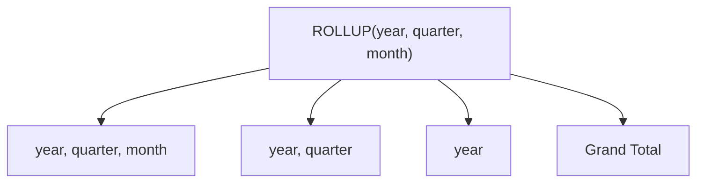
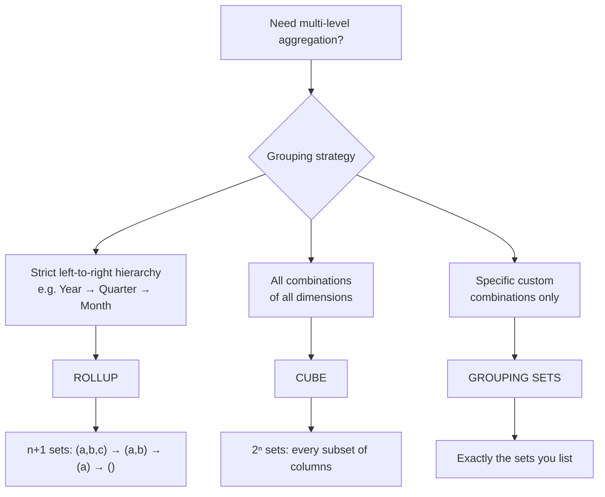

# :material-chevron-up: ROLLUP

`ROLLUP` extends `GROUP BY` to produce aggregate rows along a **left-to-right hierarchy**, generating one subtotal row per prefix of the column list plus a single grand total.

### :material-sitemap: Overview



---

## :material-pin: Syntax

```sql
SELECT col1 [, col2, ...], agg_func(expr) [AS alias]
FROM   table_name
GROUP BY ROLLUP (col1 [, col2, ...]);
```

For `n` columns, `ROLLUP` produces **n + 1** grouping sets:

| Columns | Grouping sets generated |
|---------|------------------------|
| `(a)` | `(a)`, `()` → 2 sets |
| `(a, b)` | `(a, b)`, `(a)`, `()` → 3 sets |
| `(a, b, c)` | `(a,b,c)`, `(a,b)`, `(a)`, `()` → 4 sets |

`ROLLUP(a, b, c)` is equivalent to:

```sql
GROUPING SETS (
    (a, b, c),
    (a, b),
    (a),
    ()
)
```

---

## :material-magnify: Behavior

1. **Hierarchical order** — subtotals are generated by removing columns from the *right*: the last column drops first, then the second-to-last, up to the grand total. This models strict parent-child hierarchies.
2. **Order is significant** — `ROLLUP(region, product)` and `ROLLUP(product, region)` produce different subtotal combinations.
3. **NULL as subtotal marker** — columns removed at a grouping level appear as `NULL` in those rows; use `GROUPING(col)` to distinguish these from real `NULL` data values.
4. **Grand total** — the empty grouping `()` always produces exactly one grand-total row.
5. **Row count** — the result contains the detail rows from a plain `GROUP BY` plus `n` additional subtotal/grand-total rows per distinct combination prefix.

---

## :material-tag-outline: GROUPING_ID()

`GROUPING_ID(col1, col2, ...)` returns a compact **bitmask integer** encoding the current grouping level — cleaner than chaining multiple `GROUPING()` calls in a `CASE` expression.

Because `ROLLUP` removes columns strictly from the **right**, only specific `GROUPING_ID` values are ever produced — those where every removed column is contiguous from the rightmost position:

| `GROUPING(region)` | `GROUPING(product)` | `GROUPING_ID` | Grouping level |
|--------------------|---------------------|---------------|----------------|
| 0 | 0 | 0 | Detail `(region, product)` |
| 0 | 1 | 1 | Region subtotal `(region)` |
| 1 | 1 | 3 | Grand total `()` |

!!! note "ID=2 is absent from ROLLUP"
    `GROUPING_ID = 2` would represent a `(product)` only subtotal — that grouping set exists in [`CUBE`](cube.md) but **not** in `ROLLUP`. For `ROLLUP(a, b, c)` the valid IDs are `0`, `1`, `3`, `7`.

```sql
SELECT
    region,
    product,
    SUM(amount)                  AS total_sales,
    GROUPING_ID(region, product) AS grp_id,
    CASE GROUPING_ID(region, product)
        WHEN 0 THEN 'Detail'
        WHEN 1 THEN 'Region Subtotal'
        WHEN 3 THEN 'Grand Total'
    END AS row_type
FROM sales
GROUP BY ROLLUP (region, product)
ORDER BY grp_id, region NULLS LAST, product NULLS LAST;
```

---

## :material-flask-outline: Practical Examples

### Setup

```sql
CREATE TABLE sales (
    order_id   BIGINT,
    region     STRING,
    product    STRING,
    amount     DOUBLE,
    order_date DATE
);

INSERT INTO sales VALUES
    (1, 'East',  'Widget',  120.00, DATE '2024-01-15'),
    (2, 'West',  'Gadget',  340.00, DATE '2024-01-15'),
    (3, 'East',  'Widget',   80.00, DATE '2024-02-10'),
    (4, 'North', 'Gadget',  210.00, DATE '2024-02-10'),
    (5, 'West',  'Widget',  150.00, DATE '2024-03-05'),
    (6, 'East',  'Gadget',  450.00, DATE '2024-03-05'),
    (7, 'North', 'Widget',   90.00, DATE '2024-03-20'),
    (8, 'West',  'Gadget',  270.00, DATE '2024-03-20');
```

### 1 — Basic ROLLUP (region subtotals + grand total)

```sql
SELECT
    region,
    SUM(amount) AS total_sales
FROM sales
GROUP BY ROLLUP (region)
ORDER BY region NULLS LAST;
-- Result:
-- region | total_sales
-- --------|------------
-- East    | 650.0       ← detail  (region)
-- North   | 300.0       ← detail  (region)
-- West    | 760.0       ← detail  (region)
-- NULL    | 1710.0      ← grand total  ()
```

### 2 — Two-column ROLLUP (region → product hierarchy)

```sql
SELECT
    region,
    product,
    SUM(amount) AS total_sales
FROM sales
GROUP BY ROLLUP (region, product)
ORDER BY region NULLS LAST, product NULLS LAST;
-- Result — groupings: (region, product), (region), ():
-- region | product | total_sales
-- --------|---------|------------
-- East    | Gadget  | 450.0       ← detail
-- East    | Widget  | 200.0       ← detail
-- East    | NULL    | 650.0       ← region subtotal
-- North   | Gadget  | 210.0
-- North   | Widget  | 90.0
-- North   | NULL    | 300.0       ← region subtotal
-- West    | Gadget  | 610.0
-- West    | Widget  | 150.0
-- West    | NULL    | 760.0       ← region subtotal
-- NULL    | NULL    | 1710.0      ← grand total
```

### 3 — Three-level hierarchy (year → region → product)

```sql
SELECT
    YEAR(order_date) AS sale_year,
    region,
    product,
    SUM(amount)      AS total_sales,
    COUNT(*)         AS order_count
FROM sales
GROUP BY ROLLUP (YEAR(order_date), region, product)
ORDER BY sale_year NULLS LAST, region NULLS LAST, product NULLS LAST;
-- Generates 4 grouping levels:
--   (year, region, product)  → detail rows
--   (year, region)           → region subtotal within each year
--   (year)                   → year subtotal
--   ()                       → grand total
```

### 4 — Using `GROUPING()` to identify subtotal rows

```sql
SELECT
    region,
    product,
    SUM(amount)       AS total_sales,
    GROUPING(region)  AS region_is_subtotal,
    GROUPING(product) AS product_is_subtotal
FROM sales
GROUP BY ROLLUP (region, product)
ORDER BY region NULLS LAST, product NULLS LAST;
-- GROUPING returns 1 for columns rolled up into the subtotal,
-- 0 for columns still present at that grouping level.
```

### 5 — Readable labels with `GROUPING()`

```sql
SELECT
    CASE WHEN GROUPING(region)  = 1 THEN 'All Regions'  ELSE region  END AS region_label,
    CASE WHEN GROUPING(product) = 1 THEN 'All Products' ELSE product END AS product_label,
    SUM(amount) AS total_sales
FROM sales
GROUP BY ROLLUP (region, product)
ORDER BY region_label, product_label;
-- Result:
-- region_label | product_label | total_sales
-- -------------|---------------|------------
-- All Regions  | All Products  | 1710.0      ← grand total
-- East         | All Products  | 650.0       ← region subtotal
-- East         | Gadget        | 450.0
-- East         | Widget        | 200.0
-- North        | All Products  | 300.0
-- North        | Gadget        | 210.0
-- North        | Widget        | 90.0
-- West         | All Products  | 760.0
-- West         | Gadget        | 610.0
-- West         | Widget        | 150.0
```

### 6 — Multiple aggregates in one pass

```sql
SELECT
    CASE WHEN GROUPING(region)  = 1 THEN 'All Regions'  ELSE region  END AS region_label,
    CASE WHEN GROUPING(product) = 1 THEN 'All Products' ELSE product END AS product_label,
    ROUND(SUM(amount), 2)  AS total_revenue,
    COUNT(*)               AS order_count,
    ROUND(AVG(amount), 2)  AS avg_order_value,
    MAX(amount)            AS max_order_value
FROM sales
GROUP BY ROLLUP (region, product)
ORDER BY GROUPING_ID(region, product), region_label, product_label;
-- A single scan produces every subtotal level with all four KPIs.
```

### 7 — Year → Quarter → Month time hierarchy

A classic BI pattern: build a three-level date rollup from a dedicated monthly-revenue table.

```sql
CREATE TABLE monthly_revenue (
    sale_year  INT,
    quarter    STRING,
    month_name STRING,
    revenue    DOUBLE
);

INSERT INTO monthly_revenue VALUES
    (2024, 'Q1', 'Jan', 12000.0),
    (2024, 'Q1', 'Feb',  9500.0),
    (2024, 'Q1', 'Mar', 11000.0),
    (2024, 'Q2', 'Apr', 13500.0),
    (2024, 'Q2', 'May', 16000.0),
    (2024, 'Q2', 'Jun', 14500.0),
    (2024, 'Q3', 'Jul', 10000.0),
    (2024, 'Q3', 'Aug',  8500.0),
    (2024, 'Q3', 'Sep', 17000.0),
    (2024, 'Q4', 'Oct', 19000.0),
    (2024, 'Q4', 'Nov', 22000.0),
    (2024, 'Q4', 'Dec', 25000.0);

SELECT
    CASE WHEN GROUPING(sale_year)  = 1 THEN 'All Years'    ELSE CAST(sale_year AS STRING) END AS yr,
    CASE WHEN GROUPING(quarter)    = 1 THEN 'All Quarters' ELSE quarter                   END AS qtr,
    CASE WHEN GROUPING(month_name) = 1 THEN 'All Months'   ELSE month_name                END AS mth,
    ROUND(SUM(revenue), 2) AS total_revenue,
    COUNT(*)               AS month_count
FROM monthly_revenue
GROUP BY ROLLUP (sale_year, quarter, month_name)
ORDER BY GROUPING_ID(sale_year, quarter, month_name), yr, qtr, mth;
-- 4 grouping levels (GROUPING_ID values: 0, 1, 3, 7):
--   0 → monthly detail    (year, quarter, month)
--   1 → quarterly total   (year, quarter)
--   3 → annual total      (year)
--   7 → grand total       ()
```

### 8 — CTE + ROLLUP for clean hierarchical reporting

Pre-filter in a CTE, compute the rollup, then apply labels downstream:

```sql
WITH raw AS (
    SELECT
        YEAR(order_date)    AS sale_year,
        QUARTER(order_date) AS sale_quarter,
        region,
        amount
    FROM sales
    WHERE order_date >= DATE '2024-01-01'
),
rollup_base AS (
    SELECT
        sale_year,
        sale_quarter,
        region,
        SUM(amount)                               AS total_revenue,
        COUNT(*)                                  AS order_count,
        GROUPING_ID(sale_year, sale_quarter, region) AS grp_id
    FROM raw
    GROUP BY ROLLUP (sale_year, sale_quarter, region)
)
SELECT
    COALESCE(CAST(sale_year    AS STRING), 'All Years')    AS year_label,
    COALESCE(CAST(sale_quarter AS STRING), 'All Quarters') AS quarter_label,
    COALESCE(region,                       'All Regions')  AS region_label,
    ROUND(total_revenue, 2)                                AS total_revenue,
    order_count,
    grp_id
FROM rollup_base
ORDER BY grp_id, year_label, quarter_label, region_label;
```

!!! tip "Pre-filter before ROLLUP"
    Placing `WHERE` inside a CTE before the `GROUP BY ROLLUP` reduces the data scanned in the shuffle stage, which is especially important on large fact tables.

### 9 — Filtering to a specific hierarchy level

Retrieve only quarterly subtotals (exclude monthly detail and annual/grand totals):

```sql
SELECT
    CASE WHEN GROUPING(sale_year) = 1 THEN 'All Years' ELSE CAST(sale_year AS STRING) END AS yr,
    CASE WHEN GROUPING(quarter)   = 1 THEN 'All Qtrs'  ELSE quarter                   END AS qtr,
    ROUND(SUM(revenue), 2) AS quarterly_revenue
FROM monthly_revenue
GROUP BY ROLLUP (sale_year, quarter, month_name)
HAVING GROUPING_ID(sale_year, quarter, month_name) = 1   -- quarterly subtotal only
ORDER BY yr, qtr;
```

### 10 — Real-world use case: product category hierarchy

Three-level product hierarchy — category → subcategory → product — in a single query:

```sql
CREATE TABLE product_sales (
    category    STRING,
    subcategory STRING,
    product     STRING,
    revenue     DOUBLE,
    units_sold  BIGINT
);

INSERT INTO product_sales VALUES
    ('Electronics', 'Phones',    'iPhone 15',     95000.0,  19),
    ('Electronics', 'Phones',    'Galaxy S24',    78000.0,  18),
    ('Electronics', 'Laptops',   'MacBook Pro',  125000.0,  10),
    ('Electronics', 'Laptops',   'ThinkPad X1',   89000.0,  11),
    ('Clothing',    'Tops',      'Polo Shirt',     4500.0, 150),
    ('Clothing',    'Tops',      'T-Shirt Pack',   3200.0, 200),
    ('Clothing',    'Bottoms',   'Slim Jeans',     6800.0,  85),
    ('Clothing',    'Bottoms',   'Chinos',         5100.0,  68),
    ('Home',        'Kitchen',   'Air Fryer',     12000.0,  60),
    ('Home',        'Kitchen',   'Coffee Maker',   8500.0,  85),
    ('Home',        'Furniture', 'Office Chair',  22000.0,  44),
    ('Home',        'Furniture', 'Standing Desk', 35000.0,  28);

SELECT
    CASE WHEN GROUPING(category)    = 1 THEN 'All Categories'    ELSE category    END AS category_label,
    CASE WHEN GROUPING(subcategory) = 1 THEN 'All Subcategories' ELSE subcategory END AS subcategory_label,
    CASE WHEN GROUPING(product)     = 1 THEN 'All Products'      ELSE product     END AS product_label,
    ROUND(SUM(revenue), 2)                                         AS total_revenue,
    SUM(units_sold)                                                AS total_units,
    ROUND(SUM(revenue) / NULLIF(SUM(units_sold), 0), 2)           AS avg_unit_price,
    GROUPING_ID(category, subcategory, product)                    AS grp_id
FROM product_sales
GROUP BY ROLLUP (category, subcategory, product)
ORDER BY grp_id, category_label, subcategory_label, product_label;
-- grp_id = 0 → product detail
-- grp_id = 1 → subcategory subtotal
-- grp_id = 3 → category subtotal
-- grp_id = 7 → grand total
```

---

## :material-magnify: Decision Flow



---

## :material-shield-outline: Common Pitfalls

!!! warning "Column order is critical"
    `ROLLUP(region, product)` and `ROLLUP(product, region)` produce **different** subtotals. The leftmost column forms the highest-level hierarchy; always list columns from most-general to most-specific.

!!! warning "NULL ambiguity without GROUPING()"
    A `NULL` output column may be a subtotal placeholder *or* genuine `NULL` data. Always use `GROUPING(col)` or `GROUPING_ID()` to distinguish them — never filter on `col IS NULL` alone.

!!! warning "Do not skip hierarchy levels"
    `ROLLUP(category, product)` will not produce a `subcategory` subtotal — it only rolls up in the order given. If you need non-contiguous subtotals (e.g., category + month, skipping subcategory), use [`GROUPING SETS`](group_set.md) instead.

!!! note "ROLLUP is not symmetric — CUBE is"
    Unlike [`CUBE`](cube.md), swapping column order in `ROLLUP` changes which subtotals are generated. Design the column order to match your actual data hierarchy.

!!! tip "Prefer ROLLUP over CUBE for strict hierarchies"
    A time dimension (year → quarter → month) has a natural parent-child order. `ROLLUP` generates exactly `n+1` sets instead of `CUBE`'s `2ⁿ`, keeping query cost proportional and predictable.

---

## :material-speedometer: Performance Tips

| Tip | Details |
|-----|---------|
| Pre-filter in a CTE | Apply `WHERE` inside a CTE before `GROUP BY ROLLUP` so only relevant rows enter the shuffle stage. |
| Predictable cost | `ROLLUP` on `n` columns produces exactly `n+1` grouping sets — much cheaper than `CUBE` (2ⁿ) when `n` is large. |
| AQE coalesces partitions | Spark AQE (`spark.sql.adaptive.coalescePartitions.enabled = true`) right-sizes shuffle output partitions for rollup queries. |
| Partition pruning | When the first `ROLLUP` column is also a table partition column (e.g., `sale_year`), Spark can skip irrelevant partitions at the scan stage. |
| Avoid high-cardinality inner columns | High-cardinality columns in the middle of the hierarchy (e.g., `order_id`) create a huge number of partial-aggregate rows. Aggregate to a coarser granularity first. |

---

## :material-brain: When to Use

| Scenario | Recommended Pattern |
|----------|---------------------|
| Year → Quarter → Month hierarchy | `ROLLUP(year, quarter, month)` |
| Country → Region → City breakdown | `ROLLUP(country, region, city)` |
| Category → Subcategory → Product totals | `ROLLUP(category, subcategory, product)` |
| Department → Team → Employee cost reporting | `ROLLUP(department, team, employee)` |
| Fiscal year → Period → Week financial rollup | `ROLLUP(fiscal_year, period, week)` |
| Compact row-type classifier per level | `GROUPING_ID()` alongside `ROLLUP` |
| Distinguish data NULLs from subtotal NULLs | `GROUPING(col)` alongside `ROLLUP` |
| Grand total only (no subtotals) | Plain `GROUP BY` |
| All possible subtotal combinations | [`CUBE`](cube.md) |
| Non-contiguous or non-hierarchical combinations | [`GROUPING SETS`](group_set.md) |
