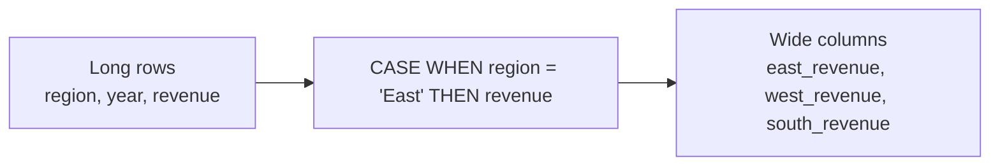

# :material-table-pivot: PIVOT with SELECT CASE

`SELECT CASE WHEN` is a fully SQL-based way to manually pivot rows into columns without the `PIVOT` keyword. It works everywhere SQL runs and gives complete control over column names and aggregate logic.

---

## :material-sitemap: Overview



---

## :material-pin: Pattern

```sql
SELECT
    group_col,
    agg_func(CASE WHEN pivot_col = 'value1' THEN measure_col END) AS value1_alias,
    agg_func(CASE WHEN pivot_col = 'value2' THEN measure_col END) AS value2_alias,
    ...
FROM table_name
GROUP BY group_col;
```

The `CASE WHEN` returns the value when the condition matches and `NULL` otherwise. The aggregate function (`SUM`, `MIN`, `MAX`, `AVG`, `COUNT`) ignores `NULL`, so each column accumulates only the rows that matched its condition.

---

## :material-flask-outline: Practical Examples

### Setup

```sql
CREATE TABLE sales (
    sale_id  INT,
    yr       INT,
    month    STRING,
    region   STRING,
    product  STRING,
    quantity INT,
    revenue  INT
);

INSERT INTO sales VALUES
    (1,  2023, 'Jan', 'East',  'Laptop',  5, 5000),
    (2,  2023, 'Jan', 'East',  'Monitor', 10, 2000),
    (3,  2023, 'Jan', 'West',  'Laptop',  3, 3000),
    (4,  2023, 'Feb', 'West',  'Monitor', 7, 1400),
    (5,  2023, 'Feb', 'South', 'Laptop',  4, 4000),
    (6,  2023, 'Feb', 'South', 'Monitor', 6, 1200),
    (7,  2024, 'Jan', 'East',  'Laptop',  6, 6000),
    (8,  2024, 'Jan', 'West',  'Laptop',  5, 5000),
    (9,  2024, 'Feb', 'South', 'Monitor', 8, 1600),
    (10, 2024, 'Feb', 'East',  'Monitor', 7, 1400);
```

### 1 — Revenue by region per year

```sql
SELECT
    yr,
    SUM(CASE WHEN region = 'East'  THEN revenue ELSE 0 END) AS east_revenue,
    SUM(CASE WHEN region = 'West'  THEN revenue ELSE 0 END) AS west_revenue,
    SUM(CASE WHEN region = 'South' THEN revenue ELSE 0 END) AS south_revenue,
    SUM(revenue)                                             AS total_revenue
FROM sales
GROUP BY yr
ORDER BY yr;
-- Result:
-- yr   | east_revenue | west_revenue | south_revenue | total_revenue
-- -----|--------------|--------------|---------------|-------------
-- 2023 | 7000         | 4400         | 5200          | 16600
-- 2024 | 7400         | 5000         | 1600          | 14000
```

### 2 — Quantity and revenue per product per year

```sql
SELECT
    yr,
    SUM(CASE WHEN product = 'Laptop'  THEN quantity END) AS laptop_qty,
    SUM(CASE WHEN product = 'Monitor' THEN quantity END) AS monitor_qty,
    SUM(CASE WHEN product = 'Laptop'  THEN revenue  END) AS laptop_revenue,
    SUM(CASE WHEN product = 'Monitor' THEN revenue  END) AS monitor_revenue
FROM sales
GROUP BY yr
ORDER BY yr;
-- Result:
-- yr   | laptop_qty | monitor_qty | laptop_revenue | monitor_revenue
-- -----|------------|-------------|----------------|----------------
-- 2023 | 12         | 23          | 12000          | 4600
-- 2024 | 11         | 15          | 11000          | 3000
```

### 3 — MAX revenue per region across all years

```sql
SELECT
    product,
    MAX(CASE WHEN region = 'East'  THEN revenue END) AS east_max,
    MAX(CASE WHEN region = 'West'  THEN revenue END) AS west_max,
    MAX(CASE WHEN region = 'South' THEN revenue END) AS south_max
FROM sales
GROUP BY product
ORDER BY product;
-- Result:
-- product | east_max | west_max | south_max
-- ---------|----------|----------|----------
-- Laptop   | 6000     | 5000     | 4000
-- Monitor  | 2000     | 1400     | 1600
```

### 4 — Conditional COUNT (orders above threshold)

```sql
SELECT
    yr,
    COUNT(CASE WHEN revenue >= 4000 THEN 1 END) AS high_value_orders,
    COUNT(CASE WHEN revenue <  4000 THEN 1 END) AS standard_orders
FROM sales
GROUP BY yr
ORDER BY yr;
-- Result:
-- yr   | high_value_orders | standard_orders
-- -----|-------------------|----------------
-- 2023 | 3                 | 3
-- 2024 | 3                 | 2
```

---

## :material-magnify: CASE WHEN vs PIVOT vs FILTER

| Feature | `CASE WHEN` | `PIVOT` keyword | `agg() FILTER (WHERE ...)` |
|---------|-------------|-----------------|---------------------------|
| Column names | Fully custom | `<value>_<agg>` pattern | Fully custom |
| Dynamic column values | Requires generated SQL | Not supported natively | Requires generated SQL |
| Readability | Verbose for many values | Compact | Compact |
| Portability | Works everywhere | Spark / Databricks specific | SQL standard |
| Multiple aggregates per pivot value | Easy | Built-in | Separate clause per agg |

---

## :material-brain: When to Use

| Scenario | Recommended Pattern |
|----------|---------------------|
| Static set of known pivot values | `SELECT CASE WHEN` (readable, portable) |
| Custom column names per value | `SELECT CASE WHEN` |
| Dynamic values discovered at runtime | Generate `CASE WHEN` SQL with PySpark |
| Concise static pivot with Spark | [`PIVOT` keyword](spark.md) |
| Single conditional aggregate column | `agg() FILTER (WHERE ...)` |
