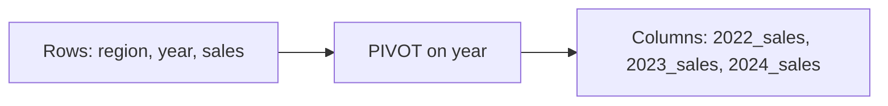

# :material-table-pivot: Pivoting

It is a great way of transforming the table to create a different view, more suitable to doing many
summarizations and aggregations.

This is accomplished by taking the values of a column and making each of the values an actual column.

The `PIVOT` clause is used for data perspective.

We can get the aggregated values based on specific column values, which will be turned to multiple columns used in SELECT clause.

The PIVOT clause can be specified after the table name or subquery.

### :material-sitemap: Overview



## Syntax

```SQL
PIVOT ( 
            { aggregate_expression [ AS aggregate_expression_alias ] }
            [ , ... ]
            FOR column_list IN ( expression_list ) 
)
```

1. `aggregate_expression`
   - Specifies an aggregate expression (SUM(a), COUNT(DISTINCT b), etc.).
2. `aggregate_expression_alias`
   - Specifies an alias for the aggregate expression.
3. `column_list`
   - Contains columns in the FROM clause, which specifies the columns we want to replace with new columns.
   - We can use brackets to surround the columns, such as (c1, c2).
4. `expression_list`
   - Specifies new columns, which are used to match values in column_list as the aggregating condition.

### SQL

```sql
SELECT * FROM students
  PIVOT (
    min(weight) AS min, 
    max(weight) AS max,
    avg(weight) AS avg
  FOR gender IN ('M' AS Male, 'F' AS Female))
```

## Emulate Dynamic Pivot via SQL Generation

### ✅ 1. Generate SQL Dynamically (Recommended)

Write a small query to fetch distinct genders, and build your final SQL dynamically.

#### Step 1: Get distinct genders

```sql
SELECT DISTINCT gender FROM students;
```

Assume the result is: 'M', 'F', 'O'

#### Step 2: Use Python (or notebook) to build the SQL

```python
from pyspark.sql import SparkSession

spark = SparkSession.getActiveSession()

# Get distinct gender values
genders = [row['gender'] for row in spark.sql("SELECT DISTINCT gender FROM students").collect()]

# Optional: Provide label aliases
gender_labels = {g: g for g in genders}  # or {'M': 'Male', 'F': 'Female'}

# Build the PIVOT SQL
gender_pivot_values = ", ".join(f"'{k}' AS {v}" for k, v in gender_labels.items())

sql = f"""
SELECT *
FROM students
PIVOT (
    min(weight) AS min,
    max(weight) AS max,
    avg(weight) AS avg 
    FOR gender IN ({gender_pivot_values})
)
"""

# Run the query
df = spark.sql(sql)
df.show()
```

### ✅ 2. Use CASE WHEN (Fully SQL Only) — Works Dynamically

If you're okay not using PIVOT, you can write a dynamic query that looks like pivoting.

#### Static version (but can be generated dynamically):

```sql
Copy
Edit
SELECT
  min(CASE WHEN gender = 'M' THEN weight END) AS min_M,
  min(CASE WHEN gender = 'F' THEN weight END) AS min_F,
  max(CASE WHEN gender = 'M' THEN weight END) AS max_M,
  max(CASE WHEN gender = 'F' THEN weight END) AS max_F,
  avg(CASE WHEN gender = 'M' THEN weight END) AS avg_M,
  avg(CASE WHEN gender = 'F' THEN weight END) AS avg_F
FROM students;
```

You can generate this part dynamically using PySpark or SQL string concat.

### ✅ Summary
Method             | Dynamic | Uses PIVOT | Complexity
-------------------|---------|------------|-----------
PySpark string gen | ✅ Yes   | ✅ Yes      | Medium
SQL with CASE WHEN | ✅ Yes   | ❌ No       | Easy
Native Spark SQL   | ❌ No    | ✅ Yes      | Easy
