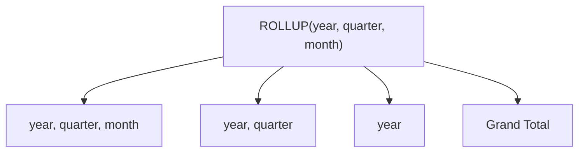

# :material-chevron-up: ROLLUP

`ROLLUP` extends `GROUP BY` to produce aggregate rows along a **left-to-right hierarchy**, generating one subtotal row per prefix of the column list plus a single grand total.

### :material-sitemap: Overview



---

## 📌 Syntax

```sql
SELECT col1 [, col2, ...], agg_func(expr) [AS alias]
FROM   table_name
GROUP BY ROLLUP (col1 [, col2, ...]);
```

For `n` columns, `ROLLUP` produces **n + 1** grouping sets:

| Columns | Grouping sets generated |
|---------|------------------------|
| `(a)` | `(a)`, `()` → 2 sets |
| `(a, b)` | `(a, b)`, `(a)`, `()` → 3 sets |
| `(a, b, c)` | `(a,b,c)`, `(a,b)`, `(a)`, `()` → 4 sets |

`ROLLUP(a, b, c)` is equivalent to:

```sql
GROUPING SETS (
    (a, b, c),
    (a, b),
    (a),
    ()
)
```

---

## 🔍 Behavior

1. **Hierarchical order** — subtotals are generated by removing columns from the *right*: the last column drops first, then the second-to-last, up to the grand total. This models strict parent-child hierarchies.
2. **Order is significant** — `ROLLUP(region, product)` and `ROLLUP(product, region)` produce different subtotal combinations.
3. **NULL as subtotal marker** — columns removed at a grouping level appear as `NULL` in those rows; use `GROUPING(col)` to distinguish these from real `NULL` data values.
4. **Grand total** — the empty grouping `()` always produces exactly one grand-total row.
5. **Row count** — the result contains the detail rows from a plain `GROUP BY` plus `n` additional subtotal/grand-total rows per distinct combination prefix.

---

## 🧪 Practical Examples

### Setup

```sql
CREATE TABLE sales (
    order_id   BIGINT,
    region     STRING,
    product    STRING,
    amount     DOUBLE,
    order_date DATE
);

INSERT INTO sales VALUES
    (1, 'East',  'Widget',  120.00, DATE '2024-01-15'),
    (2, 'West',  'Gadget',  340.00, DATE '2024-01-15'),
    (3, 'East',  'Widget',   80.00, DATE '2024-02-10'),
    (4, 'North', 'Gadget',  210.00, DATE '2024-02-10'),
    (5, 'West',  'Widget',  150.00, DATE '2024-03-05'),
    (6, 'East',  'Gadget',  450.00, DATE '2024-03-05'),
    (7, 'North', 'Widget',   90.00, DATE '2024-03-20'),
    (8, 'West',  'Gadget',  270.00, DATE '2024-03-20');
```

### 1 — Basic ROLLUP (region subtotals + grand total)

```sql
SELECT
    region,
    SUM(amount) AS total_sales
FROM sales
GROUP BY ROLLUP (region)
ORDER BY region NULLS LAST;
-- Result:
-- region | total_sales
-- --------|------------
-- East    | 650.0       ← detail  (region)
-- North   | 300.0       ← detail  (region)
-- West    | 760.0       ← detail  (region)
-- NULL    | 1710.0      ← grand total  ()
```

### 2 — Two-column ROLLUP (region → product hierarchy)

```sql
SELECT
    region,
    product,
    SUM(amount) AS total_sales
FROM sales
GROUP BY ROLLUP (region, product)
ORDER BY region NULLS LAST, product NULLS LAST;
-- Result — groupings: (region, product), (region), ():
-- region | product | total_sales
-- --------|---------|------------
-- East    | Gadget  | 450.0       ← detail
-- East    | Widget  | 200.0       ← detail
-- East    | NULL    | 650.0       ← region subtotal
-- North   | Gadget  | 210.0
-- North   | Widget  | 90.0
-- North   | NULL    | 300.0       ← region subtotal
-- West    | Gadget  | 610.0
-- West    | Widget  | 150.0
-- West    | NULL    | 760.0       ← region subtotal
-- NULL    | NULL    | 1710.0      ← grand total
```

### 3 — Three-level hierarchy (year → region → product)

```sql
SELECT
    YEAR(order_date) AS sale_year,
    region,
    product,
    SUM(amount)      AS total_sales,
    COUNT(*)         AS order_count
FROM sales
GROUP BY ROLLUP (YEAR(order_date), region, product)
ORDER BY sale_year NULLS LAST, region NULLS LAST, product NULLS LAST;
-- Generates 4 grouping levels:
--   (year, region, product)  → detail rows
--   (year, region)           → region subtotal within each year
--   (year)                   → year subtotal
--   ()                       → grand total
```

### 4 — Using `GROUPING()` to identify subtotal rows

```sql
SELECT
    region,
    product,
    SUM(amount)       AS total_sales,
    GROUPING(region)  AS region_is_subtotal,
    GROUPING(product) AS product_is_subtotal
FROM sales
GROUP BY ROLLUP (region, product)
ORDER BY region NULLS LAST, product NULLS LAST;
-- GROUPING returns 1 for columns rolled up into the subtotal,
-- 0 for columns still present at that grouping level.
```

### 5 — Readable labels with `GROUPING()`

```sql
SELECT
    CASE WHEN GROUPING(region)  = 1 THEN 'All Regions'  ELSE region  END AS region_label,
    CASE WHEN GROUPING(product) = 1 THEN 'All Products' ELSE product END AS product_label,
    SUM(amount) AS total_sales
FROM sales
GROUP BY ROLLUP (region, product)
ORDER BY region_label, product_label;
-- Result:
-- region_label | product_label | total_sales
-- -------------|---------------|------------
-- All Regions  | All Products  | 1710.0      ← grand total
-- East         | All Products  | 650.0       ← region subtotal
-- East         | Gadget        | 450.0
-- East         | Widget        | 200.0
-- North        | All Products  | 300.0
-- North        | Gadget        | 210.0
-- North        | Widget        | 90.0
-- West         | All Products  | 760.0
-- West         | Gadget        | 610.0
-- West         | Widget        | 150.0
```

---

## 🧠 When to Use

| Scenario | Recommended Pattern |
|----------|---------------------|
| Year → Quarter → Month hierarchy | `ROLLUP(year, quarter, month)` |
| Country → Region → City breakdown | `ROLLUP(country, region, city)` |
| Category → Subcategory totals | `ROLLUP(category, subcategory)` |
| Grand total only (no subtotals) | Plain `GROUP BY` |
| All possible subtotal combinations | [`CUBE`](cube.md) |
| Specific non-hierarchical combinations | [`GROUPING SETS`](group_set.md) |
