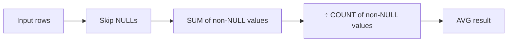

# :material-sigma: AVG

`AVG` returns the arithmetic mean of all non-NULL values in a group.

### :material-sitemap: Overview



---

## :material-pin: Syntax

```sql
AVG(expr)
AVG(DISTINCT expr)
AVG(expr) FILTER (WHERE condition)
```

| Variant | Description |
|---------|-------------|
| `AVG(expr)` | Mean of all non-NULL values |
| `AVG(DISTINCT expr)` | Mean of unique non-NULL values only |
| `AVG(expr) FILTER (WHERE ...)` | Mean scoped to rows matching the condition |

---

## :material-magnify: Behavior

1. **NULL ignored** — `NULL` values are excluded from both the numerator (sum) and denominator (count); `AVG` over an all-NULL column returns `NULL`.
2. **Return type** — `DOUBLE` for `INTEGER` / `BIGINT` / `FLOAT` inputs; `DECIMAL(p, s)` for `DECIMAL` inputs (preserves precision).
3. **DISTINCT semantics** — `AVG(DISTINCT col)` deduplicates values before averaging; useful when rows are duplicated by a join.
4. **Integer division** — input integers are promoted to `DOUBLE` before averaging, so `AVG(1, 2)` returns `1.5`, not `1`.
5. **Window function** — `AVG` is also available as a window function with `OVER (...)` for moving averages; see [Window Aggregate Functions](../../../window/window/aggregate.md).

---

## :material-flask-outline: Practical Examples

### Setup

```sql
CREATE TABLE sales (
    order_id   BIGINT,
    region     STRING,
    product    STRING,
    amount     DOUBLE,
    order_date DATE
);

INSERT INTO sales VALUES
    (1, 'East',  'Widget', 120.00, DATE '2024-01-15'),
    (2, 'West',  'Gadget', 340.00, DATE '2024-01-15'),
    (3, 'East',  'Widget',  80.00, DATE '2024-02-10'),
    (4, 'North', 'Gadget', 210.00, DATE '2024-02-10'),
    (5, 'West',  'Widget', 150.00, DATE '2024-03-05'),
    (6, 'East',  'Gadget', 450.00, DATE '2024-03-05'),
    (7, 'North', 'Widget',  90.00, DATE '2024-03-20'),
    (8, 'West',  'Gadget', 270.00, DATE '2024-03-20'),
    (9, 'East',  'Widget',  NULL,  DATE '2024-03-25');  -- NULL amount
```

### 1 — Grand average (NULL ignored)

```sql
SELECT
    COUNT(*)              AS total_rows,
    COUNT(amount)         AS non_null_rows,
    ROUND(AVG(amount), 2) AS avg_amount
FROM sales;
-- Result:
-- total_rows | non_null_rows | avg_amount
-- -----------|---------------|----------
-- 9          | 8             | 213.75
-- row 9 (NULL) is excluded from both sum and count
```

### 2 — AVG per group

```sql
SELECT
    region,
    COUNT(*)              AS order_count,
    ROUND(AVG(amount), 2) AS avg_sale
FROM sales
GROUP BY region
ORDER BY avg_sale DESC;
-- Result:
-- region | order_count | avg_sale
-- --------|-------------|--------
-- West    | 3           | 253.33
-- East    | 4           | 216.67   -- row 9 has NULL, excluded from avg but counted by COUNT(*)
-- North   | 2           | 150.00
```

### 3 — AVG with FILTER clause

```sql
SELECT
    product,
    ROUND(AVG(amount), 2)                                AS overall_avg,
    ROUND(AVG(amount) FILTER (WHERE region = 'East'), 2) AS east_avg,
    ROUND(AVG(amount) FILTER (WHERE region = 'West'), 2) AS west_avg
FROM sales
GROUP BY product
ORDER BY product;
-- Result:
-- product | overall_avg | east_avg | west_avg
-- ---------|-------------|----------|--------
-- Gadget   | 317.50      | 450.00   | 305.00
-- Widget   | 110.00      | 100.00   | 150.00
```

### 4 — AVG(DISTINCT) to avoid double-counting

```sql
WITH expanded AS (
    SELECT 120.00 AS amount
    UNION ALL SELECT 120.00   -- duplicate
    UNION ALL SELECT 200.00
)
SELECT
    ROUND(AVG(amount), 2)          AS avg_all,       -- (120+120+200) / 3 = 146.67
    ROUND(AVG(DISTINCT amount), 2) AS avg_distinct    -- (120+200) / 2    = 160.00
FROM expanded;
-- Result:
-- avg_all | avg_distinct
-- --------|------------
-- 146.67  | 160.00
```

### 5 — Moving average (3-row window)

```sql
SELECT
    order_id,
    order_date,
    amount,
    ROUND(AVG(amount) OVER (
        ORDER BY order_date, order_id
        ROWS BETWEEN 2 PRECEDING AND CURRENT ROW
    ), 2) AS moving_avg_3
FROM sales
WHERE amount IS NOT NULL
ORDER BY order_date, order_id;
-- Result:
-- order_id | order_date | amount | moving_avg_3
-- ----------|------------|--------|------------
-- 1         | 2024-01-15 | 120.0  | 120.00
-- 2         | 2024-01-15 | 340.0  | 230.00
-- 3         | 2024-02-10 |  80.0  | 180.00
-- 4         | 2024-02-10 | 210.0  | 210.00
-- 5         | 2024-03-05 | 150.0  | 146.67
-- 6         | 2024-03-05 | 450.0  | 270.00
-- 7         | 2024-03-20 |  90.0  | 230.00
-- 8         | 2024-03-20 | 270.0  | 270.00
```

### 6 — Comparing group average to overall average

```sql
SELECT
    region,
    ROUND(AVG(amount), 2)                              AS region_avg,
    ROUND(AVG(amount) OVER (), 2)                      AS overall_avg,
    ROUND(AVG(amount) - AVG(amount) OVER (), 2)        AS delta_from_overall
FROM sales
WHERE amount IS NOT NULL
GROUP BY region
ORDER BY region;
-- Result:
-- region | region_avg | overall_avg | delta_from_overall
-- --------|------------|-------------|-------------------
-- East    | 216.67     | 213.75      | 2.92
-- North   | 150.00     | 213.75      | -63.75
-- West    | 253.33     | 213.75      | 39.58
```

---

## :material-brain: When to Use

| Scenario | Recommended Pattern |
|----------|---------------------|
| Grand average of a column | `AVG(col)` |
| Per-group average | `GROUP BY ... AVG(col)` |
| Conditional average (subset of rows) | `AVG(col) FILTER (WHERE ...)` |
| Avoid double-counting from joins | `AVG(DISTINCT col)` |
| Smoothed time-series (rolling mean) | `AVG(col) OVER (ROWS BETWEEN n PRECEDING AND CURRENT ROW)` |
| Compare group average to overall | `AVG(col)` alongside `AVG(col) OVER ()` |
