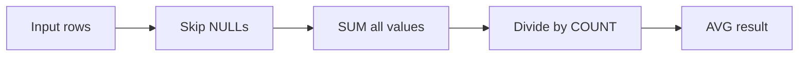

# :material-sigma: AVG

`AVG` returns the arithmetic mean of non-NULL values.

### :material-sitemap: Overview



---

## 📌 Syntax

```sql
AVG(expr)
```

---

## 🔍 Behavior

1. NULL values are ignored.
2. The return type is DOUBLE (or DECIMAL for DECIMAL inputs).
3. Use `AVG(DISTINCT expr)` to average unique values only.

---

## 🧪 Practical Examples

### Average Order Amount

```sql
SELECT AVG(amount) AS avg_amount
FROM orders;
```

### Average Per Group

```sql
SELECT region, AVG(amount) AS avg_amount
FROM orders
GROUP BY region;
```

### Distinct Average

```sql
SELECT AVG(DISTINCT score) AS avg_score
FROM ratings;
```

---

## 🧠 When to Use

| Scenario | Pattern |
|----------|---------|
| Mean of values | `AVG(col)` |
| Grouped averages | `AVG(col) ... GROUP BY` |
| Remove duplicates | `AVG(DISTINCT col)` |
