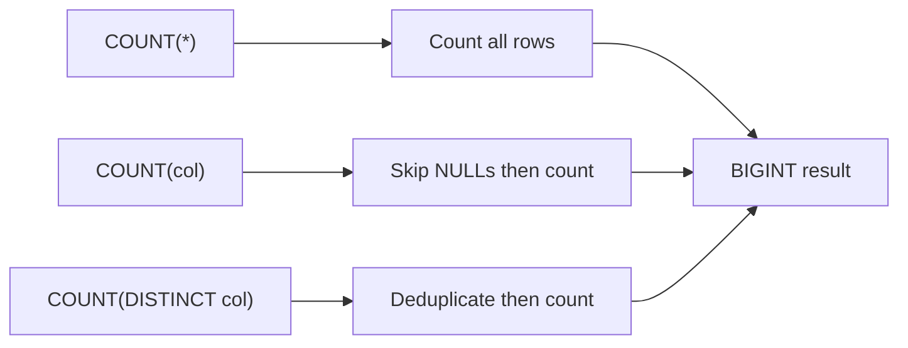

# :material-counter: COUNT

`COUNT` counts rows or non-NULL values within a group, making it one of the most commonly used aggregate functions in Spark SQL.

### :material-sitemap: Overview



---

## 📌 Syntax

```sql
COUNT(*)
COUNT(expr)
COUNT(DISTINCT expr)
COUNT(DISTINCT expr1, expr2)
COUNT(expr) FILTER (WHERE condition)
```

| Variant | Description |
|---------|-------------|
| `COUNT(*)` | Counts all rows, including rows with `NULL` values |
| `COUNT(expr)` | Counts rows where `expr` is not `NULL` |
| `COUNT(DISTINCT expr)` | Counts distinct non-NULL values of `expr` |
| `COUNT(DISTINCT e1, e2)` | Counts distinct `(e1, e2)` pairs where both are non-NULL |
| `COUNT(*) FILTER (WHERE ...)` | Counts only rows matching the condition |

---

## 🔍 Behavior

1. **`COUNT(*)`** counts every row regardless of `NULL`s; it is the only aggregate that never returns `NULL` — it returns `0` for an empty group.
2. **`COUNT(col)`** skips rows where `col` IS `NULL`; the expression `COUNT(*) - COUNT(col)` equals the number of `NULL`s in that column.
3. **`COUNT(DISTINCT col)`** deduplicates before counting; all `NULL` values are excluded from the distinct set.
4. **Multi-column DISTINCT** — `COUNT(DISTINCT a, b)` counts unique `(a, b)` pairs where *both* `a` and `b` are non-NULL.
5. **`FILTER` clause** — `COUNT(*) FILTER (WHERE condition)` is equivalent to `SUM(CASE WHEN condition THEN 1 ELSE 0 END)` but is cleaner and more readable.
6. **Return type** — always `BIGINT`.

---

## 🧪 Practical Examples

### Setup

```sql
CREATE TABLE sales (
    order_id   BIGINT,
    region     STRING,
    product    STRING,
    amount     DOUBLE,
    order_date DATE
);

INSERT INTO sales VALUES
    (1,  'East',  'Widget',  120.00, DATE '2024-01-15'),
    (2,  'West',  'Gadget',  340.00, DATE '2024-01-15'),
    (3,  'East',  'Widget',   80.00, DATE '2024-02-10'),
    (4,  'North', 'Gadget',  210.00, DATE '2024-02-10'),
    (5,  'West',  'Widget',  150.00, DATE '2024-03-05'),
    (6,  'East',  'Gadget',  450.00, DATE '2024-03-05'),
    (7,  'North', 'Widget',   90.00, DATE '2024-03-20'),
    (8,  'West',  'Gadget',  270.00, DATE '2024-03-20'),
    (9,  'East',  NULL,      NULL,   DATE '2024-03-25'),  -- NULL product and amount
    (10, NULL,    'Widget',   50.00, DATE '2024-03-25');  -- NULL region
```

### 1 — `COUNT(*)` vs `COUNT(col)` with NULL data

```sql
SELECT
    COUNT(*)       AS total_rows,
    COUNT(region)  AS rows_with_region,
    COUNT(product) AS rows_with_product,
    COUNT(amount)  AS rows_with_amount
FROM sales;
-- Result:
-- total_rows | rows_with_region | rows_with_product | rows_with_amount
-- -----------|------------------|-------------------|----------------
-- 10         | 9                | 9                 | 9
-- (1 NULL in region, 1 NULL in product, 1 NULL in amount)
```

### 2 — `COUNT(DISTINCT col)`

```sql
SELECT
    COUNT(DISTINCT region)  AS distinct_regions,
    COUNT(DISTINCT product) AS distinct_products
FROM sales;
-- Result:
-- distinct_regions | distinct_products
-- -----------------|------------------
-- 3                | 2
-- (NULL values are excluded from the DISTINCT count)
```

### 3 — Conditional COUNT with FILTER

```sql
SELECT
    COUNT(*)                                        AS total_orders,
    COUNT(*) FILTER (WHERE region = 'East')         AS east_orders,
    COUNT(*) FILTER (WHERE amount > 200)            AS high_value_orders,
    COUNT(*) FILTER (WHERE product IS NULL)         AS orders_missing_product
FROM sales;
-- Result:
-- total_orders | east_orders | high_value_orders | orders_missing_product
-- -------------|-------------|-------------------|-----------------------
-- 10           | 4           | 4                 | 1
```

### 4 — COUNT per group

```sql
SELECT
    region,
    COUNT(*)                AS total_orders,
    COUNT(amount)           AS orders_with_amount,
    COUNT(DISTINCT product) AS distinct_products
FROM sales
GROUP BY region
ORDER BY total_orders DESC;
-- Result:
-- region | total_orders | orders_with_amount | distinct_products
-- --------|--------------|--------------------|-----------------
-- East    | 4            | 3                  | 2
-- West    | 3            | 3                  | 2
-- North   | 2            | 2                  | 2
-- NULL    | 1            | 1                  | 1
```

### 5 — Multi-column DISTINCT

```sql
SELECT COUNT(DISTINCT region, product) AS distinct_region_product_pairs
FROM sales;
-- Counts unique (region, product) combinations where both are non-NULL.
-- Result:
-- distinct_region_product_pairs
-- -----------------------------
-- 6
```

### 6 — Audit NULLs across multiple columns

```sql
SELECT
    column_name,
    null_count
FROM (
    SELECT 'region'  AS column_name, COUNT(*) - COUNT(region)  AS null_count FROM sales
    UNION ALL
    SELECT 'product' AS column_name, COUNT(*) - COUNT(product) AS null_count FROM sales
    UNION ALL
    SELECT 'amount'  AS column_name, COUNT(*) - COUNT(amount)  AS null_count FROM sales
) t
ORDER BY null_count DESC;
-- Result:
-- column_name | null_count
-- ------------|----------
-- region      | 1
-- product     | 1
-- amount      | 1
```

---

## 🧠 When to Use

| Scenario | Recommended Pattern |
|----------|---------------------|
| Count all rows in a table | `COUNT(*)` |
| Count non-NULL values in a column | `COUNT(col)` |
| Audit NULL counts | `COUNT(*) - COUNT(col)` |
| Count unique values | `COUNT(DISTINCT col)` |
| Count unique combinations | `COUNT(DISTINCT col1, col2)` |
| Conditional row counts | `COUNT(*) FILTER (WHERE ...)` |
| Fast approximate distinct count at scale | [`APPROX_COUNT_DISTINCT`](ApproxCountDistinct.md) |
