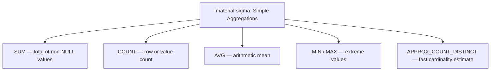
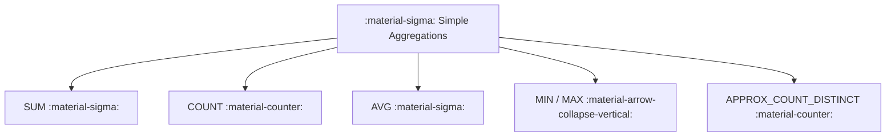

# :material-sigma: Simple Aggregations

Simple aggregation functions compute a single summary value from a group of rows. All functions skip `NULL` values unless stated otherwise.

---

## :material-sitemap: Overview



---

## :material-pin: Function Reference

| Function | Syntax variants | NULL handling | Returns |
|----------|----------------|--------------|---------|
| `SUM` | `SUM(col)`, `SUM(DISTINCT col)`, `SUM(col) FILTER (WHERE ...)` | Skips NULLs | Same type as input |
| `COUNT` | `COUNT(*)`, `COUNT(col)`, `COUNT(DISTINCT col)`, `COUNT(*) FILTER (WHERE ...)` | `COUNT(*)` includes NULLs; others skip | `BIGINT` |
| `AVG` | `AVG(col)`, `AVG(DISTINCT col)` | Skips NULLs | `DOUBLE` / `DECIMAL` |
| `MIN` | `MIN(col)`, `MIN(col) FILTER (WHERE ...)` | Skips NULLs | Same type as input |
| `MAX` | `MAX(col)`, `MAX(col) FILTER (WHERE ...)` | Skips NULLs | Same type as input |
| `APPROX_COUNT_DISTINCT` | `APPROX_COUNT_DISTINCT(col [, rsd])` | Skips NULLs | `BIGINT` |

All functions also work as **window functions** with `OVER (...)`.

---

## :material-flask-outline: Example

```sql
CREATE OR REPLACE TEMP VIEW sales AS
SELECT * FROM VALUES
    (1, 'East',  'Widget', 120.00),
    (2, 'West',  'Gadget', 340.00),
    (3, 'East',  'Widget',  80.00),
    (4, 'North', 'Gadget', 210.00),
    (5, 'West',  'Widget', 150.00),
    (6, 'East',  'Gadget', 450.00),
    (7, 'North', 'Widget',  90.00),
    (8, 'West',  'Gadget', 270.00)
AS sales(order_id, region, product, amount);

SELECT
    COUNT(*)                        AS total_orders,
    SUM(amount)                     AS total_revenue,
    ROUND(AVG(amount), 2)           AS avg_order,
    MIN(amount)                     AS min_order,
    MAX(amount)                     AS max_order,
    APPROX_COUNT_DISTINCT(region)   AS approx_distinct_regions
FROM sales;
-- Result:
-- total_orders | total_revenue | avg_order | min_order | max_order | approx_distinct_regions
-- -------------|---------------|-----------|-----------|-----------|------------------------
-- 8            | 1710.0        | 213.75    | 80.0      | 450.0     | 3
```

---

## :material-brain: When to Use

| Scenario | Pattern |
|----------|---------|
| Total or grouped sum | [`SUM`](sum/sum_aggregation.md) |
| Row count or NULL audit | [`COUNT`](count/SparkCountAggr.md) |
| Arithmetic mean | [`AVG`](avg/spark_avg.md) |
| Lowest / highest value, argmin/argmax | [`MIN / MAX`](minmax/min_max_agg.md) |
| Fast distinct count at scale | [`APPROX_COUNT_DISTINCT`](count/ApproxCountDistinct.md) |


### :material-sitemap: Overview



---

## :material-pin: Common Functions

| Function | Purpose |
|----------|---------|
| `COUNT` | Row count |
| `SUM` | Total of numeric values |
| `AVG` | Mean of values |
| `MIN` / `MAX` | Lowest / highest value |

---

## :material-flask-outline: Example

```sql
SELECT
  COUNT(*) AS total_orders,
  SUM(amount) AS total_amount,
  AVG(amount) AS avg_amount
FROM orders;
```

---

### Related Guides

- [AVG](avg/spark_avg.md)
- [COUNT](count/SparkCountAggr.md)
- [MIN/MAX](minmax/min_max_agg.md)
- [SUM](sum/sum_aggregation.md)
