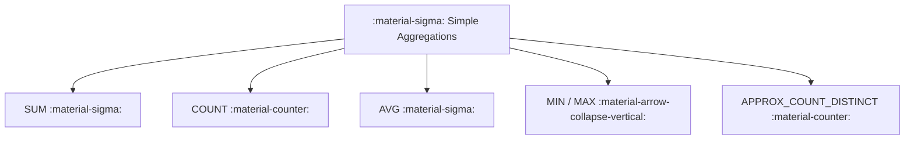

# :material-sigma: Simple Aggregations

Simple aggregation functions summarize values within groups or across a table.

### :material-sitemap: Overview



---

## 📌 Common Functions

| Function | Purpose |
|----------|---------|
| `COUNT` | Row count |
| `SUM` | Total of numeric values |
| `AVG` | Mean of values |
| `MIN` / `MAX` | Lowest / highest value |

---

## 🧪 Example

```sql
SELECT
  COUNT(*) AS total_orders,
  SUM(amount) AS total_amount,
  AVG(amount) AS avg_amount
FROM orders;
```

---

### Related Guides

- [AVG](avg/spark_avg.md)
- [COUNT](count/SparkCountAggr.md)
- [MIN/MAX](minmax/min_max_agg.md)
- [SUM](sum/sum_aggregation.md)
