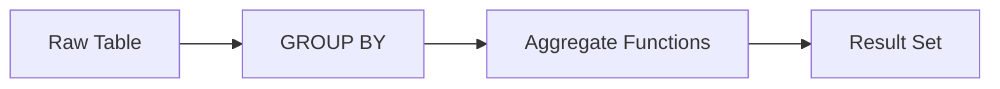

# :material-sigma: Aggregation

Summarise raw sales data using GROUP BY, conditional aggregation, and boolean aggregates.

---

## :material-sitemap: Overview



---

## 📌 Quick Reference

| Technique | Use Case | Key Function |
|-----------|----------|-------------|
| SUM / AVG / MIN / MAX | Total and average sales metrics | `SUM()`, `AVG()`, `MIN()`, `MAX()` |
| GROUP BY multi-column | Breakdown by make and model | `GROUP BY col1, col2` |
| COUNT variants | Row counts including / excluding NULLs | `COUNT(*)`, `COUNT(col)` |
| HAVING filter | Keep only groups above a threshold | `HAVING SUM(...) > n` |
| Threshold per group | Conditional counts within groups | `COUNT(CASE WHEN ...)` |
| Cross-column aggregation | Aggregate across related columns | Multi-column `SUM` / `CASE` |
| BOOL_AND / BOOL_OR | Boolean aggregation over a group | `BOOL_AND()`, `BOOL_OR()` |

---

## 🔍 Examples

### Basic Aggregates

Standard SUM, AVG, MIN, MAX over the sales table.

```sql
--8<-- "src/application/aggregation/basic_aggregates.sql"
```

---

### Grouped Aggregations

Aggregate metrics grouped by make and model.

```sql
--8<-- "src/application/aggregation/grouped_aggregations.sql"
```

---

### COUNT Operations

Difference between `COUNT(*)` and `COUNT(column)` with NULL behaviour.

```sql
--8<-- "src/application/aggregation/count_operations.sql"
```

---

### HAVING Filters

Filter grouped results to only those meeting a minimum threshold.

```sql
--8<-- "src/application/aggregation/having_filters.sql"
```

---

### Threshold Aggregates

Conditional aggregation using CASE inside aggregate functions.

```sql
--8<-- "src/application/aggregation/threshold_aggregates.sql"
```

---

### Cross-Column Aggregation

Aggregate across multiple related columns in a single pass.

```sql
--8<-- "src/application/aggregation/cross_column_aggregation.sql"
```

---

### Boolean Aggregations

Use BOOL_AND and BOOL_OR to reduce boolean expressions across a group.

```sql
--8<-- "src/application/aggregation/bool_aggregations.sql"
```

---

## 🧠 When to Use

| Scenario | Recommended Approach |
|----------|---------------------|
| Summarise total sales revenue | `SUM` / `AVG` with `GROUP BY` |
| Conditional totals per segment | `HAVING` clause |
| Boolean flag across a group | `BOOL_AND` / `BOOL_OR` |
| Grouped statistics by dimension | `GROUP BY` multi-column |
| Min / max per group | Threshold aggregates with `MIN` / `MAX` |

!!! tip
    Use FILTER (WHERE ...) with aggregate functions for conditional aggregation without CASE WHEN.
