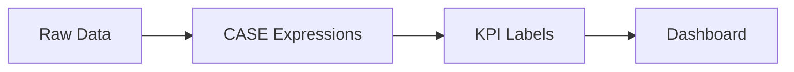

# :material-chart-line: Analytics

Apply CASE expressions, KPI banding, NULL ordering, and text formatting for dashboard-ready output.

---

## :material-sitemap: Overview



---

## :material-pin: Quick Reference

| Technique | Use Case | Key Function |
|-----------|----------|-------------|
| CASE thresholds | KPI metrics and alert banding | `CASE WHEN ... THEN ...` |
| Nested CASE | Multi-tier classification | Nested `CASE WHEN` |
| NULLS FIRST / LAST | Controlled NULL placement in ORDER BY | `ORDER BY col NULLS FIRST` |
| LEFT / LPAD / CONCAT | Formatted text output | `LEFT()`, `LPAD()`, `CONCAT()` |

---

## :material-magnify: Examples

### KPI and Alerts

Band numeric metrics into KPI labels using CASE expressions.

```sql
--8<-- "src/application/analytics/kpi_and_alerts.sql"
```

---

### Categorization

Multi-tier classification using nested CASE expressions.

```sql
--8<-- "src/application/analytics/categorization.sql"
```

---

### NULL Ordering

Control NULL placement in sorted result sets.

```sql
--8<-- "src/application/analytics/null_ordering.sql"
```

---

### Text Formatting

Truncate, pad, and concatenate strings for formatted report output.

```sql
--8<-- "src/application/analytics/text_formatting.sql"
```

---

## :material-brain: When to Use

| Scenario | Recommended Approach |
|----------|---------------------|
| KPI banding (Low / Medium / High) | `kpi_and_alerts` pattern |
| Custom categories from numeric range | `categorization` with nested CASE |
| NULL placement in sorted output | `null_ordering` with NULLS FIRST / LAST |
| Text truncation and padding | `text_formatting` with LEFT / LPAD |

!!! note
    NULLS FIRST / NULLS LAST is a Spark SQL extension; combine with ORDER BY for deterministic NULL placement.
