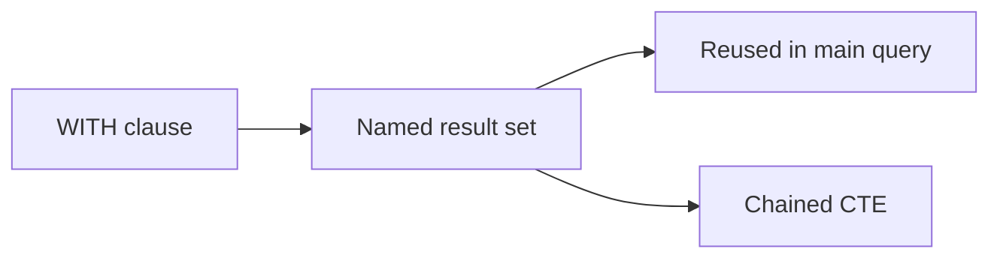

# :material-table-refresh: CTE

Break complex queries into readable, reusable named result sets using Common Table Expressions.

---

## :material-sitemap: Overview



---

## :material-pin: Quick Reference

| Technique | Use Case | Key Function |
|-----------|----------|-------------|
| Single CTE | Simple intermediate step | `WITH name AS (...)` |
| Multi-CTE | Pipeline stages | Multiple `WITH` blocks |
| Chained CTEs | Sequential transforms | CTE referencing prior CTE |
| Nested CTEs | Scoped sub-logic | CTE inside CTE definition |

---

## :material-magnify: Examples

### CTE Basics

Single and multi-CTE patterns for intermediate calculations.

```sql
--8<-- "src/application/cte/cte_basics.sql"
```

---

### CTE Advanced

Chained CTEs and reuse patterns for complex multi-step pipelines.

```sql
--8<-- "src/application/cte/cte_advanced.sql"
```

---

## :material-brain: When to Use

| Scenario | Recommended Approach |
|----------|---------------------|
| Break a complex query into steps | Use CTEs for each logical stage |
| Reuse a subquery result | Name it as a CTE |
| Build readable multi-step pipelines | Chain CTEs sequentially |

!!! tip
    CTEs are not materialised by default in Spark SQL — the optimizer may inline them. Use Delta temp views if materialisation is needed.
