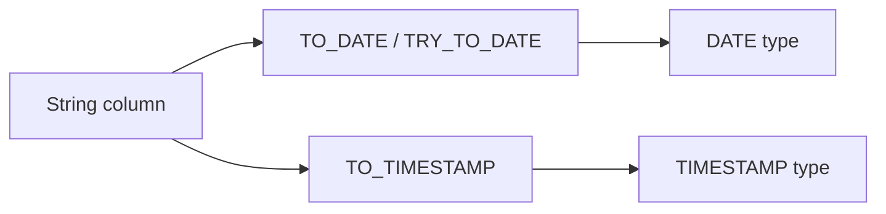

# :material-calendar-text: Date Strings

Parse, convert, and format date strings using TO_DATE, TO_TIMESTAMP, and DATE_FORMAT.

---

## :material-sitemap: Overview



---

## :material-pin: Quick Reference

| Technique | Use Case | Key Function |
|-----------|----------|-------------|
| TO_DATE | Parse a date string into DATE type | `TO_DATE(col, 'format')` |
| TO_TIMESTAMP | Parse a datetime string into TIMESTAMP | `TO_TIMESTAMP(col, 'format')` |
| DATE_FORMAT | Format a date value back to string | `DATE_FORMAT(col, 'format')` |
| TRY_TO_DATE | Safe parse — returns NULL on error | `TRY_TO_DATE(col, 'format')` |

---

## :material-magnify: Examples

### Reading Date Strings

Parse varchar date columns and format them for downstream use.

```sql
--8<-- "src/application/date_string/reading_date_strings.sql"
```

---

## :material-brain: When to Use

| Scenario | Recommended Approach |
|----------|---------------------|
| Source data stored as varchar dates | `TO_DATE` / `TRY_TO_DATE` |
| Need formatted date output | `DATE_FORMAT` |
| Prevent parse errors in ETL | `TRY_TO_DATE` for safe parsing |

!!! warning
    Always use TRY_TO_DATE in ETL pipelines to avoid runtime errors from malformed date strings.
