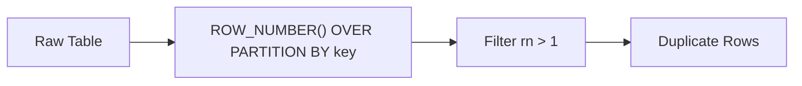

# :material-content-duplicate: Find duplicates

To find duplicates using a key in Spark SQL, you want to identify key values that appear more than once in a dataset.

### :material-sitemap: Overview



## ✅ Example: Find Duplicates by Key in Spark SQL

Assume your table is named my_table and the key column is id.

### 🔍 Query to Find Duplicated Keys

```sql
SELECT id, COUNT(*) AS count
FROM my_table
GROUP BY id
HAVING COUNT(*) > 1
```

This query returns all id values that appear more than once.

## 🔄 Find Full Duplicate Rows Using the Key

To return the full rows that have duplicate keys:

```sql
SELECT *
FROM my_table
WHERE concat(id, name) IN (
    SELECT concat(id, name)
    FROM my_table
    GROUP BY id, name
    HAVING COUNT(*) > 1
)
```
